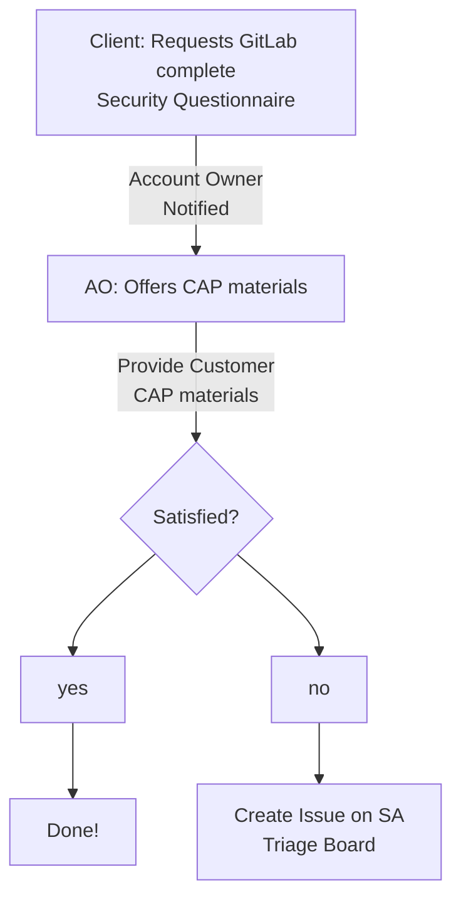
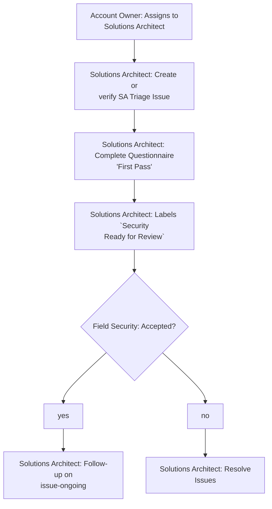

## On this page
{:.no_toc .hidden-md .hidden-lg}

- TOC
{:toc .hidden-md .hidden-lg}

# GitLab's Customer Security Assessment Process

## What is a Customer Security Assessment
Often customers conduct due diligence and vendor risk management processes on suppliers, this is not uncommon and GitLab even conducts security reviews of our vendors, [Third Party Vendor Security Review Process](/handbook/engineering/security/third-party-vendor-security-review.html).

## How our values come into play
GitLab operates differently; Specifically we are extremely [transparent](/handbook/values/#transparency) and we [Iterate](/handbook/values/#iteration) quickly while allowing [anyone to contribute](/handbook/values/#collaboration). Because of this, many questions a customer or prospect may have are already documented publicly.

### Finding answers to security questions (**All Publicly Available**)
* [General Information about GitLab](https://about.gitlab.com)
	* **NOTE**: Much information can be found by navigating to https://www.google.com and searching `about.gitlab.com [keywords]` replacing `[keywords]` with what one are searching for.
	* Example, vulnerability management `about.gitlab.com vulnerability management overview`. This search would quickly yield our [Vulnerability Management Overview Handbook Page](/handbook/engineering/security/vulnerability_management/)
	* Also see [Searching the GitLab Website Like a Pro](/handbook/tools-and-tips/searching/)
* How GitLab handles Security
	* [GitLab's Security Trust Center](https://about.gitlab.com/security/)
	* [GitLab's Security Compliance Controls](https://about.gitlab.com/security/)
	* [GitLab Security's Handbook Page](/handbook/engineering/security/)
	* [GitLab's Security Best Practices](/handbook/security/)
* Information about GitLab's Product Security
	* [GitLab Documentation](https://docs.gitlab.com)
	* [GitLab CAIQ](https://cloudsecurityalliance.org/star/registry/gitlab/)

## How to Request a Questionnaire be Completed
### For customers and prospects
* Contact your [account owner](/handbook/sales/#initial-account-owner---based-on-segment) at GitLab
* Don't know who your account representative is? Reach out to [support@gitlab.com](mailto:support@gitlab.com) and ask to be connected to your account owner
OR
* (if you aren't a current customer) [Fill out a request](https://about.gitlab.com/sales/) form to be connected with a representative

### For GitLab Team Members
**Important NOTE**: Follow-on questions greater than 5 questions are considered a new questionnaire and must be created as a new SA Triage Issue or reset the desired completion date for the SA triage issue. 

* The Account Owner should always start the workflow
	* [Lookup customer account details](/handbook/support/workflows/looking_up_customer_account_details.html)
* The Account Owner should first provide our public statements on security to the customer
	* [GitLab's Security Trust Center](https://about.gitlab.com/security/)
	* [GitLab's Security Compliance Controls](https://about.gitlab.com/security/)
	* [Customer Assurance Package (CAP)](/handbook/engineering/security/security-assurance/field-security/customer-assurance-package.html) These materials are up-to-date and meant to speed time to meeting customer demand
	* **NOTE**: The materials should be enough to meet the needs of most customers
	* **NOTE**: If questions are asked that are answered in the CAP materials the answer given will be a reference to the Customer Assurance Package
* In the event the customer or prospect has more specialized concerns or needs clarification on provided materials the Account Owner is to [engage the Solutions Architect for the account](/handbook/customer-success/solutions-architects/#engaging-a-solutions-architect)
	* [Lookup customer account details](/handbook/support/workflows/looking_up_customer_account_details.html)
	* **NOTE**: To speed the process consider [creating an issue on the SA Triage Board](https://gitlab.com/gitlab-com/customer-success/sa-triage-boards/) **using the Vendor Security Assessment Template** and assign to the customer/prospect Solutions Architect

#### For Solutions Architects, Technical Account Managers, and others
If you are a team member taking a "first pass" on the customer questionnaire you have several additional resources available to you to help complete these questionnaires. It is our priority to provide Solutions Architects the information they need to answer between 80% and 90% of customer questions.
* [create an issue on the SA Triage Board](https://gitlab.com/gitlab-com/customer-success/sa-triage-boards/) **using the Vendor Security Assessment Template** or ensure that the issue created by your Account Owner is done correctly
	* **NOTE**: If opportunity is less than $5,000.00 Security will not provide input on the questionnaire unless otherwise prioritized through Sales and Security Leadership.
	* **NOTE**: An opportunity tier is required as this helps to prioritize conflicting requests
	* **NOTE**: Ensure CRM link is to the **applicable opportunity, not the account**
* Complete the questionnaire as much as possible using existing resources
	* [Solutions Architect Top 50](https://docs.google.com/document/d/14r4wlmjoe70ex2PNgbsW7w9_558ZJRjqyn3UJ4Jg5Pw/edit?usp=sharing) **GitLab Internal**
		* **NOTE**: Please feel free to comment in this document, ask questions, and type lessons learned. This is for your team
	* [First Pass Q&A Issue Board](https://gitlab.com/gitlab-com/gl-security/field-security-team/security-questionnaire-first-pass/-/boards/1593994) **GitLab Internal**
	* [Security Questionnaire Folder - Prior Completed Questionnaires](https://drive.google.com/open?id=0B6GNv2pwhtCxWVJWdEZCTUEwbXc)
	* Ask Questions in Slack, [#sec-fieldsecurity](https://gitlab.slack.com/archives/CV5A53V70)
		* **NOTE**: Pro-tip, search for prior questions and answers in slack `[keywords] in:[channel name]`
* Once Solutions Architect has completed the questionnaire:
	* ensure that filled out questionnaire is loaded into the [Security Questionnaire Folder - Prior Completed Questionnaires](https://drive.google.com/open?id=0B6GNv2pwhtCxWVJWdEZCTUEwbXc) and that the field security team (@dsharris, @tsteinwart, @jburrows001, @Julia.Lake) has edit access to the file _no need to send share notifications_
	* ensure that desired completion date is populated, and is in line with the 10-day Service Level Agreement (SLA) for completion of Customer Security Assessments
	* label the issue on the SA Triage board `Security Ready for Review`
	* if expedited review is needed mention the field security team and explain in a comment on the issue, and message the #sec-fieldsecurity slack channel

#### For Field Security
1. Capture the request in [tracker](https://drive.google.com/open?id=12_UTcwDbssu7igrDsoIU4-cY60ylwYvVbt2rqsWld6Q)
2. Verify the SA Triage Issue
	* Is All required information Provided?
		* Yes (continue)
		* No [Return to Solutions Architect](#return-to-sa-language)
	* Did the Solutions Architect make a solid first pass?
		* Yes (continue)
		* No
			* Did the Solutions Architect already contact Field Security?
				* Yes (continue)
				* No [Return to Solutions Architect](#return-to-sa-language)
	* Can Field Security Meet the Requested Desired Completion Date?
		* Yes (continue)
		* No [Inform relevant Parties](#backlog-language) (continue)
3. Assign the issue to a Directly Responsible Individual (@tsteinwart or @dsharris)
4. Update the issue with a comment
5. **Daily**, Update issue comments with status update
6. Facilitate Questionnaire Completion
7. If at any point in time, it becomes clear that desired completion date won't be met, [Inform relevant Parties](#backlog-language).

### Service Level Agreements
#### Account Owner
There is currently no published guidance on SLA from customer request to Account Owner response.

#### Solutions Architect
There is currently no published guidance on SLA from Account Owner assignment to response from Solutions Architect. 

#### Field Security
* **Acknowledgement of issue** - Within **1 business day** of being labeled `Security Ready for Review`
* **Completion of questionnaire** - Within **10 calendar days** of being accepted by Field Security; in some cases this may not be possible

Once the [issue on the SA Triage Board](https://gitlab.com/gitlab-com/customer-success/sa-triage-boards/) is successfully labeled `Security Ready for Review` Field Security will acknowledge issue within **1 business day**. _Field Security is currently located in US Eastern Timezone and observes all US Federal holidays_
* **Note**: If you have not recieved a response within one business day, please ask status and link in Slack [#sec-fieldsecurity](https://gitlab.slack.com/archives/CV5A53V70)

Once Field Security has accepted the issue, all efforts will be made to complete the questionnaire within **10 calendar days**. Questionnaires are prioritized based off opportunity tier and guidance from sales leadership. In some cases the **10 calendar day** timeline can not be met, in this case Field Security will provide an updated estimated completion date.

Field Security will respond to issues once they are labeled `Security Ready for Review`, when responding Field Security will respond one of 3 ways:
1. **All good** - Acknowledge receipt of issue, Acknowledge that first pass was completed, confirm that desired completion date is attainable
2. **Unsatisfactory** - Acknowledge receipt of issue, unlabel `Security Ready for Review`, comment on what is unsatisfactory, see [Return to Solutions Architect](#return-to-sa-language)
	* No Solutions Architect first Pass or poor quality first pass
	* Required information missing (i.e. Opportunity Tier, CRM link, Link to Questionnaire with correct permissions, etc...)
	* Does not meet requirements (i.e. opportunity below $5,000.00 ACV and not prioritized)
	* Questions not appropriate for security (this often happens when customers ask financial and business operations information)
	* **NOTE**: If the Solutions Architect is concerned this might be an issue, they should reach out in Slack [#sec-fieldsecurity](https://gitlab.slack.com/archives/CV5A53V70) and discuss to minimize delays
3. **Unable to meet request** - In the event that security is backlogged, Field Security will commit to a timeline that can be achieved this happens
	* During sales surge cycles (end of quarter/year, etc)
	* When questionnaires are prohibitively burdensome
		* Security has seen questionnaires in excess of 1000 questions

## Workflow Diagrams
### Customer's Initial Request
**NOTE**: This is an overview, for detailed steps see [For GitLab Team Members](#for-gitlab-team-members)


### Solutions Architect Workflow
**NOTE**: This is an overview, for detailed steps see [For GitLab Team Members](#for-gitlab-team-members) and [SA specific instructions](#for-solutions-architects-technical-account-managers-and-others)


### Field Security Workflow
```mermaid
graph TD;
  st[Issue: Labeled 'Security Ready<br/>for Review'];
  ac{Accept Issue?};
  ak[Field Security: Acknowledge Receipt of<br/>issue and clarify];
  as[Field Security: Assign a Directly<br/>Responsible Individual];
  cpy[Field Security: Complete and Return to<br/>Solutions Architect];
  cpi[Field Security: Complete and Return to<br/>Solutions Architect];
  rt[Field Security: Return to Solutions Architect<br/>with feedback];
  ul[Field Security: Unlabel 'Security<br/>Ready for Review'];
  uln[Field Security: Unlabel 'Security<br/>Ready for Review'];
  sl[Field Security: Label `Security Reviewed`];
  ua[Field Security: Unassign Analyst];
  ud[Field Security: Explain issues, provide update<br/>with expected completion<br/>date, inform leadership];
  st -->|Triage SA<br/>Triage Issue|ac --> yes & no & issues;
  yes -->|Within 1 Business<br/>day|ak --> as -->|Within 10 cal days|cpy --> ul --> sl;
  no -->|Within 1 Business<br/>day|uln --> rt --> st;
  issues -->|Within 1 Business<br/>day|ud --> as -->|As possible|cpi --> ul;
  sl --> ua --> Done!;
  ```

## Return to SA Language
In the event that the issue isn't ready for Field Security, it may be returned to the Solutions Architect with language similar to the below blockquote.

>>>
[Solutions Architect],

I'm sorry we have to return this issue to you. The following issues are preventing us from beginning our review of this assessment.

* [item 1]
* [item 2]
* [item 3]

We are removing the `Security Ready for Review` Label until these issues are resolved.

If you have further questions please feel free to message in Slack [#sec-fieldsecurity](https://gitlab.slack.com/archives/CV5A53V70) or you can DM me directly.

/unlabel ~"Security Ready for Review"
>>>


## Backlog Language
In the event Field Security can not meet the requirements of the Sales Team it is important to update the Solutions Architect, Account Owner, and Security Leadership as soon as possible.

>>>
[Solutions Architect] and [Account Owner],

I'm sorry to inform you that due to [circumstances] we will be unable to meet your desired completion date of mm/dd/yyyy. We are truly sorry about this but we wanted to communicate and set expectations early.

Currently we estimate we can complete this request by [mm/dd/yyyy]. Please feel free to message in Slack [#sec-fieldsecurity](https://gitlab.slack.com/archives/CV5A53V70) or you can DM me directly. I'm copying in my leadership to inform them of the issue.

In the interim, please have a look at our [Customer Assurance Package]()

We look forward to resolving this request.

/cc @jburrows001, @julia.lake
>>>
