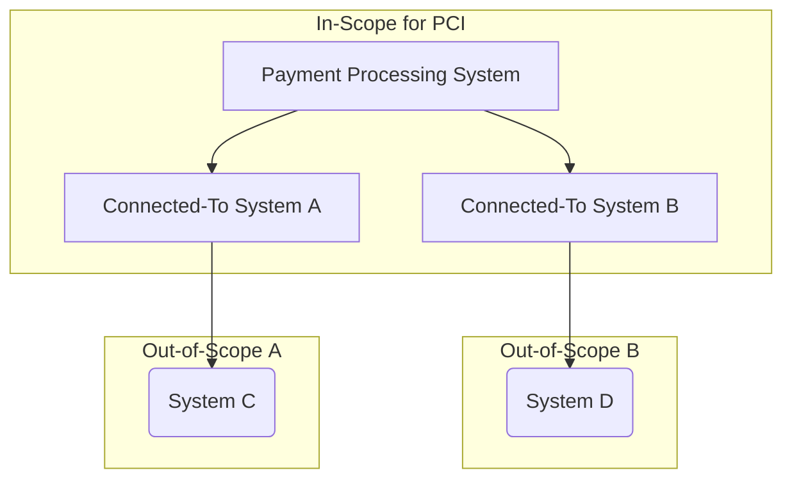

## On this page
{:.no_toc .hidden-md .hidden-lg}

- TOC
{:toc .hidden-md .hidden-lg}

# IAM.1.07 - Shared Account Restrictions

## Control Statement
Where applicable, the use of generic and shared accounts to administer systems or perform critical functions is prohibited; generic user IDs are disabled or removed.

## Context
Use of shared or generic accounts limits the ability to ensure authenticity and integrity.  Someone outside the organization could exploit this and their actions could not be easily traced.

## Scope
This control applies to all systems within our production environment that are in-scope for PCI compliance.

* The production environment includes all endpoints and cloud assets used in hosting GitLab.com and its subdomains. This may include third-party systems that support the business of GitLab.com.
* in-scope for PCI compliance are systems that process or support the processing of credit card data, additionally any system that is connected-to to those systems that process or support the processing of credit card data.

## Ownership
* Control Owner: `IT Ops`
* Process owner(s): `IT Ops`

## Guidance
Review and document required accounts for a given system and disable all unnecessary accounts. Use of shared accounts should not used.  If unavoidable, compensating controls should be utilized to add accountability.

## Additional control information and project tracking
Non-public information relating to this security control as well as links to the work associated with various phases of project work can be found in the [Shared Account Restrictions control issue](https://gitlab.com/gitlab-com/gl-security/security-assurance/sec-compliance/compliance/issues/811).

Examples of evidence an auditor might request to satisfy this control:
* Link to the handbook entry on shared accounts and their restrictions
* List of systems and services where shared accounts are restricted
* User export of those systems and services

### Policy Reference

- [Shared Account Access Request](/handbook/business-ops/team-member-enablement/onboarding-access-requests/access-requests/#shared-account-access-request)
- [Access Control Policy and Procedures](/handbook/engineering/security/#access-control-policy-and-procedures)
- [Okta documentation on shared accounts](/handbook/business-ops/okta/#i-have-an-application-that-uses-a-shared-password-for-my-team-can-i-move-this-to-okta)
- [New Shared Account Access Request](/handbook/business-ops/team-member-enablement/onboarding-access-requests/access-requests/#shared-account-access-request)
- [Shared Account Access Request Handbook page](/handbook/business-ops/team-member-enablement/onboarding-access-requests/access-requests/)

## Framework Mapping
* PCI
  * 8.5
