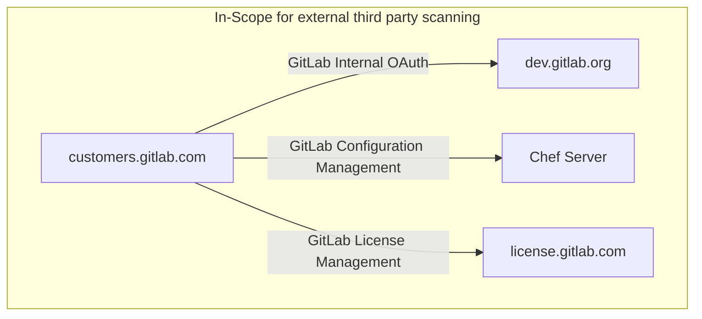

## On this page
{:.no_toc .hidden-md .hidden-lg}

- TOC
{:toc .hidden-md .hidden-lg}

# VUL.1.03 - Approved Scanning Vendor

## Control Statement

External vulnerability scans are conducted by an approved third party vendor on a quarterly basis.

## Context

Utilization of a third party vendor to scan and validate potential vulnerability results provides checks and balances against our internally conducted scanning processes.  Additionally, the third party scanning provides the view of our external network risk that can be potentially exploited to gain access to our environment.

## Scope

This control applies to externally facing systems of our production environment that are in-scope for PCI.

## Ownership

* Control Owners: 
  * SIRT Team
* Process owner(s):
  * SIRT Team

## Additional control information and project tracking

Non-public information relating to this security control as well as links to the work associated with various phases of project work can be found in the [Approved Scanning Vendor control issue](https://gitlab.com/gitlab-com/gl-security/security-assurance/sec-compliance/compliance/-/issues/938).

Examples of evidence an auditor might request to satisfy this control:

* Scanning results reports demonstrating GitLab's externally-facing, in-scope PCI systems are scanned by an approved vendor on a quarterly basis.
### Policy Reference

## Framework Mapping

* SOC2 CC
  * CC4.1
* PCI
  * 11.2
