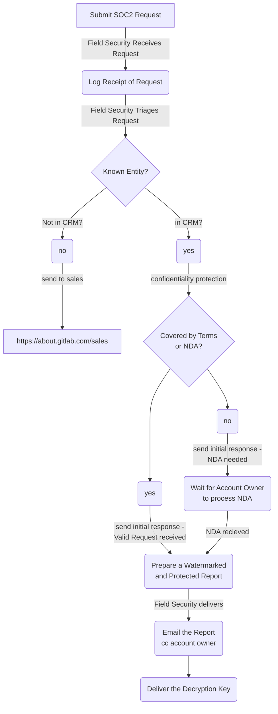

## On this page
{:.no_toc .hidden-md .hidden-lg}

- TOC
{:toc .hidden-md .hidden-lg}

## What is SOC2?

SOC2 is a security control report developed by the American Institute of Certified Public Accountants (AICPA) based on the Statement on Standards for Attestation Engagements no. 18 (SSAE 18).

### What are the different types of SOC reports?

* SOC1 - Type 1
   * SOC1 Type 1 reports evaluate the design of controls relating to financial reporting.
* SOC1 - Type 2
   * SOC1 Type 2 reports evaluate the design and operating effectiveness of controls relating to financial reporting.
* SOC2 - Type 1
   * SOC2 Type 1 reports evaluate the design of controls relating to security controls within various Trust Services Criteria.
* SOC2 - Type 2
   * SOC2 Type 2 reports evaluate the design and operating effectiveness of controls relating to security controls within various Trust Services Criteria.
* SOC3
   * SOC3 reports are general use report that can be freely shared and show that an organization has been evaluated the same as a SOC2 Type 2 examination, but this report doesn't show the testing process or results.

## Why is GitLab pursuing SOC2 certification?

SOC2 is becoming an industry standard for validating that a baseline of security program maturity is in place within an organization.

Customer benefits:
* SOC2 certification will increase customer confidence in our information security program
* SOC2 is an easy way for our customers to manage GitLab as a vendor since SOC2 reports are becoming the industry standard for vendor security management

GitLab benefits:
* SOC2 reports enable our sales team to quickly share the state of our security program with potential customers
* SOC2 reports reduce the need for GitLab's security compliance team to fill out individual security questionnaires since SOC2 reports are often accepted in place of those questionnaires
* SOC2 is a good way to ensure we are meeting all requirements of a strong and comprehensive information security program and we aren't focusing only on certain areas of security
* An external examination such as SOC2 is a good way to report on the results of the security mechanisms we have put in place instead of relying solely on the design of those security mechanisms

## Is GitLab SOC2 compliant?

Yes! GitLab completed the SOC2 Type 1 process in March 2020. For information on how to request a copy of that report, please refer to the [requesting the GitLab SOC2 report section](#requesting-a-copy-of-the-gitlab-soc2-type-1-report) of this page.

### Scope of the above SOC2 Type 1 report

The SOC2 Type 1 report available for customer and potential customers upon request is scoped to GitLab.com. There are elements of the report that cover organizational-level security considerations (e.g. Business Continuity Planning, Risk Assessments, etc.) which go beyond the scope of GitLab.com as a SaaS product and speak to the mature state of GitLab's information security program.

## What are we doing to become SOC2 Type 2 compliant?

With GitLab's security control design already validated through the SOC2 Type 1 audit, the next step is to solidify those controls to ensure they are operating in the manner we would expect for all in-scope systems. If you're wondering why it would take another 9-12 months for this process, check out the [why is it going to take that long section](#why-is-it-going-to-take-that-long) below.

### What's the difference between SOC2 controls and the GCF?

The GitLab Control Framework (GCF) is an overarching set of security controls that satisfy many underlying compliance requirements (e.g. SOC2, PCI, SOX, etc.).

SOC2 is a subset of the requirements that the GCF satisfies.

### What will be the scope of our SOC2 examination?

GitLab's SOC2 report will cover the people, process, and technology that make up GitLab.com. The exact inventory of systems that comprise this scope are still being developed but any system that is connected to systems/services that operate GitLab.com is likely to be included in the scope of this audit.

### When are we going to be compliant?

* GitLab's SOC2 Type 1 audit report was obtained in March 2020
   * For information on how to request a copy of that report, please refer to the [requesting the GitLab SOC2 report section](#requesting-a-copy-of-the-gitlab-soc2-type-1-report) below.
* GitLab's SOC2 Type 2 is scheduled to start during the first quarter of 2021

### Requesting a copy of the GitLab SOC2 Type 1 report

The nature of SOC2 reports is such that these reports cannot be made publicly available. Not only do these reports contain very candid information about how our systems operate (which could make a potential attack against GitLab easier) but these reports also contain proprietary information about how these audit firms conduct their testing. For these reasons we can only share SOC2 reports with prospective customers that are under an NDA with GitLab or with current customers bound by the confidentiality of our customer agreements. These reports can not be distributed to anyone other than the individuals receiving these reports.

#### Process
- **GitLab Team Members should not email security@gitlab.com**
- Customers, Prospects, and Partners - email [security@gitlab.com](mailto:security@gitlab.com?subject=Requesting%20GitLab%27s%20SOC2%20Type%201%20Report)
- GitLab Team Members - send a slack message in [#sec-fieldsecurity](https://gitlab.slack.com/archives/CV5A53V70), use the below template
>>>
Field Security, can I get a SOC2 Type 1 Report sent to a {customer/prospect}?
- Account Name: {customer name}
- SFDC: {Salesforce link to account or opportunity}
- Individual: {receiving person's name}
- Individual Position: {title of receiving person}
- Individual Email: {receiving person's email address}
- Account Owner: {GitLab Team Member responsible for account}
- Account Owner Email: {GitLab Team Member's email}
>>>
- See full process flow below

#### Why is GitLab offering me a SOC2 report instead of filling out my company's security questionnaire?

GitLab is in the very fortunate position of having a lot of new customers sign up for our GitLab.com SaaS service every month. With our focus on efficiency we have decided to invest the time and money into pursuing this SOC2 certification in part so that our customers will have an assessment on the maturity and design of our information security program. With the security team we have, we want to spend as much of that team's time as possible securing the GitLab product and providing as much protection to customer data as possible. Responding to each individual customer security questionnaire doesn't scale very well.

The SOC2 Type 1 report we offer to our potential and existing customers uses an industry baseline for the topics it evaluates; this report should offer a lot of the same information customers would be looking to collect through their individual questionnaires. If you find you still have questions after reviewing our SOC2 report we're very happy to answer those questions but we just ask that you target those questions to the information missing from that SOC2 report instead of having us respond to the same information that already exists in the report.

### Why is it going to take that long?

1. We don't want to roll out controls specific to SOC2 only to go back to our teams next year with controls specific to ISO. Instead we are taking a longer-term view of our compliance needs and created a [comprehensive security control framework](/handbook/engineering/security/security-assurance/security-compliance/sec-controls.html) that will allow us to gather security control evidence and work with teams in a more [efficient](/handbook/values/#efficiency) manner.
1. SOC2 Type 2 reports require 6 months worth of operating security controls in order to validate the effectiveness of the controls. If we want to be audited for a SOC2 Type 2 report on 2020-07-01 we need to have all controls designed, remediated, tested, and producing audit-ready evidence as of 2020-01-01.

## How will this SOC2 project impact other teams at GitLab?

Creating security controls from scratch is a difficult process. Each GitLab team-member is iterating on processes, developing new features, reconfiguring systems, etc. every day. Security controls require a certain amount of stability in order to generate effective evidence we can present to external auditors. Combine this with the collaborative approach the security compliance team is trying to take and it makes this process especially challenging. The security compliance team doesn't want to go out to GitLab teams with archaic requirements that have been around for 10 years just because auditors are used to those requirements and the evidence to expect from each. Instead, we want collaborate with GitLab teams and innovate ways to gather evidence and be flexible in the requirements we are establishing in order to create an industry-leading security compliance program. Since GitLab creates new and innovative software, this process is really challenging since the security compliance team don't have deep technical expertise in all areas of the company. Instead we have to parter with GitLab teams to come up with the best way to approach each security control and generate meaningful evidence we can use in an audit.

TL;DR: There's just no way to establish a security program that is external-audit-ready without adding a certain amount of friction for our teams. Please know that we take this extra friction seriously and work **hard** to minimize that friction as much as possible.

## Who is responsible for the SOC2 project?

* The security compliance team is responsible for the creation of security controls and the advisement of audit requirement relating to those controls
* Every GitLab team is responsible for operating the processes required by SOC2 that the various teams and the security compliance team work together to create and document
* GitLab's leadership is responsible for supporting this initiative and giving all GitLab teams the resources (e.g. time and tools) they require to work with the security compliance team as they work towards this audit

## Where can I submit feedback for this SOC2 project?

Please add a comment to [this feedback issue](https://gitlab.com/gitlab-com/gl-security/security-assurance/sec-compliance/compliance/issues/1097).

You can also [contact the security compliance team](/handbook/engineering/security/security-assurance/security-compliance/compliance.html#contact-the-compliance-team) if there's any way we can help.
