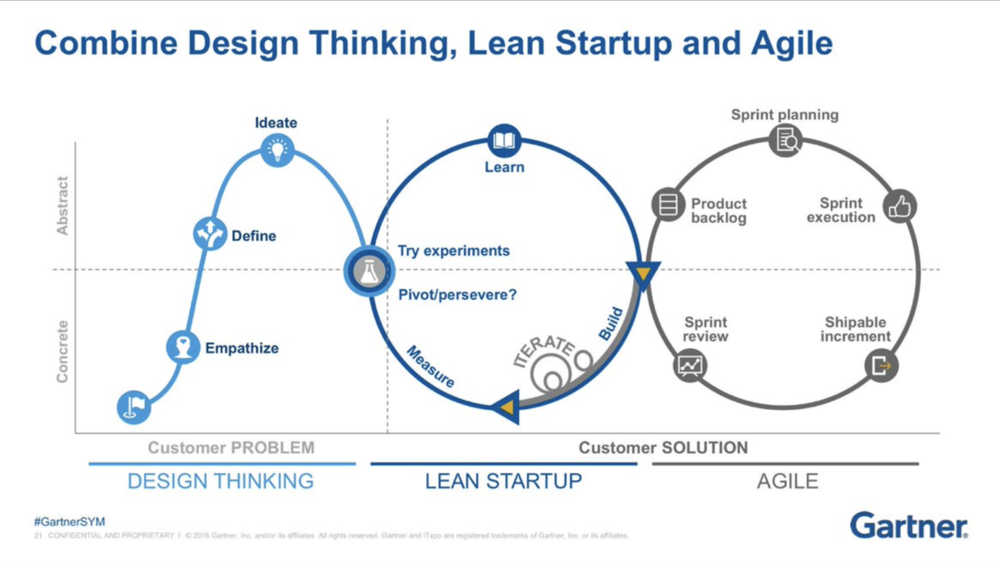
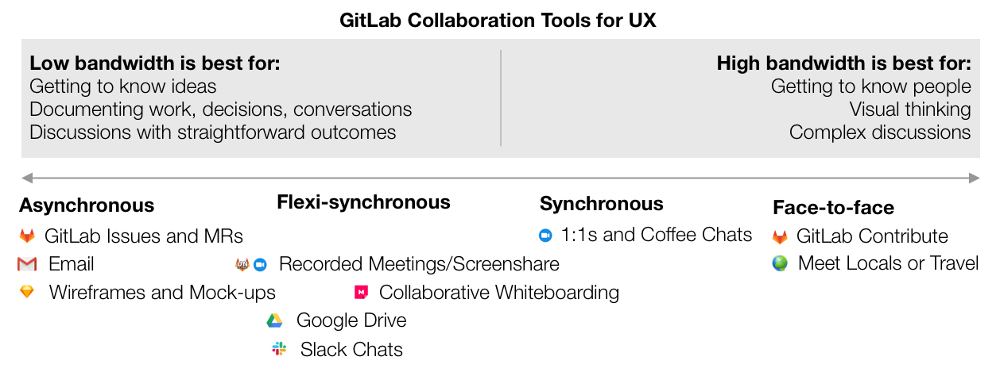

## On this page
{:.no_toc .hidden-md .hidden-lg}

- TOC
{:toc .hidden-md .hidden-lg}

The UX Department works alongside the community, Product Managers (PMs), Frontend engineers (FE), and Backend engineers (BE). PMs are responsible for kicking off initiatives and setting the product direction. PMs define the "what" and "why" for feature-related issues by gathering customer and user feedback, and they give GitLab team members and the wider community space to suggest and create.

UX should assist in driving the [product vision](/direction/) early in the process. We inform the vision by conducting [generative research](/handbook/engineering/ux/ux-research/) and facilitating discussions with community members, customers, PM, FE, and BE. We are **elevated** above just the transactional workflow and **generative** in creating work, rather than just executing tasks.

## UX Workflows

* [UX Department](/handbook/engineering/ux/ux-department-workflow/)
* [Product Designer workflows](/handbook/engineering/ux/ux-designer/)
* [UX Researcher workflows](/handbook/engineering/ux/ux-research/)
* [Technical Writing workflows](/handbook/engineering/ux/technical-writing/workflow/)

## UX team mission

Our mission is to collaborate with the wider GitLab community and fellow GitLabbers to rapidly create products and experiences that customers value over competitor products and toolchains. To achieve our mission, we commit ourselves to being:

* **Innovative** - We create [disruptive innovation](https://www.economist.com/the-economist-explains/2015/01/25/what-disruptive-innovation-means) through GitLab's unified, feature-complete solution by replacing disconnected toolchains with streamlined solutions and seamless experiences.
* **Informative** - We partner with Product Management to conduct the rapid research and prototyping required for evidence-based planning, innovation, design, and delivery.
* **Efficient** - We generate more value, faster through conventional “boring” solutions, Lean UX, and design reuse (like our Design System, Pajamas).
* **Results focused** - We focus on rapid, continual delivery of customer results (not designs and docs).
* **Collaborative** - We design in the open and foster collaboration, so Gitlabbers and the wider GitLab community can improve strategies and solutions end to end.

## Everyone can contribute

The UX department is not solely responsible for the user experience of GitLab. Everyone is encouraged to contribute their thoughts on how we can make GitLab better by opening an issue. You can use just words or include images. These images can take a variety of forms; here are just a few examples:

* Drawings or sketches to convey your idea
* Wireframes made using a software of your choosing (Balsamiq, Sketch, etc.)
* High-fidelity mockups made using the [Pajamas Design System][pajamas]
* Screenshots of changes to our UI, made by manipulating the DOM in the browser

If you are creating high-fidelity designs, please make sure to let others know that this is a proposal and needs UX review. You can ping anyone on the UX team for assistance.

## Proactive and reactive UX

We'll always have responsibility for reactive tasks that help "keep the lights on," such as bug fixes and minor UX enhancements. But we also must carve out some portion of our time for proactive work that identifies existing pain points, redefines how we approach problems, and uncovers actionable innovation and improvement opportunities. This proactive UX work enables us to create the most complete, competitive, and resilient solutions.

It isn’t always easy to find the space for proactive UX work, but the challenge is worth it, because it's how we create a best-in-class product experience. And it's not just the UX team's responsibility; it requires a coordinated effort from Leadership, Product, and Engineering, too.

We're currently working to find the right balance between proactive and reactive UX work. While we don't have a prescriptive ratio, we also don't allot 100% of our available work time to reactive efforts. Before and at the start of each milestone, UXers should work with their managers to define the appropriate ratio, based on our active OKRs and stage group requirements. When there are questions about priority or scope, or when a UXer is concerned about meeting a deadline, they should immediately reach out to their manager to help them resolve any concerns. Comunicate early and often!

### Examples of proactive UX

One example of proactive UX work is our [UX Scorecards](/handbook/engineering/ux/ux-scorecards/) initiative. Another example is the generative research that our UX Researchers lead (while inviting cross-functional partners to participate). Yet another example is the ongoing effort to beautify our UI, both through [small, tactical changes](https://gitlab.com/groups/gitlab-org/-/epics/989) and through our [Pajamas Design System][pajamas].

**UX Scorecards**  
Designers use [UX Scorecards](/handbook/engineering/ux/ux-scorecards/) to benchmark common user tasks. In many cases, tasks involve multiple stages of the product, giving designers visibility into how users traverse across stages. Designers follow with [Experience Recommendations](/handbook/engineering/ux/ux-scorecards/) for how to improve the experience in upcoming milestones.

## Iteration

Here at GitLab, iteration means making the [smallest thing that adds value and getting it out as quickly as possible](/handbook/values/#iteration). Working like this allows us to reduce cycle time and get feedback from users faster, so we can continue to improve quickly and efficiently.

Iteration isn't just one of GitLab’s six founding values, [C.R.E.D.I.T](/handbook/values/#credit), it is one of the [foundational concepts in design thinking and user experience](https://www.interaction-design.org/literature/article/design-iteration-brings-powerful-results-so-do-it-again-designer). Planning too far ahead without real-world feedback can cause you to build something that doesn't meet user needs.

Iteration is especially vital in an open-source community. Keeping changes small and iterative makes it easy for anyone to contribute. Here are some examples of how we are embracing the power of iteration and using it to build GitLab:

* We aggressively break issues down into the smallest scope possible. If an effort is too big to be developed in one milestone, then it is too big. [Epics](/handbook/product/product-processes/#epics) allow us to maintain a holistic view of an area, while breaking the work down into an MVC.
* We keep a list of improvement issues that are actively seeking contributions from the community. They are small in scope, allowing the community to contribute designs or code to the issues. You can learn more about it in the [Community Contributions](/handbook/engineering/ux/ux-department-workflow/#community-contributions) section of this handbook. You can also [view the list of issues that need UX work](https://gitlab.com/groups/gitlab-org/-/issues?state=opened&label_name[]=Accepting+merge+requests&label_name[]=UX).
* You may notice that our [Design System](https://gitlab.com/gitlab-org/gitlab-services/design.gitlab.com) has a lot of "to-do" items. Rather than try to tackle everything at once, we are gradually populating our component library and incrementally rolling those components out to production.

## Pair Designing

Pair Designing gives Product Designers a consistent partner to ideate with at the beginning of an effort and get feedback from during the design process and conduct [design reviews](/handbook/engineering/ux/ux-designer/#design-reviews). It also gives Product Designers exposure to product areas outside of their own.

* Every six months, Product Designers are assigned to a new pair designer from a different stage group.
* If we have an odd number of designers, we'll have one 3-person partnership.
* Pairs decide what to share and when; there is no pre-defined schedule or guidelines.
* It’s imperative to explicitly ask for feedback and give context.

## Stable counterparts

Every Product Designer is aligned with a PM and is responsible for the same features their PM oversees.
Technical Writers each support multiple stage groups. UX Researchers support multiple PMs within a section.

UXers work alongside PMs and engineering at each phase of the process: planning, discovery, implementation, and further iteration. The area a Product Designer or Technical Writer is responsible for is part of their title; for example, "Product Designer, Plan." You can see which area of the product each Product Designer or Technical Writer is aligned with in the [team org chart](/company/team/org-chart/).

### Headcount planning

In the spirit of having "stable counterparts," we plan headcount as follows:

* **One Product Designer for every stage group**
    * 1:1 ratio of Product Designers to Product Managers
    * Approximately a 1:7 ratio of Product Designers to Engineers
* **One Technical Writer for up to three stage groups**
    * 1:3 ratio of Technical Writers to stage groups
    * Approximately a 1:21 ratio of Technical Writers to Engineers
* **One UX Researcher for up to 5 stage groups**
    * 1:5 ratio of UX Researchers to Product Managers
    * Approximately a 1:35 ratio of UX Researchers to Engineers
* **Manager support that's appropriate for the function**
    * Approximately a 1:5 ratio of Managers to direct reports for UX Research and Product Design
    * Approximately a 1:7 ratio of Managers to direct reports for Technical Writing

### Time off

Taking [time off](/handbook/paid-time-off/) is important. It is equally important to come back to work and feel refreshed. We discourage team members from checking work-related activities while on leave as a way of feeling less overwhelmed when returning. To prevent this, your stage design peers, or manager if you do not have stage design peers, will serve as your backup when you are on PTO (paid time off) by:

* Providing a touch point for Product and Engineering to ask UX questions related to your stage group.
* Unblocking an issue or merge request when possible.
* Delegating work to others on the team.
* Communicating blocking issues or merge requests with the report when they return if it was not possible to resolve or delegate while they were away.

Backups are responsible for addressing critical UX work while a designer is away. Critical UX work is defined as any work that addresses an outage, a broken feature with no workaround, or the current workaround is unacceptable. If a backup begins to feel overwhelmed with workload, they should immediately reach out to their manager for help. Your manager will be able to help further delegate tasks when necessary.

When taking time off, be sure to [communicate it with other people](/handbook/paid-time-off/#communicating-your-time-off). 

* In [PTO Ninja](/handbook/paid-time-off/#pto-ninja), set a role for your backup person during your PTO, and add the UX Calendar to your settings (its calendar ID is in the Google Calendar settings), so your PTO events are visible to everyone in the department.
* In the GitLab Design project, open a new issue using the [UX Coverage template](https://gitlab.com/gitlab-org/gitlab-design/-/blob/master/.gitlab/issue_templates/UX%20Coverage.md) and list the priorities and issues that the responsible backups need to cover while you are on PTO.
  * Make sure to open your UX coverage issue at least one week ahead of the scheduled PTO to effectively evaluate the scope of the open tasks and align on the items for coverage with your backup person.
  * Make sure to align with your Product and Engineering Managers that no new features design work will be scheduled during your PTO time. The backup person is only covering for urgent needs, such as reviewing MRs that are in development during the milestone, providing feedback to general questions that already have a design proposal established and replying to Slack questions, etc.
  * When leaving on PTO, make sure that the more significant design discussions are closed. This way the backup person can avoid spending lots of time on finding a SSOT and collecting historical data around the request that will lead to blocking the team.

When taking an extended time off, such as [Parental Leave](/handbook/total-rewards/benefits/general-and-entity-benefits/#parental-leave), work with your manager to communicate with the relevant stable counterparts to ensure that UX workload for that stage is reduced in order to avoid burnout among other designers on the team.

When returning to work, you are not responsible for responding to every To Do that accrued while you were away. Utilizing a tool such as [PTO Tanuki](https://gitlab.com/yorickpeterse/pto-tanuki) helps reduce outdated mentions upon returning.

## Collaboration model

We believe that strong cross-functional collaboration between Product, UX, and Engineering leads to the most successful products.

These roles should be well balanced, so that each group can contribute to the product and make informed decisions about what to build and how to build it. Collaboration enables us to build features that are desirable, usable, and feasible. It also helps GitLab to achieve business goals, delight users, and build software that's high quality, fast, and secure.

There are three essential parts to great collaboration: shared processes, appropriate tools, and psychological safety.

### Collaboration essential 1: Shared process
A shared process for how we work (that everyone on the team understands) is essential to collaboration. If we don't understand how we work, then we can't work together well. A handbook section written in cooperation with Product, UX, and Engineering is in development and will serve as the SSOT for our [Dual-Track Agile](https://www.mindtheproduct.com/2017/04/dual-track-agile-messy-leads-innovation/) process. For now, be sure that you are familiar with the [Product](/handbook/product/) and [Engineering](/handbook/engineering/) teams and how they work.

#### Dual-Track Agile
We follow a [Dual-Track](/handbook/product-development-flow/) development approach that helps us work smarter, faster, and more collaboratively. In this model, one track of work focuses on *validating* what adds value to our product and another track of work focuses on *building* what has already been validated. These tracks run concurrently during every milestone.

UX research and design are essential components of both tracks. Talking to customers or potential customers to understand their problems is at the core of this idea.

Here at GitLab, we are adopting concepts from this model over time. Currently we're doing a good job on the Build track, but we want to shift more attention to the Validate track (we also talk about this as [reactive vs. proactive UX](#proactive-and-reactive-ux)).

If you're interested in learning more about Dual-Track Agile and other methods for producing awesome products, you can check out the book [Inspired](https://www.goodreads.com/book/show/35249663-inspired) by Marty Cagan. If you don't want to read the entire book, you can try [this summary](https://www.becausetech.rocks/blog/inspired/)
or [Blinkist](https://www.blinkist.com/en/books/inspired-en).

### Collaboration essential 2: Collaboration tools
We have a lot of collaboration tools available to us at GitLab. It's our responsibility to select the best communication medium for the situation and to understand when and how to use our tools. Zapier, another all remote company, wrote [an article about collaboration tools and methods](https://zapier.com/blog/remote-design-culture/) that help foster communication among remote teams.

### Collaboration essential 3: Psychological safety and trust
People thrive in environments where they can bring their unique perspectives to work, put ideas forward without fear, and openly debate and critique ideas in a healthy and productive way. Read more about [Trust on Teams](https://www.inc.com/justin-bariso/google-spent-years-studying-effective-teams-this-single-quality-contributed-most-to-their-success.html) and why it matters.

### When to collaborate
The remote and asynchronous way we work can make it hard to know when collaboration is needed. Here are some things to think about:

- Keep in mind the strengths and weaknesses of synchronous and asynchronous communication. There is a time for both, and using the right one for the job you are doing is an important way for you to be a leader and set a great example for team collaboration.
- Adding collaboration never hurts, so if in doubt, just reach out to someone on your team and chat with them about an idea, a user problem, or your design work.
- Let your product manager know you would like to be included in planning conversations. If you know early what the PM is thinking about working on, you can involve the research team early in the process.
- Product Designers will collaborate with PMs on issues during all tracks of work (Problem Validation, Solution Validation and Build). However, issues should be assigned directly to the Product Designer when it is within their scope of responsibility to do the UX work required to design or test a solution. This generally means that Problem Validation is complete and the user stories/requirements are defined well enough for the designer to make progress on a solution. Product Designers are also responsible for moving an issue through the UX workflow and assigning a `UX ready` label when the work is ready for the Build track. Just before UX Ready is a great time for PM, UX, and Engineering to sync up a final time to make sure the issue is indeed ready for development. Learn more about how we use Workflow labels in the [GitLab Docs](https://docs.gitlab.com/ee/development/contributing/issue_workflow.html).
- Collaborate in a way that is sufficient for the type of project you are working on. For example:
	- **A completely new feature** will require a high level of collaboration, including synchronous time to brainstorm, sketch, and debate. The user research team should be involved. The bigger or riskier the feature, the more questions you should ask the PM.
	- **When making a major change to an existing experience**, it's important to talk to a lot of people (including customers, product, engineering, and support) to gather the full context and understand the impact your changes will have.
	- **When adding depth to a feature**, collaborate with the entire team during user research to carefully decide which features will be the most valuable. Also, engage your cross-functional team to determine how to add featuers in a way that keeps the rest of the product usable and useful to customers.

The beginning of an epic is a good time to talk through the big picture with the product manager and rest of the team as often as possible. Visuals like journey maps and screen or user flows can help keep everyone on the same page and make these discussions richer.

Remember:

- **Ask great questions.** UX designers design best when they understand the reasons behind the features they work on. Ask your PM things like why this particular feature has value, why it's a priority over something else, what goals they are trying to accomplish, and so on.
- **Ask for help.** When you're working on something that feels especially ambiguous or tricky, or if you are struggling to select one of multiple options, this is a signal for you to collaborate. Bring in UX Research, PM, and/or Engineering for a discussion.
- **Frequently review design ideas with Product Managers and Engineers *before* they are finalized.** If the first time your cross-functional partners see a design is when it includes high-fidelity assets or specs, *that's too late*.
- **Engage your team in research.** Usability testing is another great time to collaborate. Invite team members to watch sessions and attend research reviews.
- **Invite peers into your process.** Some UX and PM tasks overlap, and individual skills vary quite a bit. Keep communication open, and talk about who is doing what. Some PMs like to do a little design work, and some UXers enjoy product strategy. This is always a good thing. With good communication, you both can work to your strengths without stepping on toes.
- **Advocate for great UX.** Consider asking your PM to allocate time each sprint to "customer delight" related stories. This could be a percentage, a point count, or whatever else works. This is a way to keep the focus on customer experience and delight, even when other priorities start to push in.

[pajamas]: https://design.gitlab.com/
