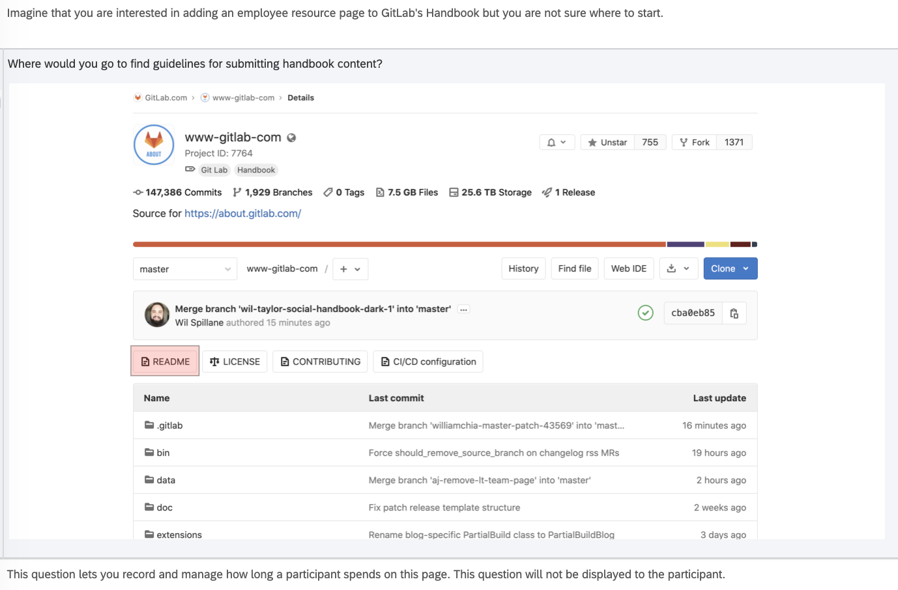
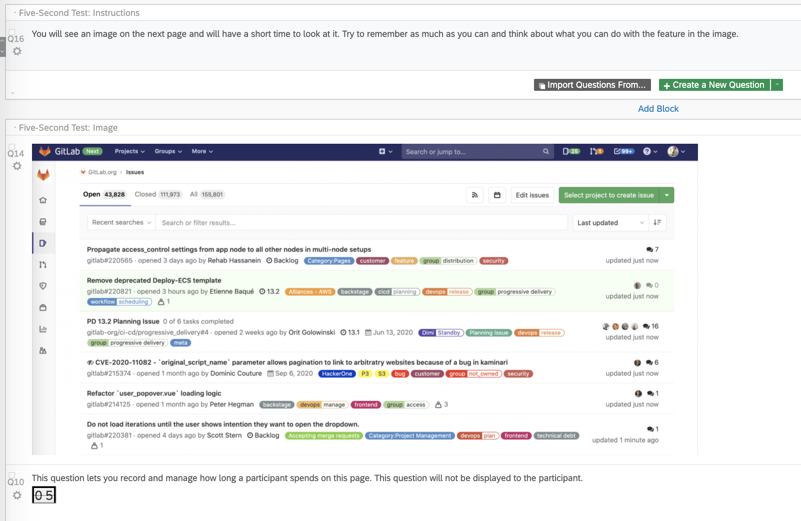

# On this page
{:.no_toc .hidden-md .hidden-lg}

- TOC
{:toc .hidden-md .hidden-lg}

## Creating design evaluations in Qualtrics 
There are often situations when teams have one or more potential solutions that meet user needs and are technically feasible. How should they move forward, when both designs could solve the problem? 

In this guide, you will learn about three methods you can use to evaluate designs in Qualtrics: 
* first-click testing
* preference testing
* five-second testing 

You can access a sample design evaluation survey in the UX Research & Product library in Qualtrics.

## How to plan a design evaluation study 
When evaluating designs, it’s best to start by [creating a hypothesis](/handbook/engineering/ux/ux-research-training/defining-goals-objectives-and-hypotheses/) about an aspect of the design. 

Consider the following questions as you determine your goals and objectives for the study: 
* Where are you most and least confident? 
What will happen as a result of including certain elements in one design versus other variations?
* What will determine whether this design is successful?

After determining what you need to test, you then need to identify ways to measure the success of the design. 

Usability metrics help you answer questions about the usability of your design. Whether you have questions about findability or readability or you just want to know the preferred option, usability metrics can outline a clear goal for your study and improve your analysis.

Some common usability metrics include:
* success rate 
* time on task 
* error rate
* satisfaction
* confidence 

NNGroup has a [great article](https://www.nngroup.com/articles/usability-metrics/) that can provide more insight into usability metrics.

## Creating a first-click test in Qualtrics
First Click Testing enables you to see users’ first instincts when completing a task. In Qualtrics, you can use a combination of [Descriptive Text](https://www.qualtrics.com/support/survey-platform/survey-module/editing-questions/question-types-guide/static-content/descriptive-text-and-graphic/), [Heatmap](https://www.qualtrics.com/support/survey-platform/survey-module/editing-questions/question-types-guide/specialty-questions/heat-map/), and [Timing](https://www.qualtrics.com/support/survey-platform/survey-module/editing-questions/question-types-guide/advanced/timing/) question types to create task scenarios and record the respondent’s first click on the image.

After logging into Qualtrics, click on “Projects” in the top navigation and click “Create a new project.” 

If you plan to create your own survey from scratch, first you should select “Create a new CoreXM” and then “Create your own survey.” 

You can then choose to create a blank project or make a copy of the sample design evaluation survey in the UX Research & Product Library. 

The first step in creating a first-click test is to use a `Descriptive Text` question to set up the task scenario:
* Create a new survey block.
* Create a New Question.
* From the Change Question Type dropdown, select ‘Descriptive Text’.

Then you can use the following steps to set up a `Heatmap` question:
* Create a New Question.
* From the Change Question Type dropdown, select ‘Heat Map’.
* Click ‘Select a graphic to use for this question’.
* Select a graphic you’ve already uploaded to your Qualtrics account (or upload a new one from your computer).
* Set the number of clicks each respondent may make on the image (‘1’ is the default). Note, if the respondent clicks more than the allowed number of times, their oldest click will be replaced with the newest one.
   * If you plan to analyze the data based on the user’s initial instinct, you should allow one click. 
   * If you want to evaluate multiple correct locations or see the user’s first click and last click, you should allow more than one click.
* Click ‘Add Region’
   * Regions are not required for a Heat Map question, but they can make reporting easier. If you do not add regions for the correct locations, all the "clicks" will be grouped as "Other" in the data report from Qualtrics. Adding regions will help you calculate the percentage of users who clicked in the correct location more efficiently.
* Click and drag the region to move it, or click and drag the corners to resize it.
* Click the text box beneath the region to type a region name (make sure to use a descriptive name as this name will not display to respondents, but will be used in your survey results).

After setting up the `Heatmap` question, you can create another block in your survey and add a [Text Entry](https://www.qualtrics.com/support/survey-platform/survey-module/editing-questions/question-types-guide/standard-content/text-entry/) question to have the user explain their motivation for clicking in a certain area. You can also use a [Multiple Choice](https://www.qualtrics.com/support/survey-platform/survey-module/editing-questions/question-types-guide/standard-content/multiple-choice/) question to have them rate their level of confidence.

Example questions: 
* Why did you click there?
* How confident are you that you clicked the correct location?

## Creating a preference test in Qualtrics 
Preference tests help you choose between design variations by asking users to select their preferred option. You can have the user select a preference based on the appearance of the design, how well it communicates information, or other qualities that evaluate your hypothesis. 

Preference testing can be used to evaluate a variety of designs: icons, mockups, color palettes, design components, and more.  

In Qualtrics, you should use the ‘Single Answer, Vertical, Graphic’ type of  `Multiple Choice` question to set up a preference test. Follow that question with a `Text Entry` question to understand why they chose that option.

Example questions:
* Why did you prefer that design?
* Why did you pick that option?
* Why did that option seem like the most [adjective] one?

## Creating a five-second test in Qualtrics 
Five-second tests help you to measure how well a design quickly communicates a message. Participants use their memory and impression of a design to answer questions, after seeing it for just 5 seconds.

This test can be created with the [Timing](https://www.qualtrics.com/support/survey-platform/survey-module/editing-questions/question-types-guide/advanced/timing/) question in Qualtrics.

First, you’ll need to set expectations for the test. Create a survey block with a Descriptive Text question that includes text such as `You will see an image on the next page and will have a short time to look at it. Try to remember as much as you can and think about what you can do with the feature in the image.` 

The next survey block should include a [Graphic](https://www.qualtrics.com/support/survey-platform/survey-module/editing-questions/question-types-guide/static-content/descriptive-text-and-graphic/) followed by a `Timing` question set to a five-second time limit. 

In the next survey block, you can follow up with `Text Entry` or `Multiple Choice` questions that test the participant’s memory or understanding of the design.

Example questions: 
* What do you think this [item] does?
* What do you think you can do on this page?
* Which area of GitLab was shown in the image?

