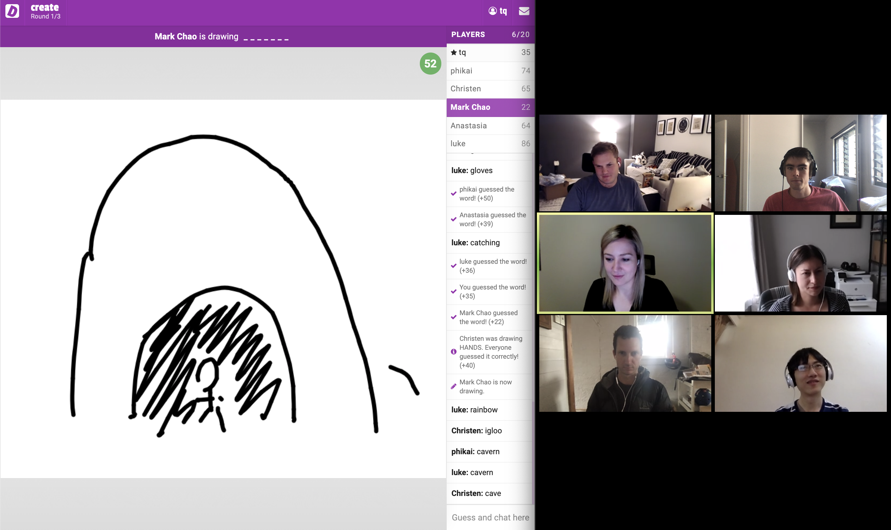

#### On this page
{:.no_toc .hidden-md .hidden-lg}

- TOC
{:toc .hidden-md .hidden-lg}

# 2020-04-17

## Interestings

### UX Showcase
[Libor Vanc](https://about.gitlab.com/company/team/#lvanc) and [Marcel van Remmerden](https://about.gitlab.com/company/team/#mvanremmerden) presented what they worked on over the last weeks in our biweekly UX Showcase session.

**Mass integrations at Group and Instance Level** (_Libor Vanc_)

<figure class="video_container">
  <iframe src="https://www.youtube.com/embed/IcOzDhbzlX8" frameborder="0" allowfullscreen="true"> </iframe>
</figure>

**Dark Mode for the Web IDE** (_Marcel van Remmerden_)

<figure class="video_container">
  <iframe src="https://www.youtube.com/embed/14E2A3BQ13w" frameborder="0" allowfullscreen="true"> </iframe>
</figure>

### Social Media Feedback

The work that [Pedro Moreira da Silva](https://about.gitlab.com/company/team/#pedroms) and the Source Code team did on file icons in the repository view got a lot of love on Twitter.

{::options parse_block_html="false" /}

<blockquote class="twitter-tweet">
I have no idea when did GitLab do this, but these new icons look amazing! <a href="https://t.co/lCSZTEYD4P">pic.twitter.com/lCSZTEYD4P</a>
&mdash; Peter Aleksander Bizjak (@peteralexbizjak) <a href="https://twitter.com/peteralexbizjak/status/1250067205003378690?ref_src=twsrc%5Etfw">April 14, 2020</a></blockquote>  

<blockquote class="twitter-tweet">
<a href="https://twitter.com/gitlab?ref_src=twsrc%5Etfw">@gitlab</a> update folder &amp; files icons, I think it&#39;s nice now 👍 <a href="https://t.co/731bEwMn7Q">pic.twitter.com/731bEwMn7Q</a>
&mdash; Maher El Gamil (@maherbusnes) <a href="https://twitter.com/maherbusnes/status/1250003803253936129?ref_src=twsrc%5Etfw">April 14, 2020</a></blockquote>  

### 13.0 Kickoff

With 13.0, we finally have the next major release coming up! To stay up to date about what the other stages outside of Dev are working on, have a look at the recording of our Kickoff livestream:

<figure class="video_container">
  <iframe src="https://www.youtube.com/embed/knWoPiKiwuw" frameborder="0" allowfullscreen="true"> </iframe>
</figure>

In case you would like more details what each group in Dev is working on, you can also have a look at each one of their kickoff videos.

- **Manage**
    - [Access, Compliance, Import, Analytics, Spaces](https://www.youtube.com/watch?v=dSHV9j4NAQI)
- **Plan**
    - [Project Management](https://www.youtube.com/watch?v=xv4vvEFGurE)
    - [Portfolio Management](https://www.youtube.com/watch?v=IMS3m9ZwCQk)
    - [Certify](https://www.youtube.com/watch?v=vgzhnfVYJdk)
- **Create**
    - [Source Code](https://www.youtube.com/watch?v=f0Ubhs1LYFk)
    - [Knowledge](https://www.youtube.com/watch?v=QGhQ3difI0c)
    - [Static Site Editor](https://www.youtube.com/watch?v=tEd-uhUZgF0)
    - [Editor](https://www.youtube.com/watch?v=DVB8A1lyWXU)
    - [Ecosystem](https://www.youtube.com/watch?v=ZJJuGXFlo4A)

## Social and fun

### Virtual pizza party

Even though we all work remotely, we like to be social. As meeting up with each other and making use of our [Visiting Grant](/handbook/incentives/#visiting-grant) has become impossible during these weeks, we organized a virtual pizza party for our team and exchanged stories about food, culture and the current situation for all the countries we are based in.

### Create Team Day

The Create team got inspired by their friends from the Plan stage and socialized during the Create Team Day with [Drawasaurus](https://www.drawasaurus.org/), Mario Kart and [6 nimmt](http://boardgamearena.com/).

