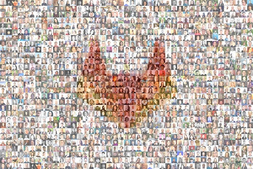

#### On this page
{:.no_toc .hidden-md .hidden-lg}

- TOC
{:toc .hidden-md .hidden-lg}

# 2020-04-24

## Interestings

### 12.10 released

There are [74 changes and improvements](https://about.gitlab.com/releases/2020/04/22/gitlab-12-10-released/) in this release! At least, that's my best guess based on counting the number of `h3` tags in the browser console: `> document.querySelectorAll("h3")`

Key features and highlights from Dev section:

- Requirements Management ([video](https://youtu.be/uSS7oUNSEoU))
- Issue and Epic Health Status
- View Issue and Merge Request feed by newest activity first

### What's planned for 13.0?

#### Create:Editor Group

[Mike Nichols](https://about.gitlab.com/company/team/#lvanc) shares what the Editor group will focus on for the  13.0 release.

<figure class="video_container">
  <iframe src="https://www.youtube.com/embed/wXi-3asYU0g?enablejsapi=1&origin=https%3A%2F%2Fabout.gitlab.com" frameborder="0" allowfullscreen="true"> </iframe>
</figure>

#### Create:Ecosystem Group

[Libor Vanc](https://gitlab.com/lvanc) shares what the Ecosystem group will focus on for the  13.0 release.

<figure class="video_container">
  <iframe src="https://www.youtube.com/embed/cJbjBKS1gJI?enablejsapi=1&origin=https%3A%2F%2Fabout.gitlab.com" frameborder="0" allowfullscreen="true"> </iframe>
</figure>

#### Create:Static Site Editor Group

[Michael Le](https://gitlab.com/mle) shares what the Static Site Editor group will focus on for the  13.0 release.

<figure class="video_container">
  <iframe src="https://www.youtube.com/embed/-lroimS5NSw?enablejsapi=1&origin=https%3A%2F%2Fabout.gitlab.com" frameborder="0" allowfullscreen="true"> </iframe>
</figure>

### Product Development Timeline

The [Product Development Timeline](/handbook/engineering/workflow/#product-development-timeline) guides our workflow so we can maintain a cadence of monthly milestone releases.

As more product plans for 13.0 are solidified, we will have more updates about what other stage groups are up to next week.

### Fun Stuff

#### Virtual Contribute 2020

Even though we couldn't all get together in person this year, [Nathan Friend](https://gitlab.com/nfriend) created a mosaic poster of the team to celebrate the end of Contribute 2020.

<a href="https://drive.google.com/drive/folders/1NGxgixIx5YstXVPb417ttIFM-GVplJGo">
  
   Download from Drive
</a>

