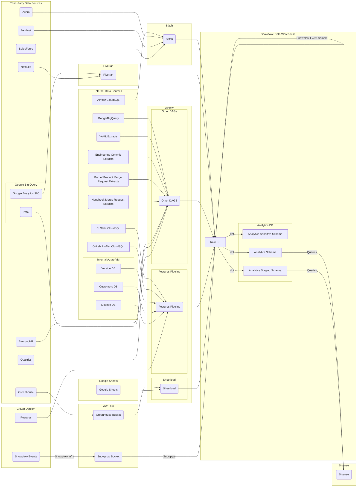

## On this page
{:.no_toc .hidden-md .hidden-lg}

- TOC
{:toc .hidden-md .hidden-lg}

{::options parse_block_html="true" /}

## Quick Links

[Airflow](https://airflow.gitlabdata.com){:.btn .btn-purple-inv}
[Data Image Project](https://gitlab.com/gitlab-data/data-image){:.btn .btn-purple-inv}
[GitLab Data Utils Project](https://gitlab.com/gitlab-data/gitlab-data-utils/){:.btn .btn-purple-inv}
[Python Guide](/handbook/business-ops/data-team/platform/python-guide){:.btn .btn-purple-inv}

## System Diagram



## Airflow

We use Airflow for all Orchestration.

### In Production

All DAGs are created using the `KubernetesPodOperator`, so the airflow pod itself has minimal dependencies and doesn't need to be restarted unless a major infrastructure change takes place.

There are 4 containers running in the current Airflow deployment as defined in the [deployment.yml](https://gitlab.com/gitlab-data/data-image/blob/master/airflow_image/manifests/deployment.yaml):

1. A sidecar container checks the repo activity feed for any merges to master. If there was one, the sidecar will reclone the repo so that Airflow runs the freshest DAGs.
1. The Airflow scheduler
1. The Airflow webserver
1. A cloudsql proxy that allows Airflow to connect to our cloudsql instance

#### Kubernetes Setup

We run in the `gitlab-analysis` project in Google Coud Platform (GCP). Airflow runs in the `data-ops` cluster.

##### Nodepools

Within this cluster there are 4 nodepools: `highmem-pool`, `production-task-pool`, `testing-pool`, and `sdc-1`.  Each nodepool has a dedicated use for ease of monitoring and resource management.

1) `highmem-pool` - used to run the Airflow server, scheduler, and network components.  Autoscales from 1-2 nodes.
2) `production-task-pool` - used to run most production Airflow tasks except SCD tasks.  Autoscales from 1-5 nodes.
3) `sdc-1` - used to run production SCD extractions.  Autoscales from 1-3 nodes.
4) `testing-pool` - a pool that does not usually have a running node, but is used to run engineer's locally-launced Airflow tasks.  Autoscales from 0-1 nodes.

All nodepools except the `highmem-pool` have labels and [taints](https://kubernetes.io/docs/concepts/configuration/taint-and-toleration/) to manage which nodepool launches which Airflow task. For a task to be scheduled in a nodepool, a task must have nodeAffinity for the pool and it must have a toleration that matches the taint. See [this MR](https://gitlab.com/gitlab-data/analytics/merge_requests/2006/diffs) where we added the affinity and toleration for the Slowly-Changing Dimensions task for our postgres pipeline jobs.

##### DNS

To enable the URL airflow.gitlabdata.com to point to our cluster, a static IP was provisioned in the us-west1 region using the command `gcloud compute addresses create airflow-west --region=us-west1`. The IP generated was `35.233.169.210`. This is available by running `gcloud compute addresses list`. Note that the static IP must be a regional and not global IP for the TLS steps to work.

This was mapped to the domain in Route 53 by the infrastructure team, documented in [this issue](https://gitlab.com/gitlab-com/gl-infra/infrastructure/issues/9267).

##### TLS

A certificate was generated for the airflow.gitlabdata.com domain via [this infrastructure issue](https://gitlab.com/gitlab-com/gl-infra/infrastructure/issues/9205).
This certificate was saved to a kubernetes secret by running the command `kubectl create secret tls airflow-tls --cert=airflow.gitlabdata.com.chained.crt --key=airflow.gitlabdata.com.key` - these are the actual filenames for the chained certificate and key.
This created the secret `airflow-tls`.
The certificate files (site, chain, chained (site+chain), and key) are also stored in the Data Team Secure vault in 1password.

We decided to use the [NGINX Ingress Controller](https://kubernetes.github.io/ingress-nginx/) since it has excellent built-ins for redirecting and enforcing TLS.
NGINX was installed into the cluster with this command `helm install airflownginx stable/nginx-ingress --values nginx_values.yaml`. The [NGINX value file](https://gitlab.com/gitlab-data/data-image/-/blob/93b20e4286d2a383e46eac091c68d162156223bd/airflow_image/manifests/nginx_values.yaml) defines what the load balancer IP address is. The load balancer IP is set to the address generated in the previous section.
The values passed into the install command are expanded in the [controller-deployment.yaml file](https://github.com/helm/charts/blob/b7afaf9d8875f6aa1cfed4c0422cb28e51d823a3/stable/nginx-ingress/templates/controller-deployment.yaml#L111-L117).

If NGINX needs to be deleted and reinstalled that can be done via `helm delete airflownginx`.

The [ingress definition](https://gitlab.com/gitlab-data/data-image/-/blob/93b20e4286d2a383e46eac091c68d162156223bd/airflow_image/manifests/ingress.yml) was also updated with these settings:

- [force-ssl-redirect](https://kubernetes.github.io/ingress-nginx/user-guide/nginx-configuration/annotations/#server-side-https-enforcement-through-redirect) is true
- tls is set for airflow.gitlabdata.com using the `airflow-tls` kubernetes secret
- All traffic matching the host is sent to the `airflow-webserver` service and not the [default backend](https://kubernetes.github.io/ingress-nginx/user-guide/default-backend/)

Although not strictly necessary, I found it cleaner to delete the ingress when applying changes. This can be done via the UI in GCP or via the command `kubectl delete ingress airflow-ingress`.
Applying the new configuration is done via the command `kubectl apply -f ingress.yaml`

### GCP IAM
{: #gcp-iam}

It is recommended for Engineers to have the following permissions for GCP:

- Cloud SQL Admin
- Kubernetes Engine Admin
- Storage Admin

For developing with Airflow locally, Engineers will also need a service account. These credentials should point to a service account provisioned by your manager. The account should follow the same pattern as your email i.e. `tmurphy@gitlab-analysis.iam.gserviceaccount.com`. Recommended permissions are:

    * Cloud SQL Client
    * Kubernetes Engine Developer
    * Storage Object Creator
    * Storage Object Viewer

The service account key should be downloaded as JSON and sent to the user for secure storage on their computer.

#### Provisioning a Service Account

- Navigate to the [Service Account section of the gitlab-analysis GCP project](https://console.cloud.google.com/iam-admin/serviceaccounts?project=gitlab-analysis)
- Click `Create Service Account`
- For an individual user, the name should follow the first initial last name pattern
- Indicate it's a service account for a specific person
- Give the service account relevant permissions
- Grant the service account to the user
- Generate a JSON key for the service account and send to user

### Handling Failed Jobs

There should never be more than one failed DAG run visible for any DAG at one time. For incremental jobs that rely on the `execution_date`, such as the extract from the gitlab.com database, any failed DAGs need to have their task instances cleared so that they can be rerun once the fix has been applied.

For jobs that are not dependent on `execution_date` the job should be rerun manually when the fix is applied and the failed DAGrun(s) should be deleted. If there is a failed DAGrun for a DAG it should mean that the current state of that DAG is `broken` and needs to be fixed.

This will make it easier to glance at the list of DAGs in Airflow and immediately know what needs attention and what doesn't.

#### Backfills

If incremental runs are missed for a given DAG or there is missing data in a table, there are two ways to do a backfill. If the table is small and a backfill would be relatively quick then dropping the table and doing a full sync is an option. However, for times when a DAG is stopped due to upstream errors, this may not be possible when there are a large number of tables.

In the latter case, it is better to run the backfill command in the airflow scheduler pod container. The command is:

`airflow backfill gitlab_com_db_extract -s 2019-10-30T00:00:00 -e 2019-11-04T12:00:00 --delay_on_limit 30 --reset_dagruns`

This will clear any DAGruns and task instances that already exist for the given time frame while also generating any new DAGruns that don't exist for the time frame. The [Airflow documentation for the CLI](https://airflow.apache.org/cli.html#backfill) details what the flags are.

If DAG runs already exist for the timeframe that is being backfilled, the tasks may run concurrently when running the command above.  If the DAGs need to run serially:

- First turn off the scheduling of the DAG.
- Then go into the Airflow UI, go to Browse, click on DAG runs.  Then, use the search bar to filter to the DAG that is going to be backfilled.  Select all DAG runs that are going to be backfilled over and go to `Actions` --> `Delete`.
- Now, with the DAG runs deleted, airflow will run the tasks serially.  However, since the tasks are not deleted, Airflow will probably not actually run the tasks.  So, to clear the tasks, go to `Browse` --> `Task Instances` and use the search bar and sorting to select the task instances that need to be ran again.  With those task instances selected, go to `Actions` --> `Clear` to clear the state of those task instances.
- With that cleared up, go back to the DAG and turn scheduling back on.
- Then run the backfill command above, but leave off `--reset_dagruns` because there are no dagruns to reset.  This should make the backfill run serially.

### In Merge Requests

To facilitate the easier use of Airflow locally while still testing properly running our DAGs in Kubernetes, we use docker-compose to spin up local Airflow instances that then have the ability to run their DAG in Kubernetes using the KubernetesPodOperator. See the [Docker section](/handbook/business-ops/data-team/platform/infrastructure/#docker) to ensure you have the proper environment variables configured.

The flow from code change to testing in Airflow should look like this (this assumes there is already a DAG for that task):

1. Commit and push your code to the remote branch.
1. Run `make init-airflow` to spin up the postgres db container and init the Airflow tables, it will also create a generic Admin user. You will get an error if Docker is not running.
1. Run `make airflow` to spin up Airflow and attach a shell to one of the containers
1. Open a web browser and navigate to `localhost:8080` to see your own local webserver. A generic Admin user is automatically created for you in MR airflow instances with the username and password set to `admin`.
1. In the airflow shell, run a command to trigger the DAG/Task you want to test, for example `airflow run snowflake_load snowflake-load 2019-01-01` (as configured in the docker-compose file, all kube pods will be created in the `testing` namespace). Or if you want to run an entire DAG (for instance the `dbt` DAG to test the branching logic), the command would be something like `airflow backfill dbt -s 2019-01-01T00:00:00 -e 2019-01-01T00:00:00`.
1. Once the job is finished, you can navigate to the DAG/Task instance to review the logs.

There is also a `make help` command that describes what commands exist and what they do.

Some gotchas:

- Ensure you have the latest version of Docker. This will prevent errors like `ERROR: Version in “./docker-compose.yml” is unsupported.`
- If you're calling a new python script in your dag, ensure the file is executable by running `chmod +x your_python_file.py`. This will avoid permission denied errors.
- Ensure that any new secrets added in your dag are also in `kube_secrets.py`. This is the source of truth for which secrets Airflow uses. The actual secret value isn't stored in this file, just the pointers.
- If your images are outdated, use the command `docker pull <image_name>` to force a fresh pull of the latest images.
- If you get an error like: "could not find an available, non-overlapping IPv4 address pool among the defaults to assign to the network", try turning off any VPN you have running.

### Video Walk Throughs

- [Airflow pt 1](https://drive.google.com/open?id=1S03mMINXJFXekeixcJS2tN4T62qYchej)
- [Airflow pt 2](https://drive.google.com/open?id=1zZGtSZIvSwHvhu2sEgGm4LjvbLim5KME)

### Troubleshooting Local Airflow Config

#### No Such File or Directory: 'Users/(user)/google-cloud-sdk-bin/gcloud'

```
FileNotFoundError: [Errno 2] No such file or directory: '/Users/(user)/google-cloud-sdk/bin/gcloud': '/Users/(user)/google-cloud-sdk/bin/gcloud'
```

This is because the default install location for the Google Cloud SDK on a Mac is now the above,
but on linux, and in containers it is installed to `/usr/lib/google-cloud-sdk/bin/gcloud`. This value is passed
to the container from the `/.kube/config` file.

To correct this error all you need to do is edit your `/.kube/config` and update the command path parameter to where it will be in the container: `/usr/lib/google-cloud-sdk/bin/gcloud`
That file gets updated everytime you install the SDK or run this command: `gcloud container clusters get-credentials data-ops`.
See related [issue](https://gitlab.com/gitlab-data/analytics/-/issues/5012) for more info

### Project variables

Our current implementation uses the following project variables:

- SNOWFLAKE_ACCOUNT
- SNOWFLAKE_REPORT_WAREHOUSE
- SNOWFLAKE_{FLAVOR}_USER
- SNOWFLAKE_{FLAVOR}_PASSWORD
- SNOWFLAKE_{FLAVOR}_DATABASE
- SNOWFLAKE_{FLAVOR}_ROLE
- SNOWFLAKE_{FLAVOR}_WAREHOUSE

The following flavors are defined:

- `LOAD` flavor is used by the Extract & Load process
- `TRANSFORM` flavor is used by the Transform process
- `TEST` flavor for testing using Snowflake
- `PERMISSION` flavor for the permission bot
- `SYSADMIN` flavor for housekeeping tasks (like setting up review instances). This flavor doesn't define `SNOWFLAKE_SYSADMIN_DATABASE` and `SNOWFLAKE_SYSADMIN_WAREHOUSE`.

The following variables are set at the job level dependending on the running environment **and should not be set in the project settings**.

- SNOWFLAKE_USER
- SNOWFLAKE_PASSWORD
- SNOWFLAKE_ROLE
- SNOWFLAKE_DATABASE
- SNOWFLAKE_WAREHOUSE

### Airflow Monitoring and Alerting

#### Monitoring

- Airflow metric values can be explored with [Thanos](https://thanos-query.ops.gitlab.net/graph?g0.range_input=2w&g0.max_source_resolution=0s&g0.expr=airflow_scheduler_heartbeat_interval&g0.tab=0). 
- Airflow is monitored by our internal Prometheus cluster.  Prometheus monitors Airflow by making a GET request to the [`/admin/metrics` endpoint](https://airflow.gitlabdata.com/admin/metrics/) on a regular interval. 
- The metrics endpoint exposes metrics which are made available by our customized version of [airflow-prometheus-exporter](https://gitlab.com/gitlab-data/airflow-prometheus-exporter) which is packaged into the GitLab Airflow Docker image.
- The package airflow-prometheus-exporter comes preconfigured to pull many different metrics about the airflow server, tasks, and DAGs.  The package can also pull metrics from what are known as [XComs](https://airflow.apache.org/docs/stable/concepts.html#concepts-xcom).  Tasks can pass data between each other using XComs.  When an XCom is returned from a task, it gets stored in the Airflow database.  The prometheus exporter reads the Airflow database and so is able to use XCom values as metrics.
- To make the KubernetesPodOperator return an XCom, first the task must have XCom passing enabled like [this one](https://gitlab.com/gitlab-data/analytics/-/blob/master/dags/extract/bamboohr_extract.py#L75).  The Airflow version we are on is between versions of how to enable XComs, which is why this one may have two different booleans to enable XCom passing.  After the KubernetesPodOperator has XComs enabled, the code it runs must write a json object to a specific file.  In order to make this easy and to abstract away where that file is, `gitlabdata.orchestration_utils.push_to_xcom_file` has been created.  This function takes a JSON object and writes it to the XCom file.  This function should only be called once per task. To use a value in an XCom as a metric, the metric must be a first-class member of the JSON object that is written to the XCom file.  For example, `{"record_count": 5, "other_record_count": 6}` would work if you want to use `record_count` and `other_record_count` as metrics.
- To enable the prometheus-exporter to use an XCom as a metric, simply add the name of the task and the name of the metric to [this configuration](https://gitlab.com/gitlab-data/data-image/-/blob/master/airflow_image/prometheus_config.yml).  If there is a metric that should be imported for all airflow tasks, then the task name `all` can be used.  Once the configuration is changed, for the metric to be visible, the airflow image will have to be rebuilt and redeployed as explained in the "Restart Deployment and Pods" section.

#### Alerting
- Alerts based on the metrics mentioned above are defined in the runbooks repository in the [`rules/airflow.yml` file](https://gitlab.com/gitlab-com/runbooks/-/blob/master/rules/airflow.yml).  A new alert can be added by adding to the `rules` list.  The `expr` element is a PromQL expression that should return 1 when alerting, and returns 0 otherwise.  The `for` element defines how long the expression must evaluate to `1` for before the Alert is actually triggered.  Labels should include a severity.  The severity is currently defined GitLab system-wide, so should be low severity for Airflow rules unless the GitLab infrastructure member on call should pay attention to it.  The `team` label ultimately determines which slack channel receives the alerts. The `team` label should be set to `data-analytics` for all alerts for the data team because `data-analytics` is the name of the team setup in [the runbook service catalog](https://gitlab.com/gitlab-com/runbooks/-/merge_requests/2738/diffs#e0a80850fadbbea8ae97d9821ef8037aa6b02348_122_122).
- Prometheus alerts assigned to the data-analytics team are sent to the `data-prom-alerts` Slack channel which should be investigated and addressed by the team member on triage.

### Common Airflow and Kubernetes Tasks

#### Tips

- We recommend aliasing `kubectl` as `kbc`

#### Debugging Airflow Problems

Sometimes things break and it's not clear what's happening. Here are some common things to check.

- [GCP Error Reporting](https://console.cloud.google.com/errors?time=P1D&order=COUNT_DESC&resolution=OPEN&resolution=ACKNOWLEDGED&project=gitlab-analysis) - This can be very useful for determining what errors are happening in Airflow and across the project
    - The GCP error report was useful when the [cluster was down in February 2020](https://gitlab.com/gitlab-data/analytics/issues/3757). The errors were reporting that the application was out of storage. This led to the fix described in [Managing Persistent Volume Claim](/handbook/business-ops/data-team/platform/infrastructure/#managing-pvc)
- Check the Workloads and Services & Ingress sections in the [Kubernetes section of GCP](https://console.cloud.google.com/kubernetes/list?project=gitlab-analysis). Notice if there are any warnings or errors there
- Run `kubectl get pods` and see if one labeled `airflow-deployment` comes back. Try to `exec` into the pod

#### Connecting to the Kubernetes Airflow Cluster:

1. [Install Kubectl](https://kubernetes.io/docs/tasks/tools/install-kubectl/#install-with-homebrew-on-macos)

1. Connect it to the data team cluster by running -> `gcloud container clusters get-credentials data-ops --zone us-west1-a --project gitlab-analysis`

1. Run `kubectl get pods` and make sure it returns successfully

1. _ALL OF YOUR COMMANDS TOUCH PRODUCTION, THERE IS CURRENTLY NO TESTING ENVIRONMENT IN Kubernetes_. The canonical way to test is to use the local docker-compose setup.

#### Access Airflow Webserver UI

- `kubectl port-forward deployment/airflow-deployment 1234:8080`. You can now navigate to `localhost:1234` in a browser and it will take you to the webserver for the instance you port-forwarded to. Note: We no longer needd to do this as we now have a stable URL to access.

#### Updating Airflow

- Bump the version in the `airflow_image/Dockerfile`, the line looks like `ARG AIRFLOW_VERSION=<version_number>`
- Delete and recreate the deployment.  See the `Restart Deployment and Pods` section below for specific directions for this step.
- `exec` into one of the containers in the pod and run `airflow upgradedb`

#### View Resources

- `kubectl get all`. This will display any pods, deployments, replicasets, etc.
- `kubectl get pods` command to see a list of all pods in your current namespace.

#### View Persistent Volumes

- To see a list of persistent volumes or persistent volume claims (where the logs are stored), use the commands `kubectl get pv` and `kubectl get pvc` respectively. The command to get persistent volumes will show all volumes regardless of namespace, as persistent volumes don't belong to namespaces. Persistent volume claims do however belong to certain namespaces and therefore will only display ones within the namespace of your current context.

#### Restart Deployment and Pods

The resource manifests for kubernetes live in `airflow-image/manifests/`. To create or update these resources in kubernetes first run `kubectl delete deployment airflow-deployment` and then run `kubectl apply -f <manifest-file.yaml>`. Because we are using a persistent volume that can only be claimed by one pod at a time we can't use the usual `kubectl apply -f` for modifications. A fresh deployment must be set up each time.

- For example, if you need to force a pod restart, either because of Airflow lockup, continual restarts, or refresh the Airflow image the containers are using, run `kubectl delete deployment airflow-deployment`. This will wipe out any and all pods (including ones being run by airflow so be careful). Then from the `data-image` repository root folder, run `kubectl apply -f airflow_image/manifests/deployment.yaml` to send the manifest back up to Kubernetes and respawn the pods.

#### Access Shell with Pod
{: #access-pod}

- To get into a shell that exists in a kube pod, use the command `kubectl exec -ti <pod-name> -c <container-name> /bin/bash`. This will drop you into a shell within the pod and container that you chose. This can be useful if you want to run airflow commands directly within a shell instead of trying to do it through the webserver UI.

    - `kubectl exec -ti airflow-deployment-56658758-ssswj -c scheduler /bin/bash` Is an example command to access that pod and the container named `scheduler`. The container names are listed in `airflow_image/manifests/deployment.yaml`. This information is also available if you do `kubectl describe <pod>` thought it is harder to read.
        - Additional tip: there is no need to specify a resource type as a separate argument when passing arguments in resource/name form (e.g. 'kubectl get resource/<resource_name>' instead of 'kubectl get resource resource/<resource_name>'
    - You can also do this through docker compose commmands when running containers locally e.g.:
    - To get into an existing, running container
        - `docker-compose exec airflow_scheduler bash`
    - To spin up and bash into it:
        - `docker-compose run airflow_scheduler bash`

- Things you might do once you're in a shell:

    - Trigger a specfic task in a dag:
        - Template: `airflow run <dag> <task_name> <execution_date> -f -A`
        - Specific example: `airflow run dbt dbt-full-refresh 05-02T15:52:00+00:00  -f -A`
        - The `-f` flag forces it to rerun even if there was already a success or failure for that task_run, the `-A` flag forces it to ignore dependencies (aka doesn’t care that it wasn’t branched to upstream)

#### Updating Secrets

- The easiest way to update secrets in the prod environment is to use the command `kubectl edit secret airflow -o yaml`, this will open the secret in a text editor and you can edit it from there. New secrets must be base64 encoded, the easiest way to do this is to use `echo -n <secret> | base64 -`. There are some `null` values in the secret file when you edit it, for the file to save successfully you must change the `null` values to `""`, otherwise it won't save properly.
- When adding new secrets, also make sure to add the secret, with an appropriate value, to the testing environment.  The command for this is `kubectl edit secret airflow -o yaml --namespace testing`.  This command follows the same guidelines as those described above for production.  If you don't add new secrets to the testing environment, the DAGs that use them will not run when testing.

#### Stopping a Running DAG

- Navigate to the graph view of the dag in question
- Select the task in the graph view
- In the modal that pops up select either Mark Failed or Mark Success with the Downstream option selected.
- Confirm in the [Kubernetes workloads tab](https://console.cloud.google.com/kubernetes/workload?project=gitlab-analysis&workload_list_tablesize=50) that the relevant pod is stopped. Delete it if necessary.

#### Running specific tasks within a DAG

- Get a shell running within a container with the command `kubectl exec -ti <pod_name> -c <webserver|scheduler> /bin/bash`
- For the simplest cases, `airflow run <dag_id> <task_id> <execution_date>` will be sufficient.
- For more complex cases, such as when you need to run a `dbt full-refresh`, a few more flags are required. `airflow run dbt dbt-full-refresh <execution_date> -f -A`. The `-f` flag forces the task to run even if it is already marked as a success of failure. The `-A` flag tells it to run regardless of any dependencies it should have.

#### Setting/Changing an Airflow variable

- On occasion, we use Airflow variables.  An Airflow variable is used right now to override the data integrity checks on the BambooHR data extract.  Airflow variables are stored within the Airflow database and are easily accessible in code running in Airflow by `from airflow.models import Variable` and then getting the variable value with `Variable.get(variable_name)`.
- In order to set a variable or change its value, go into the Airflow UI.  Click on the "Admin" tab, and then "Variables."  To add a new variable, press the `+` button.  Type in the desired key and value.  If the value should be encrypted, check the box.  Then press save.  To edit a variable, click on the edit icon next to the variable of interest and change what you would like.  Then press save.
- For the BambooHR integrity check bypass specifically, the variable key should be `BAMBOOHR_SKIP_TEST`.  The value should be a comma-separated list of the names of the tables you would like to temporarily skip testing.  Once the BambooHR extract has succeeded, please either remove the variable or change the value to an empty string.

#### Managing Persistent Volume Claim and its Data

{: #managing-pvc}

The persistent volume claim for Airflow is defined in the [`persistent_volume.yaml` manifest](https://gitlab.com/gitlab-data/data-image/-/blob/master/airflow_image/manifests/persistent_volume.yaml). It is used in the [deployment for logs](https://gitlab.com/gitlab-data/data-image/-/blob/master/airflow_image/manifests/deployment.yaml#L25-27) and writes to the [`/usr/local/airflow/logs` directory](https://gitlab.com/gitlab-data/data-image/-/blob/master/airflow_image/manifests/deployment.yaml#L76-77). If the persistent volume claim is full, there are two solutions:

- Increase the volume available for the claim
- Delete data from the claim

##### Deleting Data

- [Exec into the airflow-deployment pod](/handbook/business-ops/data-team/platform/infrastructure/#access-pod)
- Navigate to the `logs` directory
- Delete files

##### Increase Claim Size

- Navigate to the [Object Browser](https://console.cloud.google.com/kubernetes/object/browser?project=gitlab-analysis) and find the claim for the DataOps cluster under core > PersistentVolume
- Click through on the PersistentVolume - it should be `pvc-<GUID>`
- Look at the YAML for that volume and find the `pdName` under `gcePersistentDisk`. This is the GCE Disk that will need to be updated
- Go to the [Compute Disks section of GCP](https://console.cloud.google.com/compute/disks?project=gitlab-analysis) and find the referenced disk
- Click through on that disk and edit it to update the size
- Go back to the YAML for the PersistentVolume and update `storage` which is under `spec: capcacity:`
- The claim size should now be increased

Alternatively, you can update the `persistent_volume.yaml` definition in the project. However, redeploying this _may_ delete the data already in the claim. This has not been tested yet.

## Bash Scripting

- The data team maintains a [training on basic and advanced command line usage](https://gitlab.com/gitlab-data/managers/-/blob/master/training/command_line_training_guide.md).  This training also contains details about advanced bash scripting usage within the analytics repo.

## Docker

### Compose

We use Docker compose to [define and run](https://gitlab.com/gitlab-data/analytics/blob/master/docker-compose.yml) our different images and applications. These are activated by users via the [Makefile](https://gitlab.com/gitlab-data/analytics/blob/master/Makefile).

#### Environment Variables

There are a few environment variables you will need to properly use the Makefile and Docker Compose.

- `GIT_BRANCH` - typically a feature branch like `2112-my-feature`
- `KUBECONFIG` - Defines where Kubernetes credentials are stored on your local machine. `KUBECONFIG="/Users/tmurphy/.kube/config"`
- `GOOGLE_APPLICATION_CREDENTIALS` - CloudSQL credentials for connecting to GCP. Typically points to a JSON file - `GOOGLE_APPLICATION_CREDENTIALS="/Users/tmurphy/Projects/GitLab/gcloud_service_creds.json"`
    - These credentials should be provisioned following the instructions in the [GCP IAM section](/handbook/business-ops/data-team/platform/infrastructure/#gcp-iam)

### Images

#### Data

The `data_image` directory contains everything needed for building and pushing the `data-image`. If a binary needs to be installed it should be done in the Dockerfile directly, python packages should be added to the `requirements.txt` file and pinned to a confirmed working version.

#### Airflow

The `airflow_image` directory contains everything needed to build and push not only the `airflow-image` but also the corresponding Kubernetes deployment manifests. The only manual work that needs to be done for a fresh deployment is setting up an `airflow` secret. The required secrets can be found in `airflow_image/manifests/secret.template.yaml`.

The `default` airflow instance is the production instance, it uses the `airflow` postgres db. The `testing` instance uses the `airflow_testing` db.

The `default` instance logs are stored in `gs://gitlab-airflow/prod`, the `testing` instance logs are stored in `gs://gitlab-airflow/testing`

#### dbt

The `dbt_image` directory contains everything needed for building and pushing the `data-image`. If a binary needs to be installed it should be done in the Dockerfile directly, python packages should be added to the `requirements.txt` file and pinned to a confirmed working version. As this image is used by Data Analysts there should not be much more than dbt in the image.

### Creating New Images

Production images are only built when a git tag is pushed on the master branch. Our current release flow is as follows:

```
# Either on the master branch or in a feature branch run:
git tag v<sem_ver>

# Push the tag
git push origin $(git describe --tags --abbrev=0)
```

The build pipelines will automatically run. Make a new MR anywhere these images are referenced to update the tag.

## Python Housekeeping

There are multiple `make` commands and CI jobs designed to help keep the repo's python clean and maintainable. The following commands in the Makefile will help analyze the repo:

- `make lint` will run the `black` python linter and update files (this is not just a check)
- `make pylint` will run the pylint checker but will NOT check for code formatting, as we use `black` for this. This will check for duplicated code, possible errors, warnings, etc. General things to increase code quality. It ignores the DAGs dir as those are not expected to follow general code standards.
- `make radon` will test relevant python code for cyclomatic complexity and show functions or modules with a score of `B` or lower.
- `make xenon` will run a complexity check that returns a non-zero exit code if the threshold isn't met. It ignores the `shared_modules` and `transform` repos until they get deleted/deprecated or updated at a later date.

## Accessing peered VPCs

Some of the GitLab specific ELTs connect to databases which are in peered GCP projects, such as the usage ping. To allow connections, a few actions have been taken:

1. The Kubernetes cluster where the runner executes has been setup to use [IP aliasing](https://cloud.google.com/kubernetes-engine/docs/how-to/ip-aliases), so each pod gets a real routable IP within GCP.
1. A [VPC peering relationship](https://cloud.google.com/vpc/docs/vpc-peering) has been established between the two projects and their networks.
1. A firewall rule has been created in the upstream project to allow access from the runner Kubernetes cluster's pod subnet.

## Extractor Documentation

- [BambooHR](https://gitlab.com/gitlab-data/analytics/tree/master/extract/bamboohr)
- [Commit Stats (Engineering)](https://gitlab.com/gitlab-data/analytics/tree/master/extract/engineering)
- [YML files from the handbook](https://gitlab.com/gitlab-data/analytics/tree/master/extract/gitlab_data_yaml)
- [SheetLoad](https://gitlab.com/gitlab-data/analytics/tree/master/extract/sheetload)

## Updating the Runner

We execute our CI jobs in the [`gitlab-data` group](https://gitlab.com/groups/gitlab-data/-/settings/ci_cd) with Kubernetes via the `gitlab-analysis` GCP project. We have a group runner setup to share across all repos.

In the case where a new group runner token needs to be associated, or if we need to update the runner image. These are the basic steps. Note - since the release of helm 3, it is recommended that all of these commands be run in the Cloud Shell console in GCP. Navigate to the deployment for the runner (currently `gitlab-data-gitlab-runner`) and use the kubectl dropdown to enter the shell.

To get the credentials

`gcloud container clusters get-credentials bizops-runner --zone us-west1-a --project gitlab-analysis`

To see the helm releases

`helm list --namespace <namespace>`

To get the chart values for a specific release

`helm get values --namespace <namespace> <chartname>`

Prep commands

`helm repo add <chart> <url>`

`helm repo update`

To delete the runner

`helm delete --namespace <namespace> <chartname>`

To install the runner with the Helm chart

`helm install --namespace <namespace> --name <chartname> -f <valuesfile> <chartrepo/name>`

Example for updating the runner version or group token

```bash
helm list --namespace gitlab-data
helm get values --namespace gitlab-data gitlab-runner
helm get values --namespace gitlab-data gitlab-runner > values.yaml
helm repo add gitlab https://charts.gitlab.io
helm repo update
helm delete --namespace gitlab-data gitlab-runner
helm install --namespace gitlab-data --name gitlab-runner -f values.yaml gitlab/gitlab-runner
```

Our YAML configuration is as follows:

```yaml
affinity: {}
checkInterval: 30
concurrent: 10
gitlabUrl: https://gitlab.com
hostAliases: []
imagePullPolicy: IfNotPresent
metrics:
  enabled: true
nodeSelector: {}
podAnnotations: {}
podLabels: {}
rbac:
  clusterWideAccess: false
  create: false
  podSecurityPolicy:
    enabled: false
    resourceNames:
    - gitlab-runner
  serviceAccountName: gitlab-data-gitlab-runner
resources: {}
runnerRegistrationToken: <token found in https://gitlab.com/groups/gitlab-data/-/settings/ci_cd>
runners:
  builds: {}
  cache: {}
  helpers: {}
  image: ubuntu:16.04
  outputLimit: 4096
  pollTimeout: 180
  privileged: false
  services: {}
  tags: analytics,housekeeping
securityContext:
  fsGroup: 65533
  runAsUser: 100
```

## Manually updating Version and License DBs

### Getting Started with Version and License DB Imports

1. Create an issue in the GitLab Infrastructure Team project similar to [this issue](https://gitlab.com/gitlab-com/gl-infra/infrastructure/issues/10947)
1. Include the link to the [runbook](https://gitlab.com/gitlab-com/runbooks/-/blob/master/docs/uncategorized/cloudsql-data-export.md)
1. Assign to Devin Sylva (`@devin`)
1. Devin or someone on the infra team will upload to a GCS bucket in the `gitlab-internal` GCP project.

    - Ensure you have access to this project. Make an access request if you don't.

1. On the command line via `gsutil`, authenticate with both the `gitlab-analysis` and `gitlab-internal` GCP projects.  It seems that `gsutil` authenticates using `gcloud` so if authentication with `gcloud` is working, then `gsutil` should work as well.  To double check that authentication is working, attempt to run `gsutil ls gs://tmurphy-temp` and `gsutil ls gs://version-db-dmp`.  If either fail, it may mean that more permissions are needed or that you are using the wrong Google Cloud account.

    - Wrong Google Account: Double check the account you are using by running `gcloud auth list`.  The account with your email address as the name should be the active account, and can be set by running `gcloud config set account {ACCOUNT}`.
    - More Permissions Needed: Double check you can see the folders in the google cloud console: `tmurphy-temp` in the `gitlab-internal` project, and `version-db-dmp` in the `gitlab-analysis` project.

1. Copy the export to the `version-db-dmp` bucket with the command `gsutil cp gs://tmurphy-temp/version-data-2020-02-11.gz  gs://version-db-dmp/version-data-2020-02-11.gz` replacing `tmurphy-temp` with the bucket in `gitlab-internal` and adjusting the date as necessary.
1. Copy the export to the `license-db-dump` bucket in a similar way: `gsutil cp gs://tmurphy-temp/license-data-2020-07-27.gz gs://license-db-dump/license-data-2020-07-27.gz` replacing the bucket name and adjusting the date or file names.
1. After you have confirmed that both files were copied successfully, delete the entire bucket `tmurphy-temp` (or whatever it might be named) in `gitlab-internal` by using the GCP web UI.
1. Follow the Version DB specific and License DB specific instructions below.

#### Version DB Specific Instructions

1. Navigate to the [`version-db-dump` CloudSQL instance](https://console.cloud.google.com/sql/instances/version-db-dump/overview?project=gitlab-analysis&duration=PT1H)
1. Click over to Databases and delete `versiondb`
1. Once that is done, on the same screen click `Create database` and name it `versiondb`. Having the exact name is important for permissioning.
1. Once that is done, navigate back to `Overview` and select `Import` at the top of the screen.

    - Select the `version-db-dmp` bucket and find the file you copied over.
    - Select the `versiondb` as the database to import it into.

1. Click `Import`. This will take a while.

    - This step often raises an error on Google's side such as the below:
    - Do not click retry, the DB should still be importing(which can be confirmed via the db activity monitor) this appears to be a bug on Google's side and can be ignored.

1. Once this is done, login to [Stitch](https://app.stitchdata.com/session/create) and find the "Version DB Dump stitch" job. It should be set to "Paused" and have a gray icon.
1. Click into the job and navigate to the "Extractions" tab and click "Run extraction".
1. When the extraction completes there should be a message saying `Exit status is: Discovery succeeded. Tap succeeded. Target succeeded.` as the last log entry for the integration.
1. To confirm your results you can then run `select max(updated_at) from raw.version_db_dump_stitch.users` in Snowflake. The integration from Stitch is not immediate so you may need to wait a while before this is refreshed.
1. Once the extraction is run and everything is loaded there is nothing else to do in Stitch.

This process is demonstrated in an internal video [here](https://drive.google.com/file/d/1NXnPrpurPrTC-amJGx86K0g1GRVvX_h7/view?usp=sharing).

#### Connecting to the Version DB Dump CloudSQL instance

In case there is a need to connect a SQL client to the CloudSQL version DB Dump instance, the following steps can be followed.
Generally, there should not be a need to follow these steps when updating the DBs.

1. In order to get a SQL connection to the version db dump postgres database, [install the cloudSQL proxy](https://cloud.google.com/sql/docs/postgres/connect-admin-proxy#install) in your home directory.
1. To make the proxy command easier, we would recommend setting the following alias `alias versiondb='~/cloud_sql_proxy -instances=gitlab-analysis:us-west1:version-db-dump=tcp:5432 -credential_file=$GOOGLE_APPLICATION_CREDENTIALS'`.
1. Leave the `versiondb` command running in a terminal.
1. Use the `Stitch version-db-dump CloudSQL user` credentials (found in Data Team Secure Vault) in the SQL IDE of choice or via the `psql` command line tool and connect via host `localhost:5432` to database `versiondb`.

#### License DB Specific Instructions

1. Navigate to the [`license-db-restore` CloudSQL instance](https://console.cloud.google.com/sql/instances/license-db-restore/overview?project=gitlab-analysis&duration=PT1H)
1. Click over to Databases and delete `license`
1. Once that is done, on the same screen click `Create database` and name it `license`. Having the exact name is important for permissioning.
1. Once that is done, navigate back to `Overview` and select `Import` at the top of the screen.

    - Select the `license-db-dump` bucket and find the file you copied over.
    - Select the `license` as the database to import it into.

1. Click `Import`. This will take a while.
1. Once this is done, login to [Stitch](https://app.stitchdata.com/session/create) and find the "License DB Dump" job. It should be set to "Paused" and have a gray icon.
1. Click into the job and navigate to the "Extractions" tab and click "Run extraction".
1. Navigate to the "Extractions" tab and click "Run extraction".
1. When the extraction completes there should be a message saying `Exit status is: Discovery succeeded. Tap succeeded. Target succeeded.` as the last log entry for the integration.
1. To confirm your results you can then run `select max(updated_at) from raw.license_db_dump.licenses` in Snowflake. The integration from Stitch is not immediate so you may need to wait a while before this is refreshed.
1. Once the extraction is run and everything is loaded there is nothing else to do in Stitch.


## Data Refresh

### dbt models full refresh

Use `dbt_full_refresh` DAG to force dbt to rebuild the entire incremental model from scratch.

1. In Airflow set up Variable `DBT_MODEL_TO_FULL_REFRESH` with name of model(s) to refresh following [dbt model selection syntax](https://docs.getdbt.com/docs/running-a-dbt-project/command-line-interface/model-selection-syntax/).  For example, to refresh version models, the value would be `sources.version staging.version`.  To refresh gitlab_dotcom models, the value would be `sources.gitlab_dotcom staging.gitlab_dotcom`.
<br></br>
1. Turn on and trigger DAG to run.

dbt command that is run behind is

```
dbt run --profiles-dir profile --target prod --models DBT_MODEL_TO_FULL_REFRESH --full-refresh
```

## GitLab Data Utilities

This is a project for centralizing handy functions we use across the team. Project is <https://gitlab.com/gitlab-data/gitlab-data-utils>

### Cutting a release

1. Increment the minor version in setup.py.  The minor version is the second number, i.e. `1` in `0.1.0`.  Currently, updating only the minor version is supported.
1. Make an MR for this change and get it merged into master.
1. Checkout and pull master locally so you have the version change you just made.  From the root folder of `gitlab-data-utils`, run `make release`, this will make sure you don't have any pending changes and will push a new tag to the GitLab repo.  This in turn will run the pipeline to publish to pypi.
1. For consistency with pypi, cut a GitLab release with a command similar to this:
    ````
    curl --header 'Content-Type: application/json' --header "PRIVATE-TOKEN: <your-private-token>" \
     --data '{ "name": "GitLab Data Utilities v0.0.1", "tag_name": "v0.0.1", "description": "Initial tagged release"}' \
     --request POST https://gitlab.com/api/v4/projects/12846518/releases
     ````
1. Update the docker image as was done in [this merge request](https://gitlab.com/gitlab-data/data-image/-/merge_requests/98)
