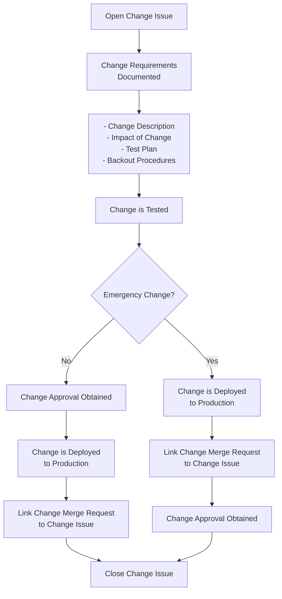

## On this page
{:.no_toc .hidden-md .hidden-lg}

- TOC
{:toc .hidden-md .hidden-lg}

# Purpose
Provide guidance and insight into the change management requirements, that have to meet the various compliance audits, such as for SOC2 and SOX.

# Overall Change Requirements
For compliance purposes, there are a minimum set of requirements that GitLab should be able to evidence to an auditor performing an operating effectiveness evaluation of GitLab change processes and procedures. These requirements include:
* Segregation Of Duties (SOD) is enforced throughout the change process to mitigate the risk that a single individual can potentially introduce harmful code that will have a negative impact to GitLab users. Typical SOD checks for compliance include:
     * Manual testing is performed by an individual that is different than the developer. For example, if changes are being made to a financial report that supports End of Month (EOM)/End of Quarter (EOQ)/End of Year (EOY) reconciliations and procedures, Accounting/Finance should perform testing to corroborate that the report provides the correct information prior to the report going live in the relevant financial systems. This could additionally apply to any databases/data warehouses depending on the nature of the change.
     * The results of any testing that is performed is reviewed and approved by an individual that is different than the person who tested the change. This individual should be *appropriate* based on their role/knowledge. For example, a developer should not review and approve testing performed over finance related reports and instead, an individual with the related domain knowledge from accounting and finance should be reviewing and approving the testing performed.
     * The person who provides an approval for the change to go-live in production is different than the developer
     * The person who deploys the change to production is different than the developer.
* Proper testing is performed prior to a change being implemented to a production environment. Testing can include manual testing performed by the business or system level testing to ensure changes to overall system features and functionality operate as expected.
* Testing is performed in an environment that is separate from Production

As a supplement to evaluating the change processes at GitLab, an Auditor may also perform testing of privileged access to production systems and reconcile the access against those with development access. Something to keep in mind as we work through the change management discussion. With how GitLab operates, this may not be a viable solution. 

# Deviating from the change requirements
## Obtaining approval prior to deployment
There are certain cases where all the change requirements may not be possible prior to being implemented into production. For example, if GitLab experiences major downtime, critical fixes may need to be deployed to make GitLab available again. In these cases,  this is considered to be an emergency change. In order to mitigate the risks of unauthorized code being deployed to production, we should ensure that if an emergency change has to be deployed that someone separate than the individual who deployed the change reviews the change after-the-fact and provides a confirmation that the change was performed correctly. 

## Testing prior to deployment
There may be some cases where it does not make sense for a change to be tested prior to being deployed. For example, in a third party system where we are making a change to a vendor provided configuration (such as making a change to the password expiration), it would not make sense to test the change given that this is a vendor provided setting.

# GCF Control Mapping

<table>
  <tr>
    <th>Change Steps</th>
    <th>Description</th>
    <th colspan="2">GCF Control Mapping</th>
  </tr>
  <tr>
    <td>Open Change Issue</td>
    <td>Create change issue to track change</td>
    <td></td>
    <td rowspan="8">[CM.1.01 - Change Management Workflow](https://gitlab.com/gitlab-com/gl-security/security-assurance/sec-compliance/compliance/-/issues/781)</td>
  </tr>
  <tr>
    <td>Change requirements documented</td>
    <td>Document: - Change Description - Impact of Change - Test Results - Backout Procedures (in-scope SOX systems) </td>
    <td rowspan="2">[CM.1.02 - Change Approval](https://gitlab.com/gitlab-com/gl-security/security-assurance/sec-compliance/compliance/-/issues/782)</td>
  </tr>
  <tr>
    <td>Change is Tested</td>
    <td>Testing is conducted in non-production environment prior to approval and deployment</td>
  </tr>
  <tr>
    <td>Emergency Change</td>
    <td>Approval obtained retroactively depending on the urgency of the change</td>
    <td>[CM.1.04 - Emergency Changes](https://gitlab.com/gitlab-com/gl-security/security-assurance/sec-compliance/compliance/-/issues/1692)</td>
  </tr>
  <tr>
    <td>Approval for Change</td>
    <td>Approval is provided by someone other than change requestor</td>
    <td rowspan="2">[CM.2.01 - Segregation of Duties](https://gitlab.com/gitlab-com/gl-security/security-assurance/sec-compliance/compliance/-/issues/783)</td>
  </tr>
  <tr>
    <td>Change is Deployed to Production</td>
    <td>Once tested and approved, the change is deployed to production.   </td>
  </tr>
  <tr>
    <td>MR is tracked in Change Issue</td>
    <td>Merge request is linked to the change issue.</td>
    <td></td>
  </tr>
  <tr>
    <td>Close Change Issue</td>
    <td>Close change issue</td>
    <td></td>
  </tr>
</table>

# Change Workflow Diagram

