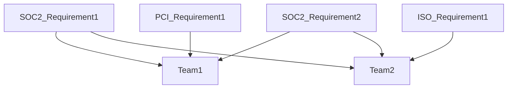
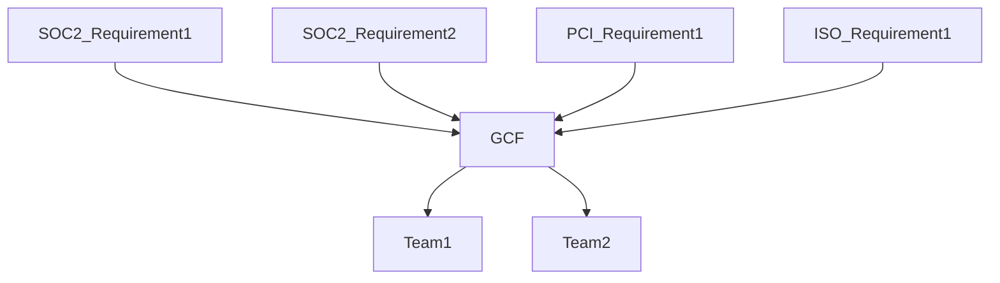

## On this page
{:.no_toc .hidden-md .hidden-lg}

- TOC
{:toc .hidden-md .hidden-lg}

# GitLab's Security Controls

Security controls are a way to state our company's position on a variety of security topics. It's not enough to simply say "We encrypt data" since our customers and teams will naturally want to know "what data do we encrypt?" and "how do we encrypt that data?". When all of our established security controls are operating effectively this creates a security program greater than the sum of its parts that will demonstrate to our stakeholders that GitLab has a mature and comprehensive security program that will provide assurance that data within GitLab is reasonably protected.

## GitLab Control Framework (GCF)

We have tried to take a comprehensive approach to our immediate and future security compliance needs. Older and larger companies tend to treat each security compliance requirement individually which results in independent security compliance teams going out to internal teams with multiple overlapping requests. For example, at such a company you might have one database engineer that is asked to provide evidence of how a particular database is encrypted based on SOC2 requirements, then again for ISO requirements, then again for PCI requirements. This approach can be visualized as follows:

Given our [efficiency value](/handbook/values/#efficiency) here at GitLab we wanted to create a set of security controls that would address multiple underlying requirements with a single security control which would allow us to make fewer requests of our internal teams and efficiently collect all evidence we would need for a variety of audits at once. This approach can be visualized as follows:

Adobe's [open source compliance framework](https://blogs.adobe.com/security/2017/05/open-source-ccf.html) served as the original starting point for this efficient method of collecting security control evidence and has since evolved with changes to control statements and related framework mappings. Below is a list of controls grouped by families and sub-families. 

Clicking a control below that has a link will take you to a page with a variety of information about that control.

## Control Ownership

Control Owner - Ensures that the design of the control and the control activities operate effectively and is responsible for remediation of any control activities that are required to bring that control into a state of audit-readiness.

Process Owner - Supports the operation of the control and carries out the process designed by the control owner. The process owner is most likely to be interviewed by an auditor to determine whether or not the process is operating as intended.

## Security Control Lifecycle

The lifecycle of our security controls can be found at [this handbook page](/handbook/engineering/security/security-assurance/security-compliance/security-control-lifecycle.html).

## What is considered `Production`?

The GitLab production environment includes all endpoints and cloud assets used in hosting GitLab.com and its subdomains. This may include third-party systems that support the business of GitLab.com. The word "production" can mean different things depending on the context. The below list is a holistic view of what is considered to be our production environment from a company perspective and is not representative of what is considered as "production" for specific external security audits (e.g. SOC 2).

|  **Functions to run gitlab.com** | **Production** | **Rationale for Determination** | **Location** |
| --- | --- | --- | --- |
|  gitlab\-ops (ops.gitlab.net) | YES | host of the Chef cookbooks and metadata | GCP |
|  gitlab\-production (gitlab.com) | YES | host of live \.com SaaS website and end user OAuth | GCP |
|  gs\-production | YES | host of GitLab version checker \- version\-gitlab\-com | GCP |
|  Route 53 | YES | host of DNS | AWS |
|  Chef server | YES | host of chef server | Digital Ocean |
|  gitlab\-ci | LIMITED | hosts runner managers | GCP |
|  dev\-gitlab\-org | YES | host of OAuth | Azure |
|  Workhose | YES | host of OAuth | GCP |
|  GitLab-Shell | YES | host of OAuth | GCP |
|  Gitaly | YES | host of OAuth | GCP |

|  **Sub-functions of gitlab.com** | **Production** | **Rationale for Determination** | **Location** |
| --- | --- | --- | --- |
|  gemnasium\-production | YES | hosts services used by dependency scanning | GCP |

|  **Functions that support gitlab.com** | **Production** | **Rationale for Determination** | **Location** |
| --- | --- | --- | --- |
|  customers\-gitlab\-com | YES | hosts subscriptions | Azure |
|  license\-gitlab\-com | YES | host of GitLab license management | GCP |

|  **Functions that indirectly supports running of GitLab** | **Production** | **Rationale for Determination** | **Location** |
| --- | --- | --- | --- |
|  gitlab\-security | YES | host of GitLab Security team tools | GCP |
|  DELKE | YES | Third party logging | GCP/Elastic |
|  InfraELK | YES | \.com logging | GCP/Elastic |
|  env\-zero | YES | host of Bootstrap GCP | GCP |
|  gitlab\-dr | YES | production backups | GCP |
|  service\-prod | YES | host of design\-gitlab\-com | GCP |
|  Prometheus | YES | dashboards\-gitlab\-net | GCP |
|  PagerDuty | YES | page on-call engineers | PagerDuty |
|  Cloudflare | YES | host of CDN | Cloudflare |
|  Pages | YES | host of OAuth | GCP |

## Security Controls Feedback

If you have any feedback on any of the security controls or related documentation, please add it as a comment in [this issue](https://gitlab.com/gitlab-com/gl-security/security-assurance/sec-compliance/compliance/issues/218).

## Security Control Changes

The GitLab compliance team is responsible for ensuring the consistency of the documentation of the security controls listed below. While normally we welcome any GitLab team-member to make edits to handbook pages, please be aware that even small changes to the wording of any of these controls impacts how they satisfy the requirements for the security frameworks they map to. Because of this, we ask any changes that need to be made to this page and the underlying guidance pages to start with a comment in [this issue](https://gitlab.com/gitlab-com/gl-security/security-assurance/sec-compliance/compliance/issues/219). The compliance team will then engage with you and make any appropriate changes to these handbook pages.

# List of controls by family:

## Asset Management
* Device and Media Inventory
    * [AM.1.01 - Inventory Management](./guidance/am.1.01-inventory-management.html)

## Backup Management
* Backup
    * [BU.1.01 - Backup Configuration](./guidance/BU.1.01_backup_configuration.html)
    * [BU.1.02 - Resilience Testing](./guidance/BU.1.02_resilience_testing.html)
    * [BU.1.03 - Alternate Storage](./guidance/BU.1.03_alternate_storage.html)

## Business Continuity
* Business Continuity Planning
    * [BC.1.01 - Business Continuity Plan](./guidance/BC.1.01_business_continuity_plan.html)
    * [BC.1.02 - Business Continuity Plan: Roles and Responsibilities](./guidance/BC.1.02_business_continuity_roles_responsibilities.html)
    * [BC.1.03 - Continuity Testing](./guidance/BC.1.03_continuity_testing.html)
    * [BC.1.04 - Business Impact Analysis](./guidance/BC.1.04_business_impact_analysis.html)

## Change Management
* Change Management
    * [CM.1.01 - Change Management Workflow](./guidance/CM.1.01_change_management_workflow.html)
    * [CM.1.02 - Change Approval](./guidance/CM.1.02_change_approval.html)
    * [CM.1.03 - Change Management Issue Tracker](./guidance/CM.1.03_change_management_issue_tracker.html)
    * [CM.1.04 - Emergency Changes](./guidance/CM.1.04_emergency_changes.html)
* Segregation of Duties
    * [CM.2.01 - Segregation of Duties](./guidance/CM.2.01_segregation_of_duties.html)

## Configuration Management
* Baseline Configurations
    * [CFG.1.01 - Baseline Configuration Standard](./guidance/CFG.1.01_baseline_configuration_standard.html)
    * [CFG.1.03 - Configuration Checks](./guidance/CFG.1.03_configuration_checks.html)

## Data Management
* Data Classification
    * [DM.1.01 - Data Classification Criteria](./guidance/DM.1.01_data_classification_criteria.html)
* Choice and Consent
    * [DM.2.01 - Terms of Service](./guidance/DM.2.01_terms_of_service.html)
* Data Encryption
    * [DM.4.01 - Encryption of Data in Transit](./guidance/DM.4.01_encryption_of_data_in_transit.html)
    * [DM.4.02 - Encryption of Data at Rest](./guidance/DM.4.02_encryption_of_data_at_rest.html)
* Data Removal
    * [DM.7.03 - Data Retention and Disposal Policy](./guidance/DM.7.03_data_retention_and_disposal_policy.html)

## Identity and Access Management
* Logical Access Account Lifecycle
    * [IAM.1.01 - Logical Access Provisioning](./guidance/IAM.1.01_logical_access_provisioning.html)
    * [IAM.1.02 - Logical Access De-provisioning](./guidance/IAM.1.02_logical_access_deprovisioning.html)
    * [IAM.1.04 - Logical Access Review](./guidance/IAM.1.04_logical_access_review.html)
    * [IAM.1.05 - Transfers: Access De-provisioning](./guidance/IAM.1.05_role_change_access_deprovisioning.html)
    * [IAM.1.06 - Shared Logical Accounts](./guidance/IAM.1.06_shared_logical_accounts.html)
    * [IAM.1.07 - Shared Account Restrictions](./guidance/IAM.1.07_shared_account_restrictions.html)
    * [IAM.1.08 - New Access Provisioning](./guidance/IAM.1.08_new_access_provisioning.html)
    * [IAM.1.09 - Access Modification](./guidance/IAM.1.09_access_modification.html)
* Authentication
    * [IAM.2.01 - Unique Identifiers](./guidance/IAM.2.01_unique_identifiers.html)
    * [IAM.2.02 - Password Authentication](./guidance/IAM.2.02_password_authentication.html)
    * [IAM.2.03 - Multifactor Authentication](./guidance/IAM.2.03_multifactor_authentication.html)
    * [IAM.2.04 - Authentication Credential Maintenance](./guidance/IAM.2.04_authentication_credential_maintenance.html)
    * [IAM.2.08 - Account Lockout](./guidance/IAM.2.08_account_lockout.html)
* Role-Based Logical Access
    * [IAM.3.02 - Source Code Security](./guidance/IAM.3.02_source_code_security.html)
    * [IAM.3.03 - Service Account Restrictions](./guidance/IAM.3.03_service_account_restriction.html)
    * [IAM.3.05 - Administrator Access to Production](./guidance/IAM.3.05_administrator_access_production.html)
* Remote Access
    * [IAM.4.01 - Remote Connections](./guidance/IAM.4.01_remote_connections.html)
    * [IAM.4.03 - Remote Maintenance: Authentication Sessions](./guidance/IAM.4.03_remote_maintenance_authentication_sessions.html)
* Key Management
    * [IAM.6.01 - Key Repository Access](./guidance/IAM.6.01_key_repository_access.html)
    
## Incident Response
* Incident Response
    * [IR.1.01 - Incident Response Plan](./guidance/IR.1.01_incident_response_plan.html)
    * [IR.1.03 - Incident Response](./guidance/IR.1.03_incident_response.html)
    * [IR.1.04 - Insurance Policy](./guidance/IR.1.04_insurance_policy.html)
* Incident Communication
    * [IR.2.01 - External Communication of Incidents](./guidance/IR.2.01_external_communication_of_incidents.html)
    * [IR.2.02 - Incident Reporting Contact Information](./guidance/IR.2.02_incident_reporting_contact_information.html)
    * [IR.2.03 - Incident External Communication](./guidance/IR.2.03_incident_external_communication.html)

## Network Operations
* Perimeter Security
    * [NO.1.01 - Network Policy Enforcement Points](./guidance/NO.1.01_network_policy_enforcement_points.html)
* Network Segmentation
    * [NO.2.01 - Network Segmentation](./guidance/NO.2.01_network_segmentation.html)
    
## People Resources
* On-boarding
    * [PR.1.01 - Background Checks](./guidance/PR.1.01_background_checks.html)
    * [PR.1.02 - Performance Management](./guidance/PR.1.02_performance_management.html)
    * [PR.1.03 - Policy and Procedure Review](./guidance/PR.1.03_policy_procedure_review.html)
    * [PR.1.04 - Hiring Review by Management](./guidance/PR.1.04_hiring_review_management.html)
    * [PR.1.05 - Job Descriptions](./guidance/PR.1.05_job_descriptions.html)

## Risk Management
* Risk Assessment
    * [RM.1.01 - Risk Assessment](./guidance/RM.1.01_risk_assessment.html)
    * [RM.1.02 - Continuous Monitoring](./guidance/RM.1.02_continuous_monitoring.html)
    * [RM.1.04 - Service Risk Rating Assignment](./guidance/RM.1.04_service_risk_rating_assignment.html)
    * [RM.1.05 - Risk Management](./guidance/RM.1.05_risk_management.html)
* Controls Implementation
    * [RM.3.01 - Remediation Tracking](./guidance/RM.3.01_remediation_tracking.html)

## Security Governance
* Policy Governance
    * [SG.1.01 - Policy and Standard Review](./guidance/SG.1.01_policy_and_standard_review.html)
* Security Documentation
    * [SG.2.01 - Information Security Program Content](./guidance/SG.2.01_information_security_program_content.html)
* Information Security Management System
    * [SG.5.03 - Security Roles and Responsibilities](./guidance/SG.5.03_security_roles_and_responsibilities.html)
    * [SG.5.06 - Board of Director Bylaws](./guidance/SG.5.06_bod_bylaws.html)
    * [SG.5.07 - Board of Directors Security Program Content](./guidance/SG.5.07_bod_security_program_content.html)

## Service Lifecycle
* Release Management
    * [SLC.1.01 - Service Lifecycle Workflow](./guidance/SLC.1.01_service_lifecycle_workflow.html)
    * [SLC.1.03 - Release Notes](./guidance/SLC.1.03_release_notes.html)
* Source Code Management
    * [SLC.2.01 - Source Code Management](./guidance/SLC.2.01_source_code_management.html)

## Systems Design Documentation
* Internal System Documentation
    * [SDM.1.01 - System Documentation](./guidance/SDM.1.01_system_documentation.html)
    
## Systems Monitoring
* Logging
    * [SYS.1.01 - Audit Logging](./guidance/SYS.1.01_audit_logging.html)
    * [SYS.1.02 - Secure Audit Logging](./guidance/SYS.1.02_secure_audit_logging.html)
    * [SYS.1.07 - Audit Log Capacity and Retention](./guidance/SYS.1.07_audit_log_capacity_retention.html)
* Security Monitoring
    * [SYS.2.01 - Security Monitoring Alert Criteria](./guidance/SYS.2.01_security_monitoring_alert_criteria.html)
    * [SYS.2.07 - System Security Monitoring](./guidance/SYS.2.07_system_security_monitoring.html)

## Third Party Management
* Vendor Assessments
    * [TPM.1.01 - Third Party Assurance Review](./guidance/TPM.1.01_third_party_assurance_review.html)
    * [TPM.1.02 - Vendor Risk Management](./guidance/TPM.1.02_vendor_risk_management.html)
    * [TPM.1.04 - Vendor Compliance Monitoring](./guidance/TPM.1.04_vendor_compliance_monitoring.html)
* Vendor Agreements
    * [TPM.2.02 - Vendor Non- disclosure Agreements](./guidance/TPM.2.02_vendor_non-disclosure_agreements.html)
    * [TPM.2.05 - Customer and Vendor Commitments and Responsibilities Documentation](./guidance/TPM.2.05_customer_vendor_commitments_responsibilities_documentation.html)
    * [TPM.2.06 - Mutual Non-Disclosure Agreements](./guidance/TPM.2.06_mutual_non_disclosure_agreements.html)
* Vendor Procurement
    * [TPM.3.01 - Approved Service Provider Listing](./guidance/TPM.3.01_approved_service_provider_listing.html)

## Training and Awareness
* General Awareness Training
    * [TRN.1.01 - General Security Awareness Training](./guidance/TRN.1.01_general_security_awareness_training.html)
    * [TRN.1.02 - Code of Conduct Training](./guidance/TRN.1.02_code_of_conduct_training.html)
* Role-Based Training
    * [TRN.2.01 - Developer Security Training](./guidance/TRN.2.01_developer_security_training.html)

## Vulnerability Management
* Production Scanning
    * [VUL.1.01 - Vulnerability Scans](./guidance/VUL.1.01_vulnerability_scans.html)
    * [VUL.1.03 - Approved Scanning Vendor](./guidance/VUL.1.03_approved_scanning_vendor.html)
* Penetration Testing
    * [VUL.2.01 - Application & Infrastructure Penetration Testing](./guidance/VUL.2.01_application_and_infrastructure_penetration_testing.html)
* Patch Management
    * [VUL.3.01 - Infrastructure Patch Management](./guidance/VUL.3.01_infrastructure_patch_management.html)
    * [VUL.3.02 - End of Life Software](./guidance/VUL.3.02_end_life_software.html)
* Malware Protection
    * [VUL.4.01 - Enterprise Protection](./guidance/VUL.4.01_enterprise_protection.html)
* Code Security
    * [VUL.5.01 - Code Security Check](./guidance/VUL.5.01_code_security_check.html)
* External Advisories and Inquiries
    * [VUL.6.01 - External Information Security inquiries](./guidance/VUL.6.01_external_information_security_inquiries.html)
