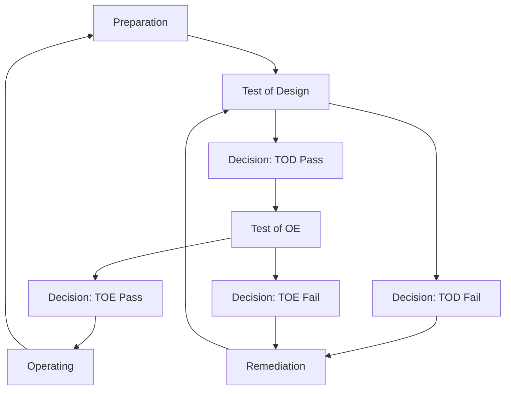

## On this page
{:.no_toc .hidden-md .hidden-lg}

- TOC
{:toc .hidden-md .hidden-lg}

# GCF Security Control Lifecycle

## Process Overview

## Lifecycle Phases Explained

As new GitLab security controls are identified that need to be implemented by the security compliance team for compliance or regulatory reasons, these controls follow an established process in order to make that implementation successful. 

### Preparation

As new [GCF security controls](/handbook/engineering/security/security-assurance/security-compliance/sec-controls.html) are identified they first must be researched and contextualized to GitLab as a company and to the applicable GitLab systems. The Preparation phase of the control lifecycle covers this initial work required to get controls into a state of ready to be tested.

Additionally, GCF controls that have been previously tested but have an upcoming requirement for renewed testing enter this Preparation phase as well to research and confirm that any changes to the control processes are captured in the updated testing activity.

### Testing

The testing activity consists of 3 major components:
1. Filling out a control testing worksheet as described by the [GitLab control testing manual](https://gitlab.com/groups/gitlab-com/gl-security/compliance/-/epics/106) (GitLab internal link)
1. Validating observations (if any were noted during testing) with the observation owners
1. Recording those observations (if any) according to the [Security Compliance Observation Management process](/handbook/engineering/security/security-assurance/security-compliance/observation-management.html)
   * **Note:** These observations can only be recorded after being validated by the observation owner to ensure that observation is accurate and represents a material deficiency in the security control process

After testing a decision is made about the controls:
* Were any validated observations recorded as a part of testing?
   * If `yes` this control enters the Remediation phase while those observations are in the process of being resolved
   * If `no` this control enters the Operation phase since the control has been determined to be designed and operating effectively to meet security compliance program needs
* Assign a control effectiveness rating to the control as described in the [GitLab control testing manual](https://gitlab.com/groups/gitlab-com/gl-security/compliance/-/epics/106) (GitLab internal link)

### Remediation

Remediation is the phase of the lifecycle where required changed are made to the design of the security control or the process of the control's operation. Remediation is either performed by the observation owner or is tracked by the observation owner if the observation remediation is blocked by another GitLab team's work. The security compliance team is responsible for tracking all validated observation and continually reporting on those observations to ensure they are tracked, prioritized appropriately, and escalated as needed to meet the security compliance program goals.

### Operating

Controls that are tested with no observations noted during that testing activity are determined to be in an operational state. This indicates that the design and operating effectiveness of this control are at or above the level required to meet the current needs of the security compliance program.

Controls in an operating state will still need to be re-tested annually or quarterly (as determined by the risk rating of the control) to ensure no substantive changes have occured which would impact the design or operating effectiveness of that control; controls move from the operating state back into the preparation state to prepare the control for the next iteration of testing.
