## On this page
{:.no_toc .hidden-md .hidden-lg}

- TOC
{:toc .hidden-md .hidden-lg}

## Process Overview and Guide for Procurement Requests

In order to minimize the risk associated with third party applications and services, the Risk and Field Security Team performs security reviews on new and renewing third party vendors that are requested through the procurement process. For non-procurement applications or services, please see the guidance below for [free apps](#free-apps).

As part of [New Vendor Evaluations and Vendor Contract Renewals](/handbook/finance/procurement/#requesting-procurement-services), a [risk-based assessment](https://gitlab.com/gitlab-com/gl-security/compliance/third-party-vendor-security-management/-/issues/new?issuable_template=gitlab_issue_templates_SOC_Report_Review) is performed 
to determine if a full security review is needed. A full security review is required if the vendor is processing, storing, and/or transmitting non-public data and poses substantial risk to GitLab. Vendors and tools that integrate to critical systems containing data 
[classified](/handbook/engineering/security/data-classification-standard.html) Red is automatically upgraded to processing Red data unless the exact information involved in the interaction can be verified. 
This extra scrutiny is due to the fact that GitLab no longer controls our data when it is processed, transmitted, or stored by a third party.

If a full review is deemed as necessary, the Risk and Field Security team utilizes the vendor [security reports](#Vendor Documentation Decision Tree), engagement details,and any compensating controls that may be available to identify potential risks to GitLab. The output of the review is not meant to be a recommended "Yes" or "No" from the Risk and Field Security team. Instead, all risks identified are shared with the relevant stakeholders to enable them to make the best business decision. The goal of the vendor security review is to reduce the likelihood that GitLab data will be exposed or mishandled by raising awareness and providing consultancy.
Security Management approval is required for vendors with major risks and the business owner is subject to the [risk acceptance process](#Accepting risks identified during the procurement process).

This process is not meant to slow down the procurement process, but a certain amount of friction to this process is inevitable. Refer to the decision tree below to determine whether a security review is required. 

```mermaid
graph TD;
    A[New Vendor or Contract renewal] --> B{"Will this vendor be used for<br>marketing purposes such as <br>events, programs, sponsorships<br>hotels, content, or creative<br>and professional services?"};
    B --> |Yes| C["No Security Review is required if non-public data <br>will not be processed by the vendor as <br>part of this contract (i.e. any information <br>not available in our handbook). Right click <br>this box and open in a new tab to navigate to the <br>appropriate vendor contract approval<br>issue template."]
    B --> |No| D[A Security Review may be required. <br>An assessment will be completed <br>to determine the vendor risk score.]
    D --> E{"Will non-public data be <br>processed by the vendor <br>as part of this contract <br>that could impact customer <br>uploaded data, personal <br>employee data or personal <br> customer data? <br>(i.e. any information not <br> available in our handbook)"}
    E --> |No| F[A Security Review is<br>not required.]
    E --> |Yes| G["A Security Review is required.<br>Determine the security controls that<br>will protect processed GitLab data <br> classification policy<br>(Red or Orange data).<br>Right click this box and open<br>in a new tab to navigate to<br>our data classification policy."]
    G --> H{Is an NDA already in place?}
    H --> |No| I[An NDA is required for any<br>vendor contract involving<br>non-public data. Right click this<br>box and open in a new tab<br>to navigate to the handbook<br>process for creating an NDA.]
    H --> |Yes| J[Complete the vendor contract approval<br>issue template by right clicking this box<br>and opening in a new tab.]
    J --> K[Reach out to the vendor contact and<br>request Security Documentation that<br>will be required for a Security Review.<br>Right click this box and open in a<br>new tab to navigate to an email<br>template that can be used.]
    click C "https://gitlab.com/gitlab-com/Finance-Division/procurement-team/procurement/-/issues/new?issuable_template=vendor_contracts_marketing_events" "Vendor Contracts Marketing Events Issue"
    click G "/https://about.gitlab.com/handbook/engineering/security/data-classification-standard.html" "Data Classification Standard"
    click I "/handbook/finance/procurement/#1-new-vendor-evaluation" "Creating an NDA"
    click J "https://gitlab.com/gitlab-com/Finance-Division/procurement-team/procurement/-/issues/new?issuable_template=software_vendor_contract_request" "Software Vendor Contract Approval Issue"
    click K "/handbook/engineering/security/security-assurance/security-compliance/third-party-vendor-security-review.html#email-template-for-requesting-security-documentation" "Security Documentation email template"

  style A fill:#e6e6e6
  style B fill:#e6e6e6
  style C fill:#a2f2a9, stroke:#0000ff, stroke-width:2px
  style D fill:#e6e6e6
  style E fill:#e6e6e6
  style F fill:#a2f2a9, stroke:#0000ff, stroke-width:2px
  style G fill:#e6e6e6, stroke:#0000ff, stroke-width:2px
  style H fill:#e6e6e6
  style I fill:#e6e6e6, stroke:#0000ff, stroke-width:2px
  style J fill:#e6e6e6, stroke:#0000ff, stroke-width:2px
  style K fill:#e6e6e6, stroke:#0000ff, stroke-width:2px
```

#### Email template for requesting security documentation
You can help expedite this process by sending the following message to the vendor:

> Because the use of your tool or services requires the protection of GitLab data and/or there is a reliance on your tool or service to support various business/financial processes at GitLab, our Security team will need some additional information to ensure that controls in your environment provide reasonable assurance that processes we rely on are operating effectively and that our data is appropriately secured. If you have gone through an independent certification for a SOC1 Type 2 or SOC2 Type 2, and have undergone a recent PenTest, please provide a copy of all these reports or summary of results. Additionally, if there are bridge letters available to supplement your SOC reports, please provide these so that our Security team can determine that there have been no major changes to controls over your environment between certifications. If you have not gone through these certification processes, please complete the GitLab Information Security Questionnaire and answer only the applicable questions. We appreciate your partnership in helping GitLab complete its due diligence requirements.

#### Vendor Documentation Decision Tree
In the event that the vendor cannot provide the above information, the following shows what documentation is required in order to complete this vendor security review process:

Does the vendor have an external audit report that shows how controls were tested and those testing results? (e.g. SOC1 Type 2 and SOC2 Type 2 reports, ISO 27001 audit reports, etc.)
   * `If yes`, does the scope of that report cover the services that GitLab will be using?
      * `If yes`, please request these reports and share with the security team for review. Also, please request a [penetration testing report](#recent-penetration-testing-report)
        * `If no`, does the vendor have an external audit report that does cover these services?
         * `If yes`, please request this report and share with the security team for review. Also, please request a [penetration testing report](#recent-penetration-testing-report)
         * `If no`, please continue through this decision tree
   * `If no`, Does the vendor have a point in time assessment of the design of controls (e.g. CSA CAIQ self-assessment, SOC1 Type 1 and SOC2 Type 1, etc.)?
      * `If yes`, please request this report and share with the security team for review. Also, please request a [penetration testing report](#recent-penetration-testing-report)
      * `If no`, please continue through this decision tree

Is the vendor willing to fill out GitLab's information security questionnaire so we can assess the maturity of their information security program?
   * `If yes`, please share the [GitLab Information Security Questionnaire](https://docs.google.com/spreadsheets/d/1isL6fkYX45Wb0BewozUPROnGgirmonTENFuBGapS_Xk/edit#gid=1307424571) with the vendor. Also, please request a [penetration testing report](#recent-penetration-testing-report)
      * **Note: It can take vendors some time to complete these questionnaires so the earlier we start this process the better **
   * `If no`, please complete a [risk exception](/handbook/engineering/security/security-assurance/security-compliance/risk-management.html#risk-treatment) so we can document the fact that we are proposing to move forward with a vendor for which we have no insight into the maturity of their security program.

##### Recent Penetration Testing Report
Penetration testing reports have a very different scope and goal than audits of an information security program audit, but they are very useful when assessing the maturity of a vendor's information security program. The fact that a vendor has completed such a test indicates that they are operating a mature security program and are reducing the likelihood of a vulnerability existing in architecture or software. 
For this reason we request a copy of a recent penetration testing report as a part of all documentation requests as well as a current state of the remediations associated with any findings in that report. If the vendor has policies that don't permit sharing of the report, a summary of the findings and their status confirmed by the vendor is acceptable. In cases where only PCI Attestation of Compliance is available for sharing, we will accept that for our records.

##### What if a vendor is providing a security whitepaper instead?
Unfortunately, security whitepapers rarely give us all of the information we need. When a company generates these whitepapers they are always from the perspective of everything the vendor feels like they are doing well, but won't have any information about what controls are not in place or not yet mature. For this reason we won't accept whitepapers in place of audit reports or the GitLab Information Security Questionnaire, but the vendor can absolutely attach the whitepaper and reference any information in there when completing our questionnaire if that makes the process easier for the vendor.

#### Third Party Vendor Hardening Guide
This helpful [guide](/handbook/engineering/security/security-assurance/security-compliance/third-party-vendor-hardening-guide.html) is for business owners and third parties who wish to know more about complying with GitLab's best practices for sensitive data. As specifications and requirements are identified by stakeholders, those will be added to this page as security guidance for sourcing. This also includes guidance for consultants, free apps and Field Marketing purchases.

#### Free Apps
Since the Vendor Security Review process is reliant on the procurement process, a third party application does not automatically fall into our purview unless it involves paid services or requires a terms of service or contract review. To initiate a security review of a free application, first request an [application/integration review](https://about.gitlab.com/handbook/communication/#need-to-add-a-new-app-to-slack) with Procurement. If needed, a [free app security review](https://gitlab.com/gitlab-com/gl-security/compliance/third-party-vendor-security-management/-/issues/new?issuable_template=Free_App_Third_Party_Security_Review) will follow. 
 
 
 
## Vendor Security Review Workflow

#### Finance Issue

*  When a procurement issue is opened for new software or services, there is a section for `Step 1` screening intake questions that must be completed by the business owner requesting the service and is reviewed by the Risk and Field Security team. This will determine the inherent risk vendor score and if a security review is needed in tandem with the Contract and Approval Workflow. These are typically {-High-} scored vendors.
*  The label [SecurityReview::NotStarted](https://gitlab.com/groups/gitlab-com/Finance-Division/-/issues?label_name%5B%5D=SecurityReview%3A%3ANotStarted) is applied by the template and the [SecurityReview::](https://gitlab.com/groups/gitlab-com/Finance-Division/-/labels?utf8=%E2%9C%93&subscribed=&search=securityreview%3A%3A) label workflow is managed thereafter by the Risk & Field Security DRI to communicate the phases of the review.
*  If the review is blocked due to missing information from the business owner or vendor reports, the blocked label set [SecurityReview_](https://gitlab.com/groups/gitlab-com/Finance-Division/-/labels?utf8=%E2%9C%93&subscribed=&search=securityreview_) is used to indicate the reason for the delay. 
*  Once resolved the label can then be updated back to the appropriate phase of the "SecurityReview::" workflow.

#### Third Party Vendor Security Management Issue

*  Security review issues are automatically created within the [Third Party Vendor Security Management project](https://gitlab.com/gitlab-com/gl-security/compliance/third-party-vendor-security-management) upon new procurement requests and is assigned to a DRI to complete the assessment and review if needed.
*  Security review issues are opened for [field marketing requests](https://gitlab.com/gitlab-com/Finance-Division/procurement-team/procurement/-/issues/new?issuable_template=vendor_contracts_marketing_events) which by default only handle public data, so these issues serve as a record since there is no security review to carry out. They also help with metrics.
*  If the vendor's risk inherent risk score is Moderate to High, the DRI will engage for the reports and/or questionnaire to complete the full review.
*  Information is requested from the vendor as needed to complete the review of the security management practices and technical security posture. 

### Vendor Risk Assessment

*  Reports and questionnaires returned by the vendor are [reviewed for noted observations](/gitlab-com/gl-security/security-assurance/sec-compliance/compliance/blob/master/runbooks/Vendor_Security_Report_Review.md).
*  Exceptions are recorded according to the instructions within the template and shared in the original procurement issue. 
*  The DRI then selects the appropriate `Security Approval` in Step 5 of the procurement issue. If management approval is needed, the additional steps are followed to tag for review otherwise completes the review by updating the label.
*  Observations that pose a potential risk to GitLab and that do not have a mitigation plan are tracked as part of ongoing vendor and risk management processes using the [VRM label](https://gitlab.com/gitlab-com/gl-security/compliance/third-party-vendor-security-management/-/issues?scope=all&utf8=%E2%9C%93&state=opened&label_name[]=VRM_for_tracking) for follow up and annual review. 

## Criteria
Security reviews are largely operating on a guidance basis where Security Assurance provides recommendations for risks identified as having the probability of impacting GitLab. This is based on the vendor's initial risk score which is determined by the data types processed, the intergrations and access levels required by third parties. The DRI consults with the Inherent Risk Rating Methodology below to identify the score as part of the Vendor Risk Assessment step that serves to determine if a security review is needed.

### Inherent Risk Rating Methodology
The risk rating or risk level assigned to a vendor is determined by assessing the following criteria:

|  | High-risk | Moderate-risk | Low-risk  | 
| --- |  --- |  --- |  --- 
| **Seats/Licenses** | 1000+  == `3` | 101 - 999  == `2`| 1 - 100  == `1` 
| **Volume** | Over 20,000 records   or volume of data == `3` | 5,001 - 19,999  == `2`| Less than 5,000 == `1`
| **Contractor Access / Integration** | Corporate user account   (GitLab.com, GCP, etc.)  / 10+ systems integrated == `3` | Read/write access to   specific data sets (limited push/pull)  / 4-9 integrated systems == `2` | Receives a file of   sensitive information   (no access to GitLab systems)  / 1-3 systems == `1`
| **Compliance Frameworks in-scope** | Two or more == `3`| One == `2` | Zero == `1`
| **Data Classification** | Red == `3`| Orange == `2` | Yellow == `1`   Green == `0`

    Risk Score          High : 36 +                  Moderate  : 9 - 35               Low : less than 8

Once a qualitative score is determined for each criteria, a final inherent risk score should be derived by performing the following calculation:

>Inherent Risk = (Licenses/Seats * Volume of Data * Integrations * Compliance frameworks) * Data classification

### Security Review
Full security reviews are carried out for Moderate and High risk vendors identified in the assessment. The vendor and product are evaluated against GitLab's [requirements](https://docs.google.com/spreadsheets/d/1llZkgIQMwky91YQBH40qfvs_BQR5z7Np81tczCJg0Bo/edit#gid=1829193653) and the Residual Risk Score is adjusted as needed. The DRI looks for compensating controls that could treat the risk from either the vendor or business side, which could lower the initial score.  The table below provides the thresholds for each Residual Risk level and the approval requried.

Inherent Risk | Score | Review Required? | Approval Required (for unresolved risks)?
| --- | -- | -- | --- |
Low | 0 - 8 | No | None
Moderate | 9 - 35 | Yes | Business unit
High | 36+ | Yes | Security management

### Observation types and Treatment Plans
Please see the linked [Vendor Observation and Treatment Catalog](https://docs.google.com/spreadsheets/d/1llZkgIQMwky91YQBH40qfvs_BQR5z7Np81tczCJg0Bo) for examples of recommendations.

## SLA
Security Compliance commits to a 3-business day SLA for completion when not waiting on input from the vendor. The scoped labels will be used to audit SLAs.

## Managing unresolved observations identified during the procurement process
If the result of a vendor security review has open moderate to high risk observations ([Tier 3 Risks](/handbook/engineering/security/security-assurance/security-compliance/risk-management.html#scope))
that indicate the vendor's security program is not appropriately mature or has known flaws and no treatment plan is available, then the unsatisfied observations need to be onboarded into [Security Compliance Observation Management](/handbook/engineering/security/security-assurance/security-compliance/observation-management.html).
The observations will be presented to the Director of Security for a final determination on whether or not that vendor can be approved from a security perspective. The purpose is to ensure that when GitLab leadership is approving of these risks,
they do so with full context and insight into the tangible dangers presented by that risk to our team-members and customers. The output of this process also gives us a record to track organizational risk which is required in external audits.

## Closing the review and reporting back to the vendor
The review is complete and can be closed once 1) the observations have been communicated to the business owner and security management if Tier 3 risks remain, 2) the vendor has 
responded to how they will address the issue(s) and 3) the business owner and security management approves of the treatment plan or files any needed acceptance if risks are unresolvable.

A report will be shared with the vendor that will contain a detailed summary of the observations and compensating controls identified through the review performed that year.
