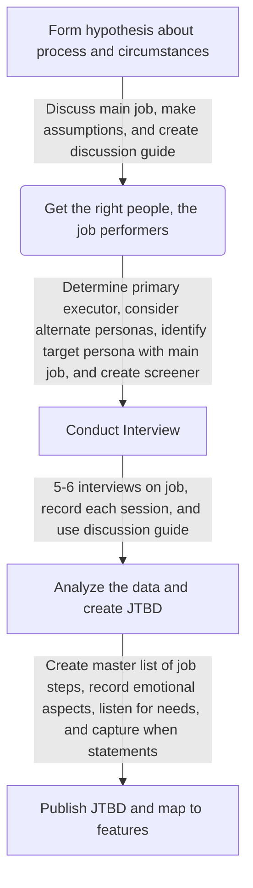

#### On this page
{:.no_toc .hidden-md .hidden-lg}

- TOC
{:toc .hidden-md .hidden-lg}

## Validating Jobs to be Done (JTBD)

### How do I conduct JTBD interviews?
Jobs don’t come in neat, little packages. You have to hunt for them. You won’t find jobs from analytics or marketing surveys, and you can’t just “brainstorm” jobs and needs. You have to get out and talk to job performers in formal interviews. 

Interviewing experts in a given domain will accelerate your learning about what job they are trying to do, revealing a true JTBD. Interview users to determine what is motivating their action and see if you’re on the right track. A few informal conversations can do wonders for narrowing in on the distinctions and labels that will make the most sense. 

**First Step - Form hypothesis about job, performer and needs**
* Discuss the main job, performer, needs, circumstances, and process. 
* It’s ok to make assumptions about the sequence of stages the performer may go through. 
* You may know some of the circumstances in advance. Have a conversation with your team about these to understand what you might need to probe during interviews. 
* Make assumptions initially, but be ready to update them later after you complete your research. 
* Create your [Job Interview Discussion Guide Template](https://docs.google.com/document/d/1ppehnUjgbS9a1tAprbfrz5WJXZokKnhS1frN09Jm4_M/edit?usp=sharing)

**Second Step - Get the right people, the job performers**
You need to determine not only whom you want to talk to, but whom you don’t want to talk to. 

Determine who the primary job executor is:
* Ask yourself, “Who holds the insights we need to uncover?” 
* You may need to sort out the potential roles you can target and get agreement from the team. 
* Ultimately, you’ll want to consider a range of different functions as a system of job performers, but at first the primary concern is sorting out the job performer.
* Keep in mind that major factors around performing the job, such as expertise, may impact the definition of the job performer. 
* Defining the main job and job performer really go hand in hand. You’ll likely define both at the same time, going back and forth as you do. 

Create a [screener](/handbook/engineering/ux/ux-research-training/recruiting-participants/#craft-your-screener-user-interviews-and-usability-testing) for recruiting that consists of criteria that you’ll use to select participants, working with our Research Ops team to build in stop points to disqualify a person from your research. Avoid including any reference to a specific product, service, or brand. 

Note that if you use existing customers for the interviews, be cautious about their bias toward your solution. You’ll need to explicitly steer them away from talking about your product or solution. It’s harder to interview existing customers from this perspective, but possible. 

Avoid interviewing people who believe they can speak on behalf of job performers. You want to talk to the actual job performers, not the people who manage the job performers. 

At a minimum, you’ll need about 5–6 interviews to start seeing consistent patterns. It’s recommended to double that number— 10–12 participants are better. More participants will strengthen the thoroughness of your research.

**Third Step - Conduct the job interview**
Then lead an open interview that lets them speak in their own words about their objectives. Probe on the job process and needs. 
Make sure you record the session.

* Jobs interviews represent a type of open interviewing. It’s not about reading from a questionnaire, but instead steering a conversation through specific topics. 
* The body of the discussion guide consists of a list of questions around the relevant themes. These prompts should address the questions, assumptions, and gaps in knowledge you have.
* It’s a best practice to do the interviews with more than one researcher. One is the primary interviewer, and the other acts as an observer. 
* People don’t know how to create solutions to solve their problems, so don’t ask them. They do know about their own objectives and needs. Focus on understanding their jobs to be done from their perspective. 
* Allow the conversation to unfold naturally, but use the discussion guide to bring the participant back on topic as needed. 

**Note:** The JTBD approach assumes that people are first and foremost motivated to get the job done so they can make progress. The interviews favor a more surgical approach to reach their goals and needs. Jobs interviews are not intended for gaining empathy for participants per se, although that is often inevitable. 

**Fourth Step - Analyze the data and create JTBD**
* The goal is to create a master list of job steps, needs, and circumstances across all of your interviews. 
* Schedule time to debrief immediately after each session. Review notes with your interview partner. Take the time to complement each other’s understanding of what the participant said. If you wait too long to review your notes, you may forget details and lose the context. 
* Create a [spreadsheet](https://docs.google.com/spreadsheets/d/1qpbjCFxr4wlSBXr3IbhkwciG4hEthyMaRVLoWWTHQI0/edit?usp=sharing) to extract relevant observations. Put direct observations and quotes in the first column. Then create four columns for interpretations: micro-jobs, emotional and social aspects, needs, and circumstances. 
* Strive to start with actual quotes from the interviews. Otherwise, paraphrasing works well. The elements of JTBD become the filter by which you’ll organize insights:
    1. **Job steps:** Indicate steps in getting a job done and the micro-jobs you find during the interview. Be sure to begin each with a verb and omit any reference to technologies or solutions. 
    2. **Emotional and social aspects:** Record emotional aspects beginning with “feel” or “avoid feeling” and then social aspects with “be perceived as” or “avoid being seen as.”
    3. **Needs:** Listen for answers to your “why” questions, as well as hacks, workarounds, avoidances, and procrastinations. Be sure to note needs beginning with a verb that shows the direction of change. 
    4. **Circumstances:** Note any situational constraints beginning with “when.” 

*  Refining and rewriting job statements is important. The form of your insights matters in JTBD. Pay attention to formatting and the rules of job statements. 
    * Do your statements represent stable intent over time? 
    * Are they devoid of technology, solutions, and methods? 

### What should I do if I don't have time to conduct JTBD interviews?
Sometimes, JTBD need to be created so fast you don’t have time to conduct job interviews. In this case, it is still a best practice to validate the JTBD with job performers.

You’re looking to increase your confidence in your stage’s priorities, strategy, and how you are measuring success and maturity of your stage.

**Creating JTBD**
* Conduct a brainstorming session with Product Management and Product Design. Write every task related to that section or feature. Reference past research projects that included interviews with target users, when you can as well as regular customer conversations.
* Bring in the engineering team to review the list and add any missing tasks. Allow them to up vote any 3 tasks they view as particularly important.

### How can I test my main JTBD?
Here are some points to consider when formulating the main job:

1.  **Get the phrasing right.** JTBD provides a common language for an organization, and getting the labels right is key. Refine your definition of the main job to ensure it is simple and one-dimensional. 
2.  **Ensure that there is a purpose.** Main jobs should be purposeful and not actions or tasks. Strive to reflect an outcome from the individual’s point of view. 
    *  Example: *look at a painting* is an action, while *understand artwork* is a JTBD with an objective.
3.  **Reflect an end state.** Avoid framing main jobs as ongoing activities. It’s problematic to start a main job with words like *manage, maintain, keep up,* and *learn* because they don’t have a clear end state. 
    *  Example: formulating a job as *manage financial portfolio* is problematic because it’s hard to point to an end: managing is ongoing. Instead, phrase the job as *grow financial portfolio*, which is stronger because there is a way to be “done.”
4.  **Separate jobs from needs.** Don’t mix up needs or desired outcomes with the main job. 
    *  Example: the main job of a street vendor with a hotdog cart is to *sell food on the street*. Of course, the vendor wants to *maximize the amount of hungry people she attracts*, but that’s considered a need. 

**Test your main job statement against these questions:**
* Does the statement reflect the job performer’s perspective? 
* Does the job statement begin with a verb?
* Is there a beginning and end point of the goal? 
* Might the job performer think, “The [object] is [verb]-ed”? (e.g., did the *financial portfolio grow*? Or was *food sold on the street*?)
* Are the statements one-dimensional without compound concepts? 
* Would people have phrased the job to be done like this 50 years ago?

## What do I need to do next?
* The next step is to [create a job map](/handbook/engineering/ux/jobs-to-be-done/mapping-jobs-to-be-done/).
