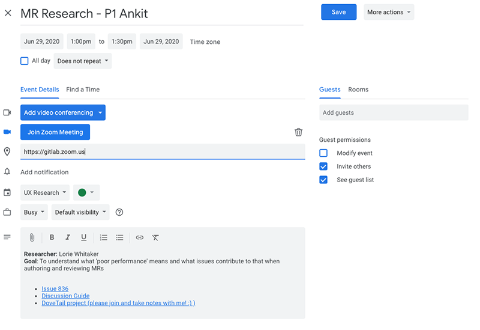

## On this page
{:.no_toc .hidden-md .hidden-lg}
{::options parse_block_html="true" /}

- TOC
{:toc .hidden-md .hidden-lg}

## UX research at GitLab

The goal of UX research at GitLab is to connect with GitLab users all around the world and gather insight into their behaviors, motivations, and goals when using GitLab. We use these insights to inform and strengthen product and design decisions.

UX Researchers aren't the only [GitLab Team Members](/handbook/communication/top-misused-terms) who conduct user research. Other roles, like Product Managers and Product Designers, frequently conduct research too with guidance from the UX research team.

### Quick links to UX research resources

- [UX Research project](https://gitlab.com/gitlab-org/ux-research) 
- [UX research coordination at GitLab](/handbook/engineering/ux/ux-research-coordination/)
- [Training resources](/handbook/engineering/ux/ux-research-training/)
- [Qualtrics tips & tricks](/handbook/engineering/ux/qualtrics/)
- [Dovetail tips & tricks](/handbook/engineering/ux/dovetail/) - Our system of record for research insights.
- [UXR Insights project](https://gitlab.com/gitlab-org/uxr_insights/) - No longer maintained or in use.

### Research methods, workshops, and exercises

Research is successful when we understand our research goals and why we choose one method over another. Knowing and understanding the research question(s) you want to learn about will help you determine which method to use.

We use a wide variety of research methods, workshops, and exercises to help us better understand our users’ needs and goals. Our teams are encouraged to seek out anything that will allow our teams to better collaborate while we continue to enhance our product experience. Some of these are listed below:

#### Problem Validation

##### Research Methods

User Interviews

**What is it**

A User Interview is used when we need to learn about what a user is doing in the present, what problems they are having, and what their general attitudes about these problems are.

Bear in mind that users tend to have better recall of things that were particularly difficult or delightful to use (in other words, the extremes). Human memory is extremely fallible and people have a great deal of difficulty knowing what they will want or do in the future. Asking a user how they currently perform a task will likely provide you with idealized information that leaves out any deviations or workarounds they usually perform to complete the task. You’re much better off observing them while they complete these tasks to ensure you’re getting the whole picture.

**When should it be used**

You should conduct User Interviews at the early stages of a project when you want to generate knowledge about your users’ thoughts, beliefs, mental models, and experiences. User Interviews are great when you need to learn and discover more when building personas and journey maps, gathering feature ideas, and understanding workflows.

**Resources**

* [Interviewing Users](https://www.nngroup.com/articles/interviewing-users/) (NNGroup)
* [Why User Interviews Fail](https://www.nngroup.com/articles/why-user-interviews-fail/?lm=interviewing-users&pt=article) (NNGroup)
* [User Interviews: How, When and Why to Conduct Them](https://www.nngroup.com/articles/user-interviews/?lm=interviewing-users&pt=article) (NNGroup)
* [Individual Interviews](https://www.usability.gov/how-to-and-tools/methods/individual-interviews.html) (Usability.gov)
* [User Interviews at GitLab](#for-user-interviews)

The Five Whys

**What is it**

The 5 Whys is an interviewing technique that allows the interviewer to dig deeper into the users’ mind. When using this interview technique, you start with a broad question, and then begin asking Why five times to learn more about the complexities of the problem.

**When should it be used**

You should use The 5 Whys to help uncover a user’s motivations and beliefs.

**Resources**

* [Design Kit: The 5 Whys](https://www.designkit.org/methods/66) (IDEO)

Surveys

**What is it**

Coming soon...

**When should it be used**

Coming soon... 

**Resources**

* [Online Surveys](https://www.usability.gov/how-to-and-tools/methods/online-surveys.html) (Usability.gov)
* [Surveys at GitLab](#for-surveys)

Journey Map

**What is it**

Journey Maps help visualize the process a customer goes through to accomplish a goal with your product. It’s an accumulation of tasks and actions over time, accompanied by their thoughts and feelings.

**When should it be used**

Use a Journey Map to help uncover all of the steps a user goes through when trying to accomplish their goals. These insights highlight pain points and challenges they have that your design will solve.

**Resources**

* [Journey Mapping for Remote Teams: A Digital Template](https://www.nngroup.com/articles/journey-map-digital-template/?utm_source=Alertbox&utm_campaign=d1d949190d-RemoteJmap_CovidIA_SearchGazePattern_20200601&utm_medium=email&utm_term=0_7f29a2b335-d1d949190d-40578453) (NNGroup)

##### Workshops

Remote Design Sprint

**What is it**

A Design Sprint is a step-by-step process that helps teams to solve big problems and test new ideas in a very short period of time. It’s great for aligning teams on a singular goal and building better products, faster.

A Remote Design Sprint has all of the above benefits while allowing teams to work collaboratively in a remote setting, synchronously and asynchronously.

**When should it be used**

You should use the Design Sprint workshop method when you need to find a design solution/direction for your section quickly or if you're stuck and are having difficulty moving forward. It’s great for solving big problems in a short period of time, but it’s overkill for solving smaller problems that can be resolved with a smaller workshop or exercise, such as a Lightning Decision Jam workshop.

**Resources**

* [How To Run Amazing Remote Design Sprints](https://www.youtube.com/watch?v=IFHfsRNTGCM) (AJ&Smart - video)

Lightning Decision Jam

**What is it**

A Remote Lightning Decision Jam is a structured brainstorming workshop where a team of between 3 - 8 people come together to define, prioritize, and solve problems without the typical bias that may occur in a standard brainstorming session. It’s really good for aligning a team on a singular goal and coming up with solutions to validate without falling into the trap of open-ended, unstructured discussions.

**When should it be used**

You should use the RLDJ workshop when you want to work collaboratively to come up with problems/challenges to be solved and then determine a solution.

**Resources**

* [Desig Sprint Workshop-LDJ](https://www.youtube.com/watch?v=33hBnZzoFAg) (AJ&Smart - video)

##### Exercises

Expert Interview

**What is it**

Coming soon...

**When should it be used**

Coming soon...

**Resources**

* [Ask The Experts](https://www.youtube.com/watch?v=ZtYp7XzmXr8&t=491s)(AJ&Smart - video)

"How Might We"

**What is it**

"How Might We" (HMW) is a technique used to reframe a challenge, pain point, or problem(s) into a phrase that is a more opportunity focused suggestion that a solution is possible. It’s important when writing your HMW to make sure you’re writing in the Goldilocks zone: not too broad and not too narrow... just right.

**When should it be used**

You should use How Might We’s when any part of a project is in short supply of fresh ideas or you’re looking for a way to rearrange your perspective on a challenge or problem you’re trying to solve.

**Resources**

* [A Design Sprint Exercise for Problem Solving](https://spin.atomicobject.com/2018/12/12/how-might-we-design-thinking/)(Atomic Object)
* [Turn Your Perspective Into Actionable Provocations](https://static1.squarespace.com/static/57c6b79629687fde090a0fdd/t/589cc8b8d2b85721b37d3efe/1486670008488/HMW-Worksheet.pdf) (DSchool - PDF)
* [How Might We...?](http://crowdresearch.stanford.edu/w/img_auth.php/f/ff/How_might_we.pdf) (DSchool)

Long-Term Goal

**What is it**

Coming soon...

**When should it be used**

Coming soon...

**Resources**

* [Long-Term Goal & Sprint Questions](https://www.youtube.com/watch?v=OaeKpGJe2To&list=PLxk9zj3EDi0X5CgoFckoheIFAx-uT2i7j&index=4) (AJ&Smart - video)

The Map

**What is it**

Coming soon...

**When should it be used**

Coming soon...

**Resources**

* [Map](https://www.youtube.com/watch?v=JTqCR84fzeg&list=PLxk9zj3EDi0X5CgoFckoheIFAx-uT2i7j&index=5) (AJ&Smart - video)
* [How To Draw The Map](https://www.youtube.com/watch?v=yYNpOKq3Wfg&list=PLxk9zj3EDi0X5CgoFckoheIFAx-uT2i7j&index=14) (AJ&Smart - video)

Lightning Demos

**What is it**

Coming soon...

**When should it be used**

Coming soon...

**Resources**

* [Lightning Demo](https://www.youtube.com/watch?v=1iH9jkJHbs4&list=PLxk9zj3EDi0X5CgoFckoheIFAx-uT2i7j&index=6) (AJ&Smart - video)

Buy a Feature

**What is it**

Coming soon...

**When should it be used**

Coming soon...

**Resources**

* [Buy a Feature](https://www.innovationgames.com/buy-a-feature/) (Inovation Games)

Competitive Analysis

**What is it**

Coming soon...

**When should it be used**

Coming soon...

**Resources**

* [Competitive Analysiss](https://medium.com/user-research/competitive-analysis-b02daf26a96e) (Medium)

#### Design

##### Research Methods
N/A

##### Workshops

4 Part Sketching

**What is it**

Coming soon...

**When should it be used**

Coming soon...

* Note Taking
* Doodling
* Crazy 8s
* Solution Concept

**Resources**

* [4-Step Sketching](https://www.youtube.com/watch?v=TK-94QiEFgw&list=PLxk9zj3EDi0X5CgoFckoheIFAx-uT2i7j&index=7) (AJ&Smart - video)

##### Exercises

User Test Flow

**What is it**

Coming soon...

**When should it be used**

Coming soon...

**Resources**

* [Storyboad Hack - User Test Flow](https://www.youtube.com/watch?v=y5pSBgQUezQ&list=PLxk9zj3EDi0X5CgoFckoheIFAx-uT2i7j&index=9) (AJ&Smart - video)

Storyboarding

**What is it**

A Storyboard is a low-resolution series of “scenes” or main events that helps you visualize and tell a story about a user’s world as they attempt to complete a task or goal using your product. This is the process that movie studios like Pixar use to block out the movie scene by scene prior to filming to ensure they have the key moments of the story plotted. Think of it as creating a mini-comic book of your user trying to use your product.

**When should it be used**

You should use the Storyboard technique when you want to visualize an interaction or how your user finds out about your product.

**Resources**

* [Design Kit: Storyboard](https://www.designkit.org/methods/35) (IDEO)
* [Storyboards Help Visualize Ideas](https://www.nngroup.com/articles/storyboards-visualize-ideas/) (NNGroup)
* [Storyboard Template](https://media.nngroup.com/media/editor/2018/06/20/storyboard-template.pdf) (NNGroup - PDF)
* [How To Draw The Storyboard](https://www.youtube.com/watch?v=yav4HN26XT8&list=PLxk9zj3EDi0X5CgoFckoheIFAx-uT2i7j&index=10) (AJ&Smart - video)

Wireflows

**What is it**

A Wireflow is a series of low- or high-fidelity wireframes/mock-ups displayed in the form of a workflow that shows the designs for completing a common user task. Wireflows can be shown as full desktop or mobile screens placed in the correct order of a task workflow, or they can be the micro-interactions/portion of a desktop screen.

**When should it be used**

You should use a Wireflow when you want to communicate how a specific task can be completed on a screen or across screens.

**Resources**

* [Wireflows](https://www.nngroup.com/articles/wireflows/) (NNGroup)

#### Solution Validation

##### Research Methods

Card Sorts

**What is it**

Coming soon...

**When should it be used**

Coming soon...

**Resources**

* [Card sorting](https://www.usability.gov/how-to-and-tools/methods/card-sorting.html) (Usability.gov)
* [Card Sorting 101](https://www.optimalworkshop.com/learn/101s/card-sorting/) (Optimal Workshop)

Tree Tests

**What is it**

Coming soon...

**When should it be used**'

Coming soon...

**Resources**

* [Tree tests](https://en.wikipedia.org/wiki/Tree_testing) (Wikipedia)
* [Tree Testing 101](https://www.optimalworkshop.com/learn/101s/tree-testing/) (Optimal Workshop)

First Click Tests

**What is it**

Coming soon...

**When should it be used**

Coming soon...

**Resources**

* [First-Click Testing](https://www.usability.gov/how-to-and-tools/methods/first-click-testing.html) (Usbility.gov)
* [First-Click Testing 101](https://www.optimalworkshop.com/learn/101s/first-click-testing/) (Optimal Workshop)
* [An Introduction to First-Click Testing](https://usabilityhub.com/guides/first-click-testing) (UsabilityHub)

Preference Tests

**What is it**

Coming soon...

**When should it be used**

Coming soon...

**Resources**

* [An Introduction to Preference Tests](https://usabilityhub.com/guides/preference-testing) (UsabilityHub)

Five Second Tests

**What is it**

Coming soon...

**When should it be used**

Coming soon...

**Resources**

* [An Introcution to Five-Second Testing](https://usabilityhub.com/guides/five-second-testing) (UsabilityHub)

Beta Testing

**What is it

Coming soon...

**When should it be used**

Coming soon...

**Resources**

* [Beta Testing](https://www.intercom.com/blog/how-to-run-a-successful-beta) (Intercom Blog)

Moderated Usability Testing

**What is it**

A Remote Moderated Usability Test is a usability test that is performed when the participant is not in the same location as the moderator. Instead of the testing taking place in a lab where all parties are in the same physical location, each party participates through conference calling apps such as Zoom, Microsoft Teams, or WebEx. Everything else about the usability test is the same.

**When should it be used**

You should use the Remote Moderated Usability Test when it’s difficult to colocate with your participants and you need to validate a design’s efficacy. This is usually done before development has occurred to save time and resources, but it may also be done to validate an existing product’s usability to determine how it might be improved.

**Resources**

* [Checklist For Planning Usability Studies](https://www.nngroup.com/articles/usability-test-checklist/) (NNGroup)
* [Usability Testing](https://www.usability.gov/how-to-and-tools/methods/usability-testing.html) (Usability.gov)

Unmoderated Usability Testing

**What is it**

An Unmoderated Usability Test is a usability test that is performed by a participant without a moderator. This is usually done through an online application such as UsabilityHub, Maze, or UserTesting.com. Everything else about the usability test is the same.

**When should it be used**

You should use the Unmoderated Usability Test when you want to validate a design’s efficacy but don’t have the time or ability to moderate the research. Unmoderated testing is often the go-to method when you need to move quickly (usually before development has occurred to save time and resources), but it may also be done to validate an existing product’s usability to determine how it might be improved.

**Resources**

* [Moderated vs. Unmoderated Usability Testing: The Pros and Cons](https://www.usertesting.com/blog/moderated-vs-unmoderated-usability-testing) (UserTesting.com)
* [How to Run an Unmoderated Remote Usability Test](https://uxmastery.com/how-to-run-an-unmoderated-remote-usability-test-urut/) (UX Mastery)

5-Act Walkthrough

**What is it**

A 5-Act Walkthrough is essentially a cross between usability testing (you'll still need to define some tasks to be tested) and an interview (you'll also need questions you want to make sure you get answered). Once you've defined these things, you do all of the typical usability/interview stuff intermingled together in a single participant session. The intention of this method is to help a team get feedback on a low- to medium- fidelity mock-up by having the user walkthrough the screens while considering a task. During this time, they describe out loud what they think they’re looking at as they progress through each screen. 

**When should it be used**

Use the 5-Act Walkthrough when you have a design that you want to get feedback on, but you also want to have a discussion with the participants as they move through the screens.

**Resources**

* [5-Act Interview](https://www.youtube.com/watch?v=U9ZG19XTbd4&t=0s) (Jake Knapp)

 

UX Scorecard

**What is it**

A UX Scorecard is a GitLab methodology to evaluate existing workflows of our product. They are mostly done in a heuristic or internal perspective but can involve real users when there is uncertainty. UX Scorecards offer a way to gain visibility and understanding of our product, motivate us to consider how a user may feel during each step, and innovate solutions for making the experience better. 

**When should it be used**

Use the UX Scorecard when you need to determine how users likely feel about a workflow, provide a benchmark to measure following UX Scorecard assessments against, and to explore how it might be improved in the future.

**Resources**

* [UX Scorecards](/handbook/engineering/ux/ux-scorecards/) (GitLab)

A/B Testing

**What is it**

A/B testing is an experiment where one or more variants of a design are compared against a control (usually the current design) to assess which one performs better on specified key metrics.

**When should it be used**

Use A/B test when you need to quantify the impact of design changes (eg. User engagement, conversion rates). If you want to run an A/B test at GitLab, start by discussing the idea with your Product Manager.

**Resources**
- If you want to run an A/B test at GitLab, start by discussing the idea with your PM.

* [Experiment Guide](https://docs.gitlab.com/ee/development/experiment_guide/)

* Surveys [See Problem Validation > Research Methods for more details](#problem-validation)

##### Workshops
* Remote Design Sprint [(See Problem Validation > Workshops for more details)](#problem-validation)

##### Exercises
N/A

### Research tools

Product Managers, Product Designers and UX Researchers have access to the following tools:

[Qualtrics: CoreXM with TextiQ](https://www.qualtrics.com/uk/core-xm/) - Used for surveys, screening surveys and contacting members of GitLab First Look. To request access to Qualtrics, [please open an access request](https://gitlab.com/gitlab-com/team-member-epics/access-requests/-/issues/new?issue%5Bassignee_id%5D=&issue%5Bmilestone_id%5D=) and assign the issue to your manager for approval. Once approved, please assign the issue to `@jeffcrow` or `asmolinkski2`. For further information about Qualtrics, including how to create and style your survey, please visit [Qualtrics tips & tricks](/handbook/engineering/ux/qualtrics/).

[Mural](https://mural.co/) - For online brainstorming, synthesis and collaboration. Please reach out to a UX Design Manager or Christie Lenneville for access.

[Calendly](https://calendly.com/) - For scheduling research sessions with users. A basic plan (free) is usually adaquate for Product Managers and Designers. UX Researchers are entitled to a Premium account. Should you wish to upgrade your Calendly account to Premium, please contact `@asmolinkski2`.

[Dovetail](https://dovetailapp.com/) - We use Dovetail to analyze data, collaborate on insights and as a research repository.

[Zoom Pro Account](https://zoom.us/) - We use Zoom to run usability testing sessions and user interviews. All new team members at GitLab automatically receive a Zoom Pro account.

[Optimal Workshop](https://www.optimalworkshop.com) - Used for [card sorts](#card-sorts) and [tree testing](#tree-tests). We do not have an ongoing subscription to Optimal Workshop. We purchase a monthly license as and when required.  

[Maze](https://maze.design/) - Used for unmoderated, quick-hit usability testing where you can provide a click-through prototype with a survey follow up. We do not have an ongoing subscription to Maze. Maze does offer a free plan that allows you to run one project at a time.

[UsabilityHub](https://usabilityhub.com/) - Used for [First-Click tests](#first-click-tests), and [Preference tests](#preference-tests), [Five Second tests](#five-second-tests). We do not have an ongoing subscription to UsabilityHub. Work with your manager if a license is required.

### How to find existing research

- [Dovetail](https://dovetailapp.com/) is the single source of truth (SSOT) for all user insights discovered by GitLab’s UX Researchers, Product Designers, and Product Managers. 

- [UXR_Insights project](https://gitlab.com/gitlab-org/uxr_insights) - Prior to Dovetail, the UX Research team used GitLab as a research repository. Instead of reports and slide decks, we used issues to document key findings from research studies. A directory of completed research is available in the project's [ReadMe](https://gitlab.com/gitlab-org/uxr_insights/blob/master/README.md) file. The UXR_Insights project is no longer maintained or in use.

- [GitLab Community Forum](https://forum.gitlab.com) - The forum is ran by community members. It's a place for community members to share, ask and discuss everything related to GitLab.

- [Zendesk](https://www.zendesk.com) - Zendesk is a ticketing system used by GitLab's Support team to track problems raised by customers. [Zendesk accounts](/handbook/support/internal-support/#viewing-support-tickets) are available for all GitLab staff.

- [Chorus.ai](https://www.chorus.ai) - Chorus.ai is used by our Sales team to record conversations that they have with GitLab customers. It has the ability to transcribe and highlight key points during these conversations. To request access to Chorus.ai, [please open an access request](https://gitlab.com/gitlab-com/team-member-epics/access-requests/-/issues/new?issue%5Bassignee_id%5D=&issue%5Bmilestone_id%5D=).

- [GitLab issue tracker](https://gitlab.com/gitlab-org/gitlab/issues)

- Social media and public forums - Such as [Twitter](https://www.twitter.com), [HackerNews](https://news.ycombinator.com/) and [Reddit](https://www.reddit.com/r/gitlab/).  

### How we decide what to research

UX Researchers collaborate with Product Managers to determine the scope of research studies. Where possible, UX Researchers should try to attend planning meetings for their designated groups. 

UX Researchers should proactively offer ways in which they can assist in the delivery of research. They should also suggest and discuss their own ideas for research studies with Product Managers.

### How we spend our time

UX Researchers have the following guidance on how they should be spending their time:

* **<10% Solution Validation** - This translates to less than 10% of a Researchers' time being allocated to assisting Product Designers and Product Design Managers with Solution Validation research.

* **~60% Problem Validation** - Researchers spend more than half their time working with Product Managers conducting Problem Validation research, with the long-term goal of investing their time towards training and mentoring.

* **~30% Foundational/Strategic Research** - Ideally, 1 big project per Researcher, per quarter.  These are projects that feed into the Researchers' stage area/team and may be derived by the Researcher.  Examples:

     * Go deeper into a SUS theme that’s specific to their stage area/team.  Doing this will help the team focus on the issues which are contributing to the detractors.
     * Look deeper into performance (ex: Why is our performance perceived the way it is?)
     * Pain points - Are those known for each stage area/team?  Are they being dealt with?  Are there real-life customer stories to help get those pain points addressed?
     * A project could even be derived from a Problem Validation topic or follow-up area.

Three noteworthy benefits to conducting Foundational/Strategic research: 

1. Researchers gain subject matter knowledge in that topic
1. Researchers have an opportunity to impact Product and influence strategy
1. Career growth opportunities

### How UX Researchers operate at GitLab

1. Assign yourself to any issues you are leading or supporting.

1. Re-organize your issues in the [UX Research board](https://gitlab.com/groups/gitlab-org/-/boards/1540253) as appropriate
	- `Doing` = issues you are working on right now.
	- `To Do` = issues you plan to tackle in the near future.
	- `Blocked`= issues you can't proceed with as you're waiting on feedback from someone else.
	- `Backlog` = issues that haven't yet been scheduled.
	- Try to order by priority (top down).
	- Aim to update the board at least once a week.

1. Add a weight to every `Problem validation research` issue.
	- `1` = Trivial
	- `2` = Small
	- `3` = Medium
	- `5`= Large
	- `8` = Huge
	- `13` = Gigantic

1. Proactively contact your Product Director, and ask them to prioritize your issues. Inform your Product Director of your capacity based on your historic velocity. This may be more effective as a Zoom call at first, rather than async.

1. Move any issues which are not prioritized into your `Backlog`. 

### How UX Research and Product Management work together on problem validation research (single-stage-group initiatives)

1. Follow the [initial steps](/handbook/product-development-flow/#validation-phase-2-problem-validation) outlined in the Product handbook.

#### For user interviews

1. Product Manager drafts the [discussion guide](/handbook/engineering/ux/ux-research-training/discussion-guide-user-interviews/). When a first draft of the guide is complete, the UX Researcher reviews and provides feedback.

1. Simultaneously, the UX Researcher begins crafting a screening survey in Qualtrics.

1. After the screening survey is created, the UX Researcher will open a `Recruiting request` issue using the available template in the [UX Research project](https://gitlab.com/gitlab-org/ux-research/) and assign it to the relevant [Research Coordinator](https://about.gitlab.com/company/team/?department=ux-research-team).

1. The Research Cordinator will perform a sense check to make sure your screener will catch the people you’ve identified as your target participants. If there are multiple rounds of review, the Coordinator will pause activities until uncertainty about your screening criteria has been resolved.

1. By default, Product Managers are responsible for leading (moderating) problem validation interviews with users. If the study is complex in nature, a UX Researcher may volunteer to moderate. UX Researchers have the discretion to decide which research studies they will moderate and which they will observe synchronously or asynchronously.

1. The person who is leading the interviews, and who has subsequently supplied their Calendly link to the Research Coordinator, is responsible for creating user interview invites on the UX Research calendar (`gitlab.com_kieqv96j35mpt8bdkcbriu2qbg@group.calendar.google.com`). Other interested parties (Product Designers, Product Managers, UX Researchers, etc) are encouraged to subscribe to the calendar.

1. After the interviews are concluded, the UX Researcher updates the `Recruiting request`. The Research Coordinator will reimburse participants for their time within 2 business days of the interview.  

1. Product Manager and UX Researcher work collaboratively to synthesize the data and identify trends in Dovetail, resulting in insights.

1. UX Researcher updates the `Problem validation research` issue with links to findings in Dovetail and, if applicable, unmarks the `Problem validation research` issue as `confidential` before closing it.

#### For surveys

1. Product Manager drafts the survey. When a first draft of the survey is complete, the UX Researcher reviews and provides feedback.

1. The UX Researcher enters the survey in Qualtrics.

1. Once the survey has been entered into Qualtrics, the UX Researcher opens a `Recruiting request` issue using the available template in the [UX Research project](https://gitlab.com/gitlab-org/ux-research/) and assigns it to the relevant [Research Coordinator](https://about.gitlab.com/company/team/?department=ux-research-team).

1. The Research Coordinator distributes the survey to a sample of participants.

1. The UX Researcher, will review the responses received so far and amend the survey if necessary. The UX Researcher should advise the Research Coordinator when to continue recruitment.

1. The UX Researcher will keep the Research Coordinator informed of the survey's response rate and must notify them when they plan to close the survey (to ensure recruitment doesn't continue on a survey that has been closed).

1. After the survey is closed, the UX Researcher updates the `Recruiting request` issue. The Research Coordinator will reimburse selected participants for their time (payment occurs on Tuesdays and Thursdays).

1. Product Manager and UX Researcher work collaboratively to synthesize the data and identify trends, resulting in insights.

1. UX Researcher documents insights in Dovetail.

1. UX Researcher updates the `Problem validation research` issue with links to findings in Dovetail and, if applicable, unmarks the `Problem validation research` issue as `confidential` before closing it.

### How UX Researchers work together on problem validation research (multi-stage-group initiatives)

Note: A Lead UX Researcher is the person who devises the research brief and provides an initial outline of the study's goals and hypotheses. A Lead UX Researcher can hold any level of seniority and experience, from Research Coordinator to Staff UX Researcher. The Lead UX Researcher is the [DRI](/handbook/people-group/directly-responsible-individuals/) for the research study. They should communicate that they are the DRI during stakeholder meetings and within research issues.

1. Lead UX Researcher meets with the relevant PM(s), fellow UX Researcher(s), Research Coordinator(s) and UX Research Manager to discuss the goals of the study and the hypotheses they have. The purpose of this meeting is to get buy-in from all stakeholders. If a stakeholder is unable to attend the meeting, record the session, and allow them the opportunity to provide their feedback asynchronously.

1. Lead UX Researcher creates an issue using the [Problem Validation template](https://gitlab.com/gitlab-org/gitlab/-/blob/master/.gitlab/issue_templates/Problem_Validation.md).

1. Lead UX Researcher applies the `~"workflow::problem validation"` label to the associated issue; this automatically removes the `~"workflow::validation backlog"` label.

1. Lead UX Researcher fills out an [opportunity canvas](#opportunity-canvas) to the best of their ability. Ensure the problem and persona is well articulated and add the opportunity canvas to the issue's [Designs](https://docs.gitlab.com/ee/user/project/issues/design_management.html#the-design-management-page). Note that you should include content for the solution and go-to-market sections, possibly with low confidence; this section may be likely to change, but thinking it through will help clarify your thoughts. 

1. Lead UX Researcher opens a `Problem validation research` issue using the available template in the UX Research project. Once completed, assigns the issue to the relevant UX Researcher(s).

1. Follow the steps outlined for [user interviews](#for-user-interviews) or [surveys](#for-surveys). However, for multi-stage-group initiatives, the Lead UX Researcher should take responsibility for all steps outlined in the user interview or survey process, for example, writing a discussion guide. They are welcome to delegate responsibilities to other UX Researchers should they need assistance.

1. Lead UX Researcher meets with the relevant PM(s), UX Researcher(s) and UX Research Manager to discuss findings and next steps. 
	
	The Lead UX Researcher may be required to:

	1. Finalize the opportunity canvas with the synthesized feedback.

	1. Present the opportunity canvas to Scott Williamson, Christie Lenneville, and the relevant Product Director(s).

### Solution validation

[Solution validation research](/handbook/product-development-flow/#validation-phase-4-solution-validation) at GitLab is led by Product Designers, with support from Product Design Managers. Occassionally, Product Design Managers may need to escalate queries about solution validation research to UX Researchers for advice and feedback. If capacity allows, UX Researchers can help with solution validation research efforts.

### How to request research

Any [GitLab Team Member](/handbook/communication/top-misused-terms) can open a research request. If you are **not** a Product Manager, Product Designer, or UX Researcher, please open a `Research request` issue using the available template in the [UX Research project](https://gitlab.com/gitlab-org/ux-research/). Once completed, please assign the issue to the relevant [Product Manager](/handbook/product/categories/), [Product Designer](/handbook/product/categories/) and [UX Researcher](/company/team/?department=ux-research-team). The team will review your issue and notify you when/if they plan to proceed with the work.

### UX Research google calendar

We use the shared [UX Research google calendar](https://calendar.google.com/calendar/b/2?cid=Z2l0bGFiLmNvbV9raWVxdjk2ajM1bXB0OGJka2Nicml1MnFiZ0Bncm91cC5jYWxlbmRhci5nb29nbGUuY29t) (link is only available to GitLab employees) to advertise upcoming problem validation and solution validation research efforts. Both Product Designers and Product Managers can add events to this calendar. These invites are only viewable by GitLab employees, your participant will see and use the original Calendly invite. 

#### Process to add an event for external research participants

1. Create a new event on the UX Research calendar.
1. Include a title that describes the research and the first name of the participant.
1. Include the Zoom meeting URL in the Location field
1. In the body of the event include
	- Overall goal for the research (this should come from the discussion guide).
	- Who will conduct the research. 
	- Links to the discussion guide, research issue, and Dovetail project
	- 

#### Process to add an event for internal research participants

1. Create a meeting invite on your calendar
1. Add the UX Research calendar as an optional attendee
1. Include a title that describes the research and the first name of the participant.
1. Include the Zoom meeting URL in the Location field
1. In the body of the event include
	- Overall goal for the research (this should come from the discussion guide).
	- Who will conduct the research. 
	- Links to the discussion guide, research issue, and Dovetail project
	- 

#### Attending a research event

Attending a UX research session can be enlightening! However, it's important to let the researcher take the lead on interactions with their participant. Some tips when attending sessions:
- If you have time, reach out to the researcher to let them know you'll be attending. Ask them how they prefer to receive questions during the session.
- Turn off your video
- Mute yourself
- Make sure to take notes in the appropriate Dovetail project
- If you have questions you'd like the researcher to ask during the session, use their preferred method of communicating them.
- Save a few minutes after the session to stick around, after the participant leaves, and talk about what you learned from the session with the researcher.

### Milestones

Like other departments at GitLab, UX Researchers follow the [Product Development Timeline](/handbook/engineering/workflow/#product-development-timeline) and use milestones to schedule their work. Milestones change monthly, [find out the dates for upcoming milestones](https://gitlab.com/groups/gitlab-org/-/milestones).

### Training resources

If you're new to conducting user research or just want a refresher, please refer to the [UX research training resources](/handbook/engineering/ux/ux-research-training/) to help you get started.

Product Designers and Product Managers should complete the [Research Shadowing](/handbook/engineering/ux/ux-research-training/research-shadowing/) process during their onboarding to gain an understanding of how research is conducted at GitLab.

### Labels

#### UX Research

Both the [GitLab CE project](https://gitlab.com/gitlab-org/gitlab-ce) and [GitLab EE project](https://gitlab.com/gitlab-org/gitlab-ee) contain a `UX Research` label. The purpose of this label is to help Product Designers and Product Managers keep track of issues which they feel may need UX Research support in the future or which are currently undergoing UX Research. 

UX Researchers are not responsible for maintaining the `UX Research` label. The `UX Research` label **should not** be used to request research from UX Researchers. 

#### UX Research backlog

[UX Research project](https://gitlab.com/gitlab-org/ux-research) contains a `UX Research Backlog` label. Its purpose is to denote research efforts which aren’t ready to be actioned on. Usage of this label is not required and its workflow is not further prescribed. This label is automatically applied with all UX Research templates.
