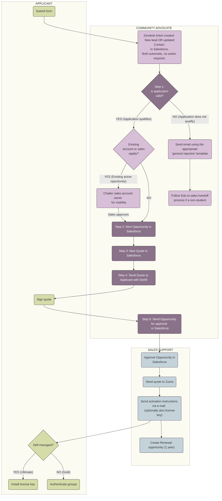

## On this page
{:.no_toc .hidden-md .hidden-lg}

- TOC
{:toc .hidden-md .hidden-lg}

## Overview

Workflow for our complimentary initiatives:
1. [GitLab for Education](/solutions/education/)
1. [GitLab Open Source Program](/solutions/open-source/program/)
1. [GitLab Startups Program](/solutions/startups/)

### Tools

We use several different tools to manage these programs:
1. Marketo for each intake form ([Education](/solutions/education/), [Open Source](/solutions/open-source/), [Startups](/solutions/startups/)) and integration which inserts the record into Salesforce.
1. [Community Advocacy Zendesk](/handbook/marketing/community-relations/community-advocacy/#zendesk), particularly *Education*, *Open source*, *E-mail* and *Suspended tickets* views
1. [Salesforce](/handbook/marketing/community-relations/community-advocacy/#salesforce)
1. [Email aliases](/handbook/marketing/community-relations/community-advocacy/workflows/e-mail/index.html#setting-up-aliases) for education@gitlab.com, opensource@gitlab.com and startups@gitlab.com
1. [Customers portal](/handbook/marketing/community-relations/community-advocacy/#customers-portal)
1. [LicenseApp](/handbook/marketing/community-relations/community-advocacy/#licenseapp)

#### Monitoring 
Community Advocates monitor the following: 
1. Zendesk views: *Education*, *Open Source*, *Startups*, *E-mail*, *Suspended tickets* (for `File {FileExternalID2} has been signed at GitLab` notifications)
1. Salesforce:
   - [Community Advocate Cases Queue](https://gitlab.my.salesforce.com/500?fcf=00B4M000004oeeF) - is a list of notifications internal to SFDC. Anytime an action is needed by a Community Advocate, a record will appear in the Case Queue with a link to the required action. This list includes chatters to `@Community Advocate` or action required on an opportunity.
   - [Community Advocate Lead Queue](https://gitlab.my.salesforce.com/00Q?fcf=00B4M000004oeeA) is a list of all inbound leads from the Marketo application form to SFDC. This list does not need to be monitored since an application to the EDU or OSS form triggers a notification to Zendesk. 
   - [Community Advocate Chatter tab](https://gitlab.my.salesforce.com/_ui/core/chatter/groups/GroupProfilePage?g=0F94M000000fydL) - for mentions of `@Community Advocate` inside SFDC. 
1. Slack channels: `#education-oss`
1. Email aliases: education@gitlab.com, opensource@gitlab.com, and startups@gitlab.com. 
    * **In order to setup these accounts in your inbox:**
         * Follow the [steps to set up the `education@gitlab.com` email alias in your inbox](/handbook/marketing/community-relations/community-advocacy/workflows/e-mail/#setting-up-aliases). If you do not have access please submit an [access request](/handbook/business-ops/team-member-enablement/onboarding-access-requests/access-requests/). 
         * Follow the [steps to set up a filter in your inbox](/handbook/tools-and-tips/#apply-label-to-all-gitlab-generated-emails) to forward all emails sent from Services@sertifi.net to community@gitlab.com. This filter is required because all notifications from eSertifi regarding action on a quote are sent to the *senders* personal email inbox. These notifications need to appear in Zendesk so proper action can be taken. 

The priorities for the daily workflow are as follows:
1. Tickets in the *Zendesk Education View* with ongoing communication between Community Advocates and the member/applicant. 
   - Renewals have the hightest priority in the queue because their license may be close to expiring. 
1. Tickets in the *Zendesk Email View* for notifications that a quote is ready to be sent for approval.
1. Cases in *SFDC Community Advocate Case Queue* (require some action on an existing record in SFDC).
1. **New applications should be left until all tickets and casese in the process have been moved forward.** 

## Application workflow

### Step 1: Determine if the application is valid

#### Education program

1. The Applicant will submit the application form.
   - If an applicant selects `Role` = `Student` an automated email from *Marketo* is sent informing them of available options to students & how to encourage the University to apply. Zendesk ticket won't be created and no action is required from Advocates.
   - If a student contacts us directly and does not use the application form, send the[student rejection email template](/handbook/marketing/community-relations/community-advocacy/workflows/education-oss-startup/#general-rejection)from Zendesk if there a ticket or from the education@gitlab.com email alias.
   - If an applicant selects any other `Role`, the data from the form will be forwarded to SFDC as LEAD/CONTACT object owned by the Community Advocate Queue. The source of the *person* is set to *Education/OSS/YC* based on the form the application originated from. A Zendesk Ticket is automatically created with a link to that object. CONTACT objects contain the same data LEAD objects do, the record is just stored differently. 
1. View the applicant's form in Zendesk.
1. **Check Email Address:** Check the applicant's email address to verify that it is from the same domain as the institution noted in the application. 
   - We cannot issue licenses to email domains outside of the applying institution. If the applicant uses a gmail or other non-related domain, please send the [Requesting email domain template](/handbook/marketing/community-relations/community-advocacy/workflows/education-oss-startup/#requesting-email-domain).
   - If the applicant has a .gov or .mil email domain, please follow the [Federal Sector Exemption steps](/handbook/marketing/community-relations/community-advocacy/workflows/education-oss-startup/#federal-sector-exception). 
   - Make sure to hand them over to the [US Public Sector team](/handbook/business-ops/#public-sector) for a review
   - This is **extremely important** because they probably aren't qualified for this program even if it looks like they are. 
1. **Check Institution:** Verify that the educational institution is an actual accredited, academic, **non-profit** institution. See the [Education Program Requirements and examples of qualifying institutions](/handbook/marketing/community-relations/education-program/#education-program-requirements). 
   - If the region is within the U.S., go to the [National Center for Education Statistics database](https://nces.ed.gov/globallocator/) and search by the name of the educational institution. The results will list the type of institution (public, private, for-profit).  Any institutions that are categorized as 'for-profit' do not qualify. 
   - If the region is not within the U.S., search for the institution on the web and view the institution's about page. Generally, the description will indicate if it is a non-profit institution. If you are unable to determine whether or not the institution is non-profit, email the applicant from the education@ email alias using the ['Requesting non-profit verification' template](/handbook/marketing/community-relations/community-advocacy/workflows/education-oss-startup/#requesting-non-profit-verification). 
   -  If the institution does not qualify, use the ['General Rejection' rejection template](/handbook/marketing/community-relations/community-advocacy/workflows/education-oss-startup/#general-rejection) to notify the applicant and follow the [Education to sales handoff process](/handbook/marketing/community-relations/community-advocacy/workflows/education-oss-startup/#education-to-sales-handoff-process).
   - Note: Non-profit entities regularly apply to the Education Program that are not primarily an educational institution and/or wish to use the license for uses cases outside of the EULA. At this time, we do not have a [formal non-profit program](/handbook/marketing/community-relations/education-program/#non-profits). These requests are handled on a case-by-case basis by the DRI (the appropriate sales team member for that region and their manager). In these cases, follow the [Education to sales handoff process](/handbook/marketing/community-relations/community-advocacy/workflows/education-oss-startup/#education-to-sales-handoff-process).We cannot guarantee that non-profit requests will be granted as the decision is at the discretion of the DRI. 
1. **Check Use Case**: View the applicant's form in Zendesk to view the `Use Case` and `Use Case Notes` response from the form submission. 
   - If the response = `Instructional Use` or `Non-Commercial Academic Research` the use case is acceptable and you can proceed to the next step. 
   - Note: If the applicant mentions anything in the `Use Case Notes` field indicating IT professional use, administrative use, or anything else questionable, you will need to follow up directly. Start by sending the ['Collecting participants usage data' email template](/handbook/marketing/community-relations/community-advocacy/workflows/education-oss-startup/#collecting-participants-usage-data) via the education@ email alias to get more information about their GitLab usage and to make sure they are aligned with our Education program terms.
      - Verifying the use case may take several back and forth emails with the applicant. If the first email does not contain sufficient information needed to verify the use case, send the ['Second email asking for participants usage data' template](/handbook/marketing/community-relations/community-advocacy/workflows/education-oss-startup/#second-email-asking-for-participants-usage-data). If you are unsure if the use case meets the terms, please reach out to the Education Program Manager or to the [Community Advocate, Education Expert](/handbook/marketing/community-relations/community-advocacy/#expertises) for assistance via the [#edu-oss slack channel](https://gitlab.slack.com/messages/edu-oss). It is better to qualify the lead now than issue a license in error.
      - Once you have verified that the use case is acceptable continue to the next step.   
    - If the response = `IT Professional Services` the use case is not acceptable under our terms. Change the lead status to unqualified and send the ['general rejection' rejection template](/handbook/marketing/community-relations/community-advocacy/workflows/education-oss-startup/#general-rejection) via Zendesk. Then follow the [Education to Sales Handoff process](/handbook/marketing/community-relations/community-advocacy/workflows/education-oss-startup/#education-to-sales-handoff-process). 
1. **Check Existing Account Status:** Search SFDC to see if there is an existing account and/or opportunity for this educational institution.
     - Note: If you notice that there is a duplicate account for the same educational institution, please follow the steps for [merging duplicated accounts](/handbook/marketing/community-relations/community-advocacy/workflows/education-oss-startup/#merging-duplicated-accounts). It is acceptable for separate entities within a single educational institution to have separate accounts. For example, it is acceptable for  *University of Missouri Hospital and Clinics* and *University of Missouri Astrophysics Center* to have separate accounts But it is not acceptable to have separate accounts for *University of Wisconsin Madison* and *UW Madison*. 
     - If there is an existing account with an active sales opportunity (stage = anything less than Closed-Won), chatter the account owner in SFDC directly from the account to let them know of the application and make sure there are no conflicts with the issuing the license. Make a note in the Zendesk ticket that you are waiting for the AO to respond. Wait 2 days to hear back. If there is no conflict, proceed with issuing the Education license.
     - If there is an existing account owned by someone from the Sales Team (SAL/SDR) but there are no active opportunities, chatter the account owner and the ASM/ISR/SDR in SFDC directly from the account and make sure there are no preliminary conversations occurring with the account and no conflicts with issuing the license. Make a note in the Zendesk ticket that you are waiting for the AO to respond. Wait 2 days to hear back. If there is no conflict, proceed with issuing the Education license.  Note: SALS/SDRs will open SFDC accounts for any existing conversations with prospects, or for those accounts in a quarterly plan. 
 1. Once you have verified the **email address**, **educational institution**, **use case**, and **existing account status** proceed to [Processing approved applications](/handbook/marketing/community-relations/community-advocacy/workflows/education-oss-startup/#processing-approved-applications) below. 
  
#### Open Source program

GitLab team members can access the [Open Source program applicant approval process training video](https://youtu.be/Vep9OL0BMq0) via the GitLab Unfiltered YouTube account.

1. The Applicant will create a Merge Request [against our OSS project](https://gitlab.com/gitlab-com/marketing/community-relations/gitlab-oss/-/merge_requests/) and submit the [application form](/solutions/open-source/program/) with a link to that Merge Request.
1. A Zendesk Ticket is automatically created with a link to a New Lead or an existing Contact in SFDC that is updated with new data.
1. Open the related Merge Request by clicking the link under *Web Form* field on the related SFDC Lead/Contact object and make sure that:
   - GitLab repository is public by clicking *GitLab Repository URL*. If you're getting a 404 error, that probably means the repository is private.
   - They're using one of the [OSI-approved licenses](https://opensource.org/licenses/alphabetical) by checking their *URL to the license file in the GitLab repository*.
   - Make sure they followed the correct format to add their project to our [OSS projects list](https://gitlab.com/gitlab-com/marketing/community-relations/gitlab-oss/blob/master/data/oss_projects.yml) under Merge Request's *Changes* tab.
   - If something needs to be added or updated, communicate to the applicant on the Merge Request.
1. **Domains.** Many open source projects may not have their own email aliases set up. It is ok to issue licenses to someone with a gmail.com address, or something other than the project's domain. 
1. If you're not certain that the project is non-profit, reach out to clarify.
1. If the Merge Request link is missing on the related SFDC object, or if some of the personal details is missing, follow up with the applicant using the opensource@gitlab.com email alias.
1. If the applicant is not qualified, send the [OSS Program Rejection Email](/handbook/marketing/community-relations/community-advocacy/workflows/education-oss-startup/#rejection--not-an-open-source-non-profit) and close their MR.
1. If you've verified that the applicant qualifies for the program, go ahead and merge the MR. If there are merge conflicts, ping the author to fix them.
     Potential text to use while pinging MR author: `Thanks for your application, 'username'. Our team is processing your application and will soon send you a quote for your signature. In the meantime, can you please fix the merge conflicts on this merge request so we can merge into the project? Please feel free to assign the merge request to myself, 'my_username' when it is ready to go. Thanks!`
1. Proceed to the [Create an Opportunity](/handbook/marketing/community-relations/community-advocacy/workflows/education-oss-startup/#step-2-create-an-opportunity) section using OSS naming convention. There is no need to wait for the MR to be merged before starting this process. Instead, advocates should get applicants started in the quote signature process while they address conflicts on the MRs at the same time to increase speed of application review.

##### Merging the OSS Application MRs

After you've determined the open source program application is valid, you need to merge the MR the applicant created into the [list of current oss program participants](https://gitlab.com/gitlab-com/marketing/community-relations/gitlab-oss/-/blob/master/data/oss_projects.yml)

1. If there are no merge conflicts, you can merge the branch directly from GitLab using the 'merge' button
1. If the GitLab web ide allows you to edit the merge conflicts on GitLab, you can make edits here and then merge.
1. Advocates have the option of pinging the author of the merge request and asking them to fix the conflicts so the file is ready to merge.
1. If you cannot use the web ide, and you'd like to fix the conflicts yourself, you'll need to resolve the conflicts locally. Make sure you've [cloned](https://docs.gitlab.com/ee/gitlab-basics/start-using-git.html#clone-a-repository) the [Open Soure Program project](https://gitlab.com/gitlab-com/marketing/community-relations/gitlab-oss) locally.
1. In your terminal, navigate to the OSS project folder
1. Perform the `git pull` command to update your local version
1. In the GitLab MR, click the 'Check Out Branch button' and copy the first 2 commands in Step 1
1. Copy these two commands into your command line. These commands will fetch the fork the application made and checkout to their application branch
1. Merge the master changes into the branch using `git merge master`
1. Resolve merge conflicts and save the file. Usually, we want to keep all the changes to the file, so simply check the new applicant entries and remove the merge conflict indicators.
1. Commit your changes using `git commit -am "your commit message"`
1. Push changes to the branch using `git push origin <applicant-branch-name>`
1. Consider deleting the branch from your local repository to keep your working brances clean.
1. Check GitLab to confirm the branch was merged. 
1. If there is ongoing conversation with the applicant on the MR, respond with any updates. Otherwise, there is not additional action needed.

#### Startups program

- Make sure they were part of the current or two most recent [YCombinator batches](https://www.ycombinator.com/companies/). If they are not on that list, follow up with [Asking for a proof for the current batch participants](/handbook/marketing/community-relations/community-advocacy/workflows/education-oss-startup/#asking-for-a-proof-for-the-current-batch-participants) email template.
- Search [Crunchbase](https://www.crunchbase.com) by startup name to check if they raised less than $3M in revenue.

#### Handoff Process to Sales
If an applicant does not meet the program terms, the account should be transferred over to the appropriate sales account representative by following these steps:
1. Identify the [appropriate sales territory and vertical of the entity](/handbook/sales/territories/#territories). 
    - If the entity is a public educational institution in the US, the vertical is [Public Sector](/handbook/sales/territories/#territories). 
    - If the entity is a private educational institution, the vertical is generally [MidMarket](/handbook/sales/territories/#territories).
    - Some territories may not have a Public Sector Vertical, in this case, use MidMarket.
1. Identify the appropriate sales representative for that Region/Vertical from the sales territory table. Note: Depending on the territory, size of the institution, and existing contact with the institution, the appropriate sales represenative could be a sales development represenative (SDR), inside sales representative (ISR), or the strategic account owner themselves (SAL). 
    - If you are unable to easily determine who the approproate sales owner is, please post the SFDC link in the appropriate slack channel (for example the US Public Sector SLED channel is [#public-sector-sled](https://gitlab.slack.com/archives/CRM6JS5L0)) and ask for guidance on who the account should be transferred to. 
1. Reassign the lead to the appropriate sales representative for the Region/Vertical in SFDC. 
1. Chatter the sales representative in SFDC directly from the account to let them know the lead has been reassigned and there is no current action item.
    - If the lead responds to the offer in the 'academic use case' rejection template for an introduction to a sales representative using the ['Handing off to sales team' email template](/handbook/marketing/community-relations/community-advocacy/workflows/education-oss-startup/#Handing-off-to-sales-team), then chatter the sales representative to set up a call. 
1. Any relevant emails regarding the use case or the scope of the opportunity should be tracked within SFDC in the account's activity history. Follow [these steps](/handbook/customer-success/using-salesforce-within-customer-success/#tracking-emails-within-salesforce) to forward any relevant email correspondance to SFDC. 
    -  Note: If the person you are contacting is not yet a contact associated with an opportunity or account in SFDC you will need to search for the email by pasting the applicant email address in the SFDC search bar, finding the email in the list, and then manually associate the email to the appropriate account in SFDC.

### Step 2: Create an opportunity
For an overview of the process, see [Create an Opportunity](https://youtu.be/YYRA34__-N0).

1. Navigate to the Account using the name and/or email address from the Zendesk ticket.
    - If the applicant is not already in SFDC, the search results will have a *Lead* object in the results list. Click on the *Lead* from the list, view the record to make sure it matches the application, and then click *Convert*.
      - Change the *Record Owner* from your name to *Christina Hupy*. Note: All records will be owned by *Christina Hupy* for consistency, but Community Advocates will be able to perform any required actions on the records. 
      - Click on *Account Name*. A drop down menu will appear. If there is already an account in SFDC for this institution choose the option to *Attach to Existing: {Account Name}*. If there is not an account choose *Create New Account:{Account Name}*. 
      - Then name the opportunity accordingly *CompanyName-NumberOfUsers Product Program [w/ Support]* (e.g. `ABC University-100 Ultimate EDU` or `ABC University-100 Ultimate YCStartups w/ Support`).
      - Turn off the *Reminder*
      - Then click *Convert* 
      - The *Opportunity* will then be created and appear under the Account. 
   - If the applicant was already in SFDC as a **Contact** click on *New Opportunity*. 
   - In either case, you'll now be in the *Opportunity* view for the following steps.
1. Set the *Initial Source* to Education/OSS (only when working with an existing Contact)
1. *Type*:
   - New Business = if it is a brand new request
   - Add-On Business = if they are adding seats, changing the amount of seats, changing license type, or adding support 
   - Renewal = if they are renewing
1. *Close date* - Today
1. *Stage* - '6-Awaiting Signature'
1. Set the *Amount* to $0.00 if they didn't purchase support or the annual amount of the support price if they did. 
   - Note: The price of support for EDU/OSS/Startups is $4.95 per user per month. The entity **must** purchase support for all of the seats they are ordering. 
   - If they purchase support, calculate the total cost for one year for all seats and add it to the opportunity. 
1. Click *Save*

### Step 3: Create a new Quote
For an overview of the process, see [Create a New Quote and Send to Applicant](https://www.youtube.com/watch?v=gKrjz8WL1XA).

1. If prompted, choose *New Billing Account*
1. Choose the appropriate *Quote Template* - `NEW CUSTOMER ORDER FORM V1.05 EDU ` / `NEW CUSTOMER ORDER FORM V1.05 OSS` / `NEW CUSTOMER ORDER FORM V1.05 YC`
1. *Sold to* and *Bill to Contacts* are the primary contacts.
   - The *Sold to* person will sign the quote and receive the license (Ultimate) or instructions for authentication (Gold). This generally should be the person that will set up the license. 
   - The *Bill to* person can be the same as the *Sold to* person, or it may be the person who applied for the license. They do not need to be the same. 
   - An institution may request that someone other than the *Sold to* or *Bill to* person signs the quote. Generally, we accept any signature by an authorized institutional represenative. You will not need to recreate the quote if someone other than the primary contacts signs the quote. 
1. Click the *Primary* checkbox
1. *Start Date* - Today.
1. The *Initial* and *Renewal* Terms should be 12 months. 
1. Disable Auto-renew.
1. Be sure *Click-through EULA* is **unchecked**.
1. If Tax Exempt and they want to purchase Support, make sure to ask for a Certificate ID so that there is not tax added to the Support cost. Not all organizations that opt for the free Ultimate or Gold will be tax exempt. If they are just signing up for the free plan, there will be no tax so you can skip this step.
1. Click *Next*
1. Click on the *Select* pull down menu. *Add base product* - `Ultimate - 1 Year (EDU or OSS)` / `Ultimate - 1 Year (Y Combinator)`) or `Gold Plan - 1 Year (EDU or OSS)` / `Gold Plan - 1 Year (Y Combinator)` with or without support and click *Select Plan*. Click *Save*. Note: In order to see the license type and number of seats, view the opportunity record. The opportunity name will list the liscense type and the number of seats will be listed in the qualifications section. 
   - If they are requesting support, be sure to choose the product with support. 
1. *Quantity* - enter the number of seats and click *Submit*
   - If they are purchasing support, the product will list $59.40 as the cost. This the cost per year for each seat. The quote will calculate the total cost for the number of seats and populate the value automatically. The resulting value should match the value you entered on the Opportunity. 

### Step 4: Send the quote to the applicant

1. Navigate to the related Contact object and make sure that the *Mailing Address* contains *Mailing Zip/Postal Code*
1. Navigate to the created Quote and click *Generate PDF*. A confirmation that the PDF has been created will appear in a separate tab. Close the tab and return to the Quote view.
1. Send the Quote to the applicant by clicking on the *Sertifi eSign* button. 
    - In the *Email Invite Message* window paste the ['Sending a quote to the applicant through Sertifi' response template](/handbook/marketing/community-relations/community-advocacy/workflows/education-oss-startup/#sending-a-quote-to-the-applicant-through-sertifi).
    - The correct participant should appear in the list. If there is not a participant in the list, search for the participant in the *Add Participants* section and add them. 
    - Next to *Related Notes and Attachments* select the newly created PDF. Then preview the PDF and verify it is rendered properly by clicking on *Preview*.
    - Double-check the quote to make sure the following is correct: Sold To Details, Subscription Details (product, quantity, total), and Edu terms. 
    - Click *Send for Signature".
1. Notify the applicant that their application was approved and the quote was sent by replying in Zendesk with the ['Approval from Zendesk' response template](/handbook/marketing/community-relations/community-advocacy/workflows/education-oss-startup/#approval-from-zendesk). Submit the ticket as closed in Zendesk. Note: We send this additional email because the quote will come directly from Sertifi eSign and we want to make sure they are aware it is coming from a different sender and it could get blocked by spam filters. 
    - Note: Notifications regarding any action (delivery, signature, or comment) on the quote will be sent from Services@sertifi.net to the individual who sent the quote. Each individual advcoate **must** have [the filter set up](/handbook/tools-and-tips/#apply-label-to-all-gitlab-generated-emails) in their personal inbox to forward all eSertifi emails to community@gitlab.com which will create a Zendesk ticket to take action on the quote. 
1. After the applicant receives the quote, we will receive the `Delivery Receipt For File` email notification (sent to the individual and then forwarded with the filter to community@gitlab.com). Use the ['License' macro in Zendesk](/handbook/marketing/community-relations/community-advocacy/tools/zendesk/#current-macro-stack-descriptions) and change related ticket's status to *Solved*. The [signed quote can be viewed](/handbook/marketing/community-relations/community-advocacy/tools/zendesk/#viewing-a-signed-quote). 
1. The quote may need to be signed manually or without Sertifi for a number of reasons. For example, it is fairly common that the Sertifi email was blocked by spam filters or the applicant was unable to sign electronically. To send the quote for signature via email:
    - Navigate to the *Opportunity* in SFDC. 
    - In the *Google Docs, Notes & Attachments* section, the preview.pdf quote generated earlier will be available. Click the preview link and then click on the link for *View file*. The PDF of the quote will open and you can download it from your browser. 
    - Download the PDF to your local machine and attach it to an email. Use the ['Sending a quote via email' template](/handbook/marketing/community-relations/community-advocacy/workflows/education-oss-startup/#sending-a-quote-via-email).

### Step 5: Submitting the Opportunity for the approval

1. When the applicant signs the quote, we will receive the notification that will end up in the *E-mail* view in Zendesk and will look like this: `File {FileExternalID2} has been signed at GitLab`. 
   - If the quote was returned via email, download the quote, name the quote with the proper Opportunity naming convention, and add 'signed' to the end. Then upload the quote to the Opportunity in the *Google Docs, Notes & Attachments* section. 
   - In either case, find the related Opportunity in SFDC, update the *Close date* to today and click on *Submit for Approval*. Note - do not change the stage, only Deal Desk and Billing have permission to do that. 
   - In order to verify that the opportunity was submitted for approval, view the [*Approval History*](/handbook/marketing/community-relations/community-advocacy/workflows/education-oss-startup/#check-approval-history).
   
1.  There are two related *E-mail tickets* from Zendesk, one indicating that the quote has been signed and then one indicating that the quote has been approved. From the quote has been signed email, change the recipient address to be the account owner, change the 'via' email to be education@ or opensource@, and apply the [welcome email template for education program members](/handbook/marketing/community-relations/community-advocacy/workflows/education-oss-startup/#welcome-to-the-GitLab-for-education-program) or the [welcome email template for open source program members](/handbook/marketing/community-relations/community-advocacy/workflows/education-oss-startup/#welcome-to-the-GitLab-for-Open-Source-Program). If it is a education program renewal send the [thank you for renewing email template](/handbook/marketing/community-relations/community-advocacy/workflows/education-oss-startup/#thanks-for-renewing-email) as the response.
   - Delete the quote has been approved email ticket. 
1. Once approved, sales-support will send the quote to Zuora. From Zuora, the license key (for Ultimate) or the subscription (for Gold) will be posted to the Customer portal and instructions for authenticating a group will be emailed (Gold). Also, a renewal opportunity will be created.  

### Renewal process
Note: All Education and Open Source renewals should be handled by Community Advocates directly because **we verify the use case before granting the renewal**. Use cases may have changed in one year and it is important to verify that the program member still meets the EULA. Please ping us on the [#education-oss](https://gitlab.slack.com/messages/education-oss) Slack channel if you have any questions. If the Opportunity is assigned to someone other than a community advocate and it is time to start the renewal process, please reassign the renewal opportunity to Community Advocate, but leave the related Account assigned to Sales Account Leader.

#### In-bound renewals
- A case will appear in the [SFDC Community Advocate Case Queue](https://gitlab.my.salesforce.com/500?fcf=00B4M000004oeeF) when Sales Support needs to reassign a renewal opportunity. The renewal opportunity may be assigned well ahead of the actual renewal date. If the date on the renewal is less than three months away, send the [Requesting renewal information template](/handbook/marketing/community-relations/community-advocacy/workflows/education-oss-startup/#requesting-renewal-information) to the member and close the case. If the renewal date is more than three months away, change the ownership to *Christina Hupy * and close the case. Note: Program members will receive 3 and 6 month automatic reminder emails regarding the subscription renewal. 
- A member may reach out directly to education@gitlab.com inquiring about how to renew their license. In this case, a Zendesk ticket will appear in the Education view. Send the [Requesting renewal information template](/handbook/marketing/community-relations/community-advocacy/workflows/education-oss-startup/#requesting-renewal-information) to the member and submit the Zendesk ticket as *Solved*.
- If a member responds to the [Requesting renewal information email](/handbook/marketing/community-relations/community-advocacy/workflows/education-oss-startup/#requesting-renewal-information), proceed with [step 5 to check account activity](/handbook/marketing/community-relations/community-advocacy/workflows/education-oss-startup/#education-program) and verify the use case. If there are no active sales opportunities and the use case is verified, proceed to Step 1: Update the renewal opportunity.  

#### Quotes for Expired Renewal Requests
Sometimes, a university will reach out to renew a license that is already expired. In this case, the renewal should be processed like a new subscription to either the Gold or Ultimate license.

1. Find the related account and review expired renewals. For example: if the university reaches out in August of 2020 for a renewal, but their account shows a renewal of August of 2019 that was never closed, it's an expired renewal.
1. Check the past opportunities to confirm the product, seat totals, and primary contact
1. Navigate to the primary contact account and click `New opportunity`. 
1. Name the opportunity using the renewal naming mechanism
1. Generate a new subscription quote for the correct product and seat count
1. Proceed with the regular renewal process. 

Please note that if this process is not followed for an expired renewal, the advocate processing the renewal will likely get a ping from sales support indicating that the quote cannot be processed due to the expired renewal. Please follow this process to avoid confusion with the university and with sales support.

For an overview of the process, see [Process Renewal Opportunity Inbound Request](https://youtu.be/sgQY76GBLxM).

#### Step 1: Update the renewal Opportunity

1. Find the adequate *Renewal Opportunity* and rename it using this format: *CompanyName-NumberOfUsers Product Program [w/ Support] Renewal RenewalDate* (e.g.*CompanyName-100 Gold EDU Renewal 01/19*). The date is the beginning of the renewal year. If you can't find the appropriate renewal opportunity or the renewal opportunity has expired chatter *@sales-support*. Note: Advocates are able to create new opportunities in SFDC. [See the 'Common Tasks in SFDC' section for process details.](/handbook/marketing/community-relations/community-advocacy/workflows/education-oss-startup/#common-tasks-in-sfdc)
1. Make sure that the *Opportunity Type* is set to Renewal, set the *Close date* to today and *Stage* to '6-Awaiting Signature'. Also, double-check that the *Amount* is correct and click Save.

#### Step 2: Create the new renewal Quote

1. Click on *New quote*
1. Select appropriate *existing billing account*, select *renew existing subscription for this billing account* and find the Opportunity that you want to renew under *Subscription name*. Then click *Next*. 
1. Make sure to select the appropriate *Quote Template* on *Provide Quote, Account and Subscription Term Details* page.
1. Check the *Sold to* and *Bill to Contact*. The contact should be the same person as the person who sent the renewal email. If is not the same see the note below. Otherwise, everything else should stay the same. Click *Next*.
  - Note: The license key will be issued to the existing primary contact's GitLab [customer portal](https://customers.gitlab.com/) account. This is generally the *Sold to* contact. If the primary account owner has changed, the new primary account owner needs to create an account on the Customer Portal and the license needs to be [associated with the new account](/handbook/marketing/community-relations/community-advocacy/workflows/education-oss-startup/#associating-customer-portal-subscriptions-with-new-accounts). If the previous primary contact is no longer with the institution/entity, the subscription will need to be removed from that account in the Customer Portal as well. 
1. Update the number of seats and/or attached product if needed and click *Submit*

#### Step 3: Final steps

- [Send the quote to the member](/handbook/marketing/community-relations/community-advocacy/workflows/education-oss-startup/#step-3-send-the-quote-to-the-applicant) and [submit the opportunity for approval](/handbook/marketing/community-relations/community-advocacy/workflows/education-oss-startup/#step-4-submitting-the-opportunity-for-the-approval) as described in the [Processing approved applications](/handbook/marketing/community-relations/community-advocacy/workflows/education-oss-startup/#processing-approved-applications) section. 
- The renewed license will become active only after the original expires (even if the renewal quote is approved before that).

### Creating an amendment for the existing subscriptions (adding more seats)

1. Navigate to the original (Closed Won) **Opportunity** and click *New Add On Opportunity*
   - Update the *Opportunity name* - `CompanyName-Add [Quantity] [Product] EDU` (e.g. Oxford University- Add 25 Ultimate EDU)
   - Update: *Initial Source* to EDU/OSS, *Close date* to Today and *Stage* to '00-Pre Opportunity'
   - Update: *Sold to* and *Bill to* Contact to the Primary Contact
1. Select newly created **Opportunity** and create a new **Quote**:
   - Update: *Select Billing Account* to *existing billing account* and *Choose Quote Type* to *amend existing subscription for this billing account* and click *Next*
   - Click *Next* again (you can change signer if needed)
   - Update the total seat number to reflect the total seats after the desired increase. For example, if the account has 20 seats and would like to add 40 seats, enter 60 on the quote. This will generate a quote for 40 additional seats.
   - Click 'Submit' and follow the process for generating a PDF and sending the quote.

Once the quote is signed and the opportunity is submitted for approval, the LicenseApp will provision a new key for the increased number of users.

### Checking the [Community Advocate Case Queue](https://gitlab.my.salesforce.com/500?fcf=00B4M000004oeeF) 
For an overview of the process, see [Checking the Case Queue](https://youtu.be/_xKNLPeRHNc).

1. Navigate to the [Community Advocate Case Queue](https://gitlab.my.salesforce.com/500?fcf=00B4M000004oeeF) in SFDC. 
1. Click the link under the *Case Number* field for the oldest case from the *Date/Time Opened* field where the *Status* field is **New**.
1. The case will open. Click the link next to *Related Chatter Object* to open up the related record with the chatter. 
1. The chatter generally will request some kind of action on a quote, lead, or opportunity. Take the recommendended action to resolve the chatter. 
   - If the chatter is asking to assign the opportunity the correct owner, assign it to *Christina Hupy*. 
   - If the chatter is asking to assign a rewewal opportunity to the correct owner, follow the steps in the [renewal process](/handbook/marketing/community-relations/community-advocacy/workflows/education-oss-startup/#renewal-process). 
   - If the chatter is asking to assign a lead and respond to an inbound request, it is likely that the lead reached out and needs to be directed to the Education Program application form. Send the [providing basic program information email template](/handbook/marketing/community-relations/community-advocacy/workflows/education-oss-startup/#providing-basic-program-information) and assign the lead to *Christina Hupy*.
       *Note If the lead was in an Outreach sequence, [it will automatically be marked as finished](/handbook/marketing/revenue-marketing/sdr/#working-with-the-community-advocacy-team). 
1. Click *Delete* on the case in the Case Queue when the requested action is complete. Note: We delete the case instead of closing it because closing a case requires an additional form. Since our cases are only chatters and the record of the chatter remains with the object, we do not need to keep a record of the case. 

### [Community Advocate Lead Queue](https://gitlab.my.salesforce.com/00Q?fcf=00B4M000004oeeA)
The Lead Queue contains all leads that come in from the application forms (EDU/OSS/Startup). Each lead also generates a notification to Zendesk so there is no need to check the Lead Queue daily. 

### Federal Sector exception
Federal entities in the United States have additional [rules of engagement](/handbook/sales/public-sector) and most do not qualify for the educational program license. If you receive an application with the words "U.S.", "Military", "Naval", "Airforce", "National Laboratory" in the institution title, and/or the applicant email has a .mil or .gov domain, please do the following:
- Reach out to the account owner directly **before** sending a rejection email to let them know of the application and ask them if we should proceed with the rejection email or if they would like to contact the applicant directly. The account owner may have an existing relationship with the institution and we want to be sensitive to any ongoing communication. See the [sales handoff process](/handbook/marketing/community-relations/community-advocacy/workflows/education-oss-startup/#handoff-process-to-sales) for details. 

Note: If you are a non-US Citizen you may not be able to view existing accounts for U.S. Federal entities in SFDC due to restrictions. If you do not see an account and you are not sure who to contact in SFDC, inquire in the [#public-sector slack channel](https://gitlab.slack.com/archives/C57F94Y8H). 

Note: The U.S. Federal Government has various entities that may have the words  "School" or "College" in them but they are actually part of a military entity or branch of the government. Examples include: "Army Cyberschool", "National Geospatial Intelligence Agency College", or "National Laboratory". These entities are not qualified for the Education Program license under the EULA.  

#### OSS federal use case policy
Federal use cases are considered on a case-by-case basis for the OSS program. Please reach out to the OSS program manager if you come across a federal use case application for the OSS program. 

### Handling Zendesk Tickets

Advocates should use the following guidelines when processing tickets for all programs.

| Ticket Details | Ticket Status and Actions Needed |
| ----- | ----- |
| License issue or legal case that needs follow up | `open` ticket |
| Need follow up from another advocate or program manager | `open` ticket + tag a teammate in the ticket and post in the #education-oss Slack channel for support |
| Waiting on the customer to respond to a ticket | `pending` ticket |
| No response is needed or expected | `solved` ticket |
| Adding notes to the ticket to address later | `new` ticket + leave internal notes |

## Common Requests

### Applicant indicates they have not received a license
An applicant may email education@gitlab.com and indicate that they signed the quote but have not yet received the license/subscription or instructions on how to access it. 
1. Locate the opportunity in SFDC. 
1. Check the *Approval History* section to verify that the *Overall Status* of the opportunity is *Approved*. 
1. Check the *Quote status* to be sure it has been sent to *Z-billing*. If the quote was sent to Z-billing, the license (Ultimate) or subscription (Gold) should be available in the Customer Portal. 
1. In order to check the status of the license, log into the [Admin Customer Portal](https://customers.gitlab.com/admin) with Okta. If you do not have access, open an [AR request](handbook/business-ops/it-ops-team/access-requests/). 
    - Click on *Customers* from the *Navigation* panel. 
    - Search for the customer's name and/or institution and locate the customer from the results. Note that the customer portal account is in the name of the *Sold to* contact on the quote. 
    - Click on the home icon in the results list for that customer. 
    - The *Manage purchases* page will open. 
    - For Ultimate, the license should appear with links to *Copy the license to clipboard*. If the license does appear with the correct renewal date, then send the [Check the customer portal for Ultimate license template](/handbook/marketing/community-relations/community-advocacy/workflows/education-oss-startup/#check-the customer-portal-for-Ultimate-license) to the customer. Note: Before sending the email check the *Sold to* contact from the *Quote* in SFDC. The customer portal account is in the name of the *Sold to* contact. The person requesting where to recieve the license may be the *Bill to* contact (and they don't have access to the portal). Adjust the template accordingly. 
    - For Gold, the Gold Plan subscription should be listed with a proper expiration date. If there is an option to *Link my GitLab.com account*, send the applicant the [Link GitLab account to Gold subscription template](/handbook/marketing/community-relations/community-advocacy/workflows/education-oss-startup/#link-GitLab-account-to-Gold-subscription).
    - If the subscription is incorrectly associated with a different account in the customer portal, follow the steps to [associate the subcription with an additional account](handbook/marketing/community-relations/community-advocacy/workflows/education-oss-startup/#associating-customer-portal-subscriptions-with-new-accounts).
1. If the license is expired or instead of a license the option to purchase plans appears, this means that the license key was not properly issued and posted to the applicants's account after it was sent to Z-billing. In this case, open an issue in the [dotcom internal project](https://gitlab.com/gitlab-com/support/internal-requests/-/issues) with the [‘License Issue’template](https://gitlab.com/gitlab-com/support/internal-requests/issues/new?issuable_template=license%20issue).
   
### Switch licenses from one type to another

If a member ask us to switch from self-hosted to GitLab.com or vice-versa during the Subscription Term, please create an add-on opportunity and follow the [amendment rules](/handbook/sales/field-operations/sales-operations/deal-desk/#amend-subscription-quote) per B.

### Associating customer portal subscriptions with a new accounts
For an overview of the process, see [Associating Customer Portal Accounts](https://youtu.be/yuainNUzxuc).

A member may request that a license subscription be associated with a new account in the [customer portal](https://customers.gitlab.com/). The *Sold To* person on the **original** opportunity and associated quote is generally the account owner that the license is granted to in the customer portal unless an additional request was made. In order to change the account to which the license is associated with in the customer portal:
1. The new person must first create an account in the [customer portal by registering](https://customers.gitlab.com/customers/sign_in). 
1. For GitLab.com (Gold/hosted), they must link their GitLab account to their customer portal account. Once they signed into the Customers Portal, if their account is not already linked, they will be prompted to link their account with a *Link my GitLab Account button*.
1. Once the new account is created and linked, log into the [Customer Portal Admin panel](https://customers.gitlab.com/admin/) with okta and follow these steps to associate the license:
   - Click Customer on the left panel.
   - Search for the current account owner's profile using their full name, find the name in the list and click the edit option to open the page in a new tab.
   - Repeat the previous step for the new account owner.
   - Copy the Zuora and SFDC ID numbers from the current account owner's profile to the new account owner's profile. Click Save on the new account owner's profile. 
   - If you need to remove the subscription from the current account owner's profile, remove the Zuora and SFDC ID numbers from their page and click Save. 
   - Email the new account owner to verify that they can see the option to either activate their group for Gold or download the license key for Ultimate. 
   - Notes: Changing the Sold To or Bill To contact information will not automatically send the subscription to the new contact in the Customer Portal. [See additional details in the support handbook](/handbook/support/workflows/license_troubleshooting.html#associating-customer-portal-subscriptions-with-additional-accounts). 

### Assigning New License to Correct Account Owner

In some instances, institution administration will be required to sign for a license, but have no intention of being the GitLab account owner. This often occurs when the administration needs to provide official signature, but the individual professor or department head plans to own the account.

In this case, the contact who will be the license manager should be the **Sold To** contact on the quote. The *Sold To** contact will need to create a customer portal account to obtain the license. The contact who signs the quote, generally an institution administrator with authority to sign, will be the **Bill To** contact.  

### Adding Support 

If a member may ask to add on support after a license has already been issued, please create the add-on opportunity and follow the [amendment rules](/handbook/sales/field-operations/sales-operations/deal-desk/#amend-subscription-quote) per 2B. 

### End user license agreement or terms modification requests

- An institution may request slight modifications to our terms. To request a modification of our terms on behalf of an institution:
    - Send the [requesting term modification template email](/handbook/marketing/community-relations/community-advocacy/workflows/education-oss-startup/#request-modification-to-our-terms) indicating that the institution should provide the specific changes in a document to us via email. 
    - Submit these changes to our legal team [review of customer edits process](handbook/business-ops/order-processing/#request-for-gitlab-review-of-customer-edits-to-gitlab-template-or-review-of-customer-agreement-template). 
- We maybe able to renew a license with modified terms if legal approved them in previously years. If the terms were previously approved, follow the same process to submit the prior terms for review. Note: Our terms may have changed so we need to check with legal even if they approved the modifications in the prior year. 
- We cannot accept a quote returned from an institution with a addendum or their own agreement. Send the requesting term modification template email and add a note indicating that we are not able to accept terms provided by individual institutions. 

### Refund process

- Send an email to ar@gitlab.com with a link to the appropriate **Opportunity** and ask them to provide a refund request (they will create a refund opportunity)
- Communicate to the member that they should see that payment reflect back to their records within 5-7 business days
- Proceed with new quotes/opportunities only when the refund process is done

### Processing tax exemption certificates

1. Attach these documents in the notes and attachments section of the opportunity
1. Enter the tax certificate ID in the Zuora quote. This should automatically remove the tax from the quote
1. CC sales-support for them to approve

### VAT ID clarification

VAT ID is not required for $0.00 transactions and additionally, many Education institutions are VAT exempt.

### Adding Credit Card details

- The member cannot pay directly by credit card. Rather, they need to add their credit card details on [customers.gitlab.com](https://customers.gitlab.com/).
- To do so, they need to follow these instructions:
  - Log into your account at [GitLab Subscription Manager](https://customers.gitlab.com/customers/sign_in)
  - Click on *Payment Methods* at the top of the page
  - Click on *Add new payment method*
  - Select *Credit Card* as the type
  - Enter the details and submit
  - Please send an e-mail to ar@gitlab.com once the credit card has been added and we will process the payment.
  
### Resolving users over license issue

If users used more seats during the previous year than they paid for, this error will appear:
- `During the year before this license started, this GitLab installation had X active users, exceeding this licenses limit of Y by Z users. Please upload a license for at least X users or contact sales at renewals@gitlab.com`
To resolve this issue, follow these steps:
  1. Go to the [LicenseApp](https://license.gitlab.com/licenses/) and find the particular license that needs to be changed
  1. Click on *Duplicate license*
  1. *Users count* - the number of seats they requested
  1. *Trueup count* - the maximum number of users during the previous year
  1. Click on *Create license* and the updated license will automatically be sent to the account contact

### Payment options for support 

Once the quote is approved and the license has been delivered, the billing department will send an invoice where users can choose to pay via credit card, wire transfer or PO. 

### Qualified Applicant Passed from Sales to Community Advocates team.

Sales will pass along qualified program applicants in a few ways. Some will ping the team in the [#education-oss](https://app.slack.com/client/T02592416/CB21NTDJQ) or [#community-relations](https://app.slack.com/client/T02592416/C0R04UMT9) slack channels. Others might reassign or ping advocates or program managers on Salesforce leads. 

If a qualified applicant is referred to us:
1. Review the associated lead in Salesforce to confirm they are elidigible.
1. Follow up with the lead via email and ask that they complete an application form for their appropriate program
1. When the application is received, follow regular processing steps for the program.

### Reviewing Applicants to the Student Spotlights Program

1. Applicant submits the[ ]Google form](https://docs.google.com/forms/d/1jpevzEoR7Mih7rnuHfnT65El1a-KTQMXc-b2LSJq9-0/edit) by the due date.
1. The Education Program Manager and Community Advocate will review and approve applicants from the [Google Form responses sheet](https://docs.google.com/spreadsheets/d/1eYiwV9lfgK_SOz760_3zmFwhkDzjVmx6iLZN5NEwMJw?usp=forms_web_b#gid=837712298).
1. Community Advocate will send email to approved applicants with [Calendly link to schedule an interview time](https://calendly.com/gitlab-edu/gitlab-student-spotlight-interview) and [interview questions](https://gitlab.com/gitlab-com/marketing/community-relations/community-advocacy/general/-/issues/111#note_353793665).
1. The Education Program Manager and Community Advocate will host recorded interviews via Zoom.
1. Community Advocate will send follow up email to participants thanking them for their participation, linking to their featured project on GitLab Unfiltered/GitLab.com, and including a [GitLab Community Swag giveaway link](/handbook/marketing/community-relations/community-advocacy/workflows/merchandise-handling/community-rewards-internal/).

### Applicant Asks for an Extended License during Renewals

Sometimes, applicants reach out for a renewal very close to the deadline and request an extension of their license while the renewal is organized.

If the advocates team determines that an extension is appropriate:
1. First ask that the member apply for a trial of Gold or Ultimate to extend their access for 1 month as the renewal is settled.
2. If for some reason they've already used their free trial, please follow these steps for [working with trial extensions](https://about.gitlab.com/handbook/support/workflows/trial_extensions.html).

## Common errors

#### Quote Errors
- Error:`Insert failed. First exception on row 0; first error: INSUFFICIENT_ACCESS_ON_CROSS_REFERENCE_ENTITY, insufficient access rights on cross-reference id...`can be encountered while trying to send generated quote through Sertifi.
  1. Check to see if you are the owner of the related Opportunity and Account objects. If not, change the owner to yourself. 
- Error: `Please obtain the necessary approvals before generating document(s)` can be encountered while generating .pdf or Word file of the quote.
  1. Update *Submitter Comments* field on the quote object.
  1. Click on *Submit for Approval* on the quote object.
- Error:`The Zuora GetTax Call to Avalara returned the following errors(s): Address not geocoded. (Address cannot be geocoded). An exact street name match could not be found.......` can be encountered after choosing the product on the quote and clicking submit. 
  1. Scroll down on the Quote view and click on the name of *Sold to Contact* to view the account details. On the account view, scroll down to the *Address information* section. Inspect the address to determine if the applicant included an actual street number and name. Commonly, applicants will list enter  *Mailing Street: Department of Computer Science*. This type of address cannot be geocoded and will prevent the quote from being issued. There may be other issues such as a typo. 
  1. Email the applicant from the Zendesk with the [`Requesting valid address' template](/handbook/marketing/community-relations/community-advocacy/workflows/education-oss-startup/#requesting-valid-address-email-template). 
  1. When the applicant replies, the ticket will appear in Zendesk. Follow the steps to [update an account address](handbook/marketing/community-relations/community-advocacy/workflows/education-oss-startup/#editing-an-address) and proceed with the [Step 3: Send the quote to the applicant.](/handbook/marketing/community-relations/community-advocacy/workflows/education-oss-startup/#step-3-send-the-quote-to-the-applicant)
     - Note: The address needs to be updated for both the *Account* and the *Opportunity* for the quote to generate properly. 
- Error encountered while updating **Opportunity Status** from *00-Pre Opportunity* to *6-Awaiting Signature*.
  1. Make sure to initially change the *Opportunity Status* from *00-Pre Opportunity* to *0-Pending Acceptance* and then you'll be able to update it to *6-Awaiting Signature*.

#### Application Form Error
- Error: An applicant may inform us that they are not able to view the application form in their browser. Most likely, the web browser is blocking the content of the form through a content or privacy blocker because the form is generated from Marketo. This happens most often in Firefox. Send the applicant the [application form not visible email template](/handbook/marketing/community-relations/community-advocacy/workflows/education-oss-startup/#application-form-not-visible).

#### Flagged for Compliance Review Error

In some cases, new opportunities need to be reviewed by our Legal team before we can process. If you try to create a quote on an opportunity that needs review, you will see an error indicating the opportunity has been flagged. If this happens:

1. Leave the related ticket open in Zendesk and add an internal note says "Pending Compliance Review"
1. Check back on the ticket in 24-48 hours. If the error is removed, process the opportunity. If the error remains, chatter @sales-support for assistance.

## Common tasks in SFDC

#### Editing an address
1. Navigate to the *Account* view in SFDC. Scroll down to the *Address Information*, *Billing Address*. 
    - Note: The *Billing Address* can also be accessed from the *Contact* view. 
1. Click the edit button to edit the address. Click *OK* to save the changes. 
    - Note: The address should update for the *Account*, *Contact* and *Opportunity*. 

#### Reassign an SFDC object 
1. Click *Change* next to the object owner field and select *Christina Hupy* or the appropriate owner.

#### Merging duplicated accounts
1. Make sure the domain and account names are the same. 
1. Chatter @Sales-Support one of the accounts and request that the accounts be merged. 

#### Viewing a signed quote
1. From the *Opportunity* view click on the appropriate quote under the *Sertifi EContracts* section. Scroll down to the *EDocuments* section. Click on the signed document under ("Signed Link"). 

#### Naming conventions
 [Naming conventions](/handbook/business-ops/resources/#lead--contact-statuses)
  - Lead status: *Accepted* - Advocate reached out to the lead/contact
  - Lead status: *Qualifying* - Advocate is in 2-way conversation with lead/contact
  - Lead status: *Unqualified* - Applicant is not qualified for that program

#### Check Approval History
1. From the *Opportunity* click *Approval History*. 
1. Each step in the process will appear under *Action*. 
1. If the opportunity was approved the *Overall Status* will indicated *Approved*. 
1. If the opportunity appears to be stalled in the process, chatter the person the opportunity is assigned to.   

#### Chatter Notifications
Chatter is the main method of communication between users and groups in SFDC. Chatter can occur at *Account* or *Opportunity* level. 
- Sales team members (operations and account owners) will chatter the Community Advocate group when an action is required on a record. This chatter will trigger a notification in the Case Queue.
- If an individual advocate is chattered, please chatter back at the individual and remind them to chatter @CommunityAdvocates rather than an individual. 
- When the Community Advocate is chattered the message will appear both at the top of the object from which the chatter initiated, i.e. *Account* or *Opportunity* and it will appear in the *Chatter* tab of SFDC. 
- Chattter notifications appear in the [Community Advocate Case Queue](https://gitlab.my.salesforce.com/500?fcf=00B4M000004oeeF). 
- In order to chatter someone directly you can type *@{NAME}* in the chatter window and select the name of the person or group you wish to chatter. 
- For most questions related to the EDU-OSS workflow, chatter *@Sales-Support* 

#### Closing Expired Renewals in Salesforce

The sales team might tag the advocates in expired opportunities that were never processed. This could be the result of an educational institution deciding they no longer need a GitLab license, or a group not reaching out to renew their license. While it's not a priority, it's important these expired opportunities be processed in Salesforce.

1. The sales team will chatter the advocates on expired opportunities. Notifications will come in the Community Advocate Case Queue. Use the link in case to navigate to the opportunity in Salesforce
2. On the opportunity page, click `Edit`
3. Update the `Close Date` to today's date.
4. Change the `Stage` to `8- Closed Lost`
5. Update the `Closed Lost/Unqualified Detailed` section to `other` and add details that say "Educational Institution did not reach out to renew" or "Educational Institution did not move forward with license"
6. Save the opportunity details. 
7. Close the case in the Case Queue.

#### Editing and Resending a Quote due to Zipcode Error

If an error is made on a quote, for example, a missing zipcode or incorrect billing contact, you'll need to update and resend the quote via Salesforce and Sertifi.

1. Navigate to the relevant opportunity
2. Click on the 'Contacts' section and choose the contact that serves as the Sold To/Bill To contact. Update the address on the billing contact's page. Click 'Save'
3. Return to the opportunity, scroll down to the 'Quotes' section and click the link to the relevant quote in the 'Quote Name' column
4. Click 'Generate PDF Doc' and proceed with standard process for sending a quote through Sertifi.

#### Editing and Resending a Quote due to a Sold To / Bill To Contact Error
1. Navigate to the relevant opportunity
2. Scroll down to the 'Quotes' section and click the link to the relevant quote in the 'Quote Name' column
3. Click the 'Edit Quote Details button'
4. Update the Sold To/Bill To information by searching and selecting the correct contacts.
5. After making the edits, click 'Save'
6. Click 'Generate PDF Doc' and proceed with standard process for sending a quote through Sertifi.

## Email templates

Below are email templates that can be used for communicating with Education program participants. Be sure to send these emails from the education@gitlab.com email alias in your gmail or from Zendesk as appropriate. Before sending an email please do the following:
1. Add the name of the contact to the salutation 'Hello <NAME>'. This information is generally found in the Zendesk ticket or the SFDC record. 
1. Add your name to the close 'Best Regards, <YOUR NAME>'.
1. Fill in or change any other details needed such as type of license, department name, or designating EDU / OSS. 

For easy and quick access to template emails that you send on a regular basis, you can add the templates to your gmail inbox by [enabling templates and creating a template](https://support.google.com/a/users/answer/9308990?hl=en). 

### Education program

#### Rejecting Students

Hello {NAME},

Thanks for your interest in GitLab and applying to our Education Program!

We are so excited that you would like to learn about GitLab. Unfortunately, we are unable to accept your application because you do not meet our [eligibility requirements](https://about.gitlab.com/terms/#edu-oss).

Your application indicates that you are currently a student. Our GitLab Education Program only offers a centralized license to the University via a campus faculty or staff member. Please encourage a University representative to apply [here](https://about.gitlab.com/solutions/education/).

In the meantime, please check out our [free subscription](https://about.gitlab.com/pricing/#gitlab-com) for GitLab.com or a [free download](https://about.gitlab.com/pricing/#self-managed) of our core self-managed offering. You can also apply for a [30-day trial](https://gitlab.com/-/trials/new) if you’d like to try out some more advanced features.

We encourage you to check out all of our content at [GitLab Learning Tracks](https://about.gitlab.com/training/) to get started on your GitLab Journey.

Best regards,

{YOUR NAME}

#### Requesting email domain 

Hello {NAME},

Thank you for your interest in GitLab and applying to our Education Program! 

In order to qualify for our Education Program, the applicant must use an official email address from the same domain as the institution applying. Please submit the application again using the same email domain as the institution. 

Best regards, 

{YOUR NAME}

#### Requesting non-profit verification 

Hello {NAME},

Thank you for your interest in GitLab and applying to our Education Program! 

In order to qualify for our Education Program, we need to verify that the Educational Institution you are applying on behalf of is a non-profit entity. Applications from for-profit educational entities are not acceptable in our Education Program under our [EULA](https://about.gitlab.com/terms/#edu-oss). [Please see our handbook](/handbook/marketing/community-relations/education-program/#education-program-requirements) for more details on GitLab for Education Program requirements. 

Please respond to this email with proof that the Educational Institution you are applying on behalf of is a non-profit entity. Acceptable proof can consist of a webpage on your institution's domain or an official document. 

Best regards, 

{YOUR NAME}

#### General Rejection  

Hello {NAME},

Thank you for the additional details regarding your institution and proposed use of GitLab. Unfortunately, your application does not qualify for our GitLab for Education Program. [Please see our handbook](/handbook/marketing/community-relations/education-program/#education-program-requirements) for more details on the program requirements including the types of educational institutions that qualify and acceptable use cases. Please feel free to email us directly with questions. 

We are happy to connect you with a sales representative within your region to discuss licensing options. 

Would you like us to connect you with our sales team? 

Thanks again,

{YOUR NAME}

#### Collecting participants' data
*Note: you can remove any sections that they have already provided.*

Hello {NAME},

Thanks for your interest in GitLab and applying to the GitLab for Education Program!

In order to qualify for a free Educational Program License, we need to verify that your use case meets the requirements of our [End User License Agreement](https://about.gitlab.com/terms/#edu-oss) and [GitLab for Education Program requirements](/handbook/marketing/community-relations/education-program/#gitlab-for-education-program-requirements). Once we receive verification of the use case, we will send a quote with the End User License Agreement attached.

**In order to proceed, please reply to this email with the following:**
* A description of how the license will be used at your educational institution
    * Professional infrastructure operations and information technology operations do not fall within the stated terms of the Education Program.
    * See [our FAQ section](https://about.gitlab.com/solutions/education/#FAQ) for additional details
* Proof that the educational institution you are applying on behalf of is a non-profit entity
    * Acceptable proof can consist of a webpage on your institution's domain or an official document
* Any adjustments needed to the primary contact information
    * Only signatures by faculty or staff with proper signing authority on behalf of the institution will be accepted
    * If you wish the license information (Customer portal login and license key) to be sent to someone other than the primary contact, please provide their information here
* Any adjustments to the number of seats that are needed
    * The number of seats is the number of different users that will be using the subscription for the next year

Once we receive the above information, we will process your request and return a quote for signature. Please allow a minimum of 10 business days for return.
You can email us back at education@gitlab.com with any questions.

Best regards,
{YOUR NAME}

#### Second email asking for participants usage data

Hello {NAME}, 

Thanks for your reply. In order to process your application we need more details on how the license will be used at your educational institution. Please see our [GitLab for Education Program requirements](/handbook/marketing/community-relations/education-program/#gitlab-for-education-program-requirements).

In order to proceed:
* Please reply to this email and **describe how the license will be used at your educational institution**.  
* Please include any adjustments needed to the number of seats or primary contact information.

Once we receive the above information, we will process your request and return a renewal quote for signature. Please allow a minimum of 10 business days for return. 

Please email us at education@gitlab.com with any questions. 

Best regards, 

{YOUR NAME}

#### Requesting valid address

Hello {NAME},

In order to process your application, we need a valid street address on the educational institution campus with a number and a street name. 

{The name of your department is not an acceptable postal address in our system.} 
{It appears that there is a typo error in the address you provided.}

Please reply to this email with a standard postal address for the campus. We will not send physical mail to this address, it is just for our record keeping system.

Best regards, 

{YOUR NAME}

#### Approval from Zendesk

Hello,

Thank you for clarifying your use case for this license.

Your application has been approved and I've emailed a quote for you to sign via *Sertifi eSign*. Please feel free to email education@gitlab.com if you have any additional questions or need support with the quote. Be sure to check your spam folder for the quote if you do not receive it shortly. 

Best regards,

{YOUR NAME}

#### Requesting renewal information

Hello {NAME}, 

Thank you for being a valued GitLab Education Program member! 

{We noticed that your Education License is set to expire soon. We hope you choose to renew and would like to assist you in the process.} 

In order to renew, please reply directly to this email with the following information: 
 - The number of seats desired for the education license renewal.
 - Describe your use case for the education license. See the [GitLab for Education Program requirements](/handbook/marketing/community-relations/education-program/#education-program-requirements). Professional IT and infrastructure operations do not fall within the stated terms of the Education Program.
 - Will the current account owner on the license stay the same? If not, please see the steps below for adding a new account owner.

Steps for adding a new account owner:
 - The new account owner must create an account in the GitLab [Customer Portal](https://customers.gitlab.com/customers/sign_in).
 - For GitLab.com (Gold/hosted), the new account owner must link their GitLab Customer Portal Account with their GitLab Account by clicking the "Link my GitLab Account button" in the Customer Portal.
 - Provide us the contact information for the new account owner including name, email address, and full billing address.

Once we receive the above information, we will process your request and return a renewal quote for signature. Please allow a minimum of 5 business days for return. 

Please email us at education@gitlab.com with any questions. 

Best regards, 

{YOUR NAME}

#### Providing basic program information

Hello {Name},

Thanks for your interest in our Education Program at GitLab! 

If you would like to learn more about our program please visit our [Education Program Website](https://about.gitlab.com/solutions/education/), our [FAQs](https://about.gitlab.com/solutions/education/#FAQ), and [End User License Agreement](https://about.gitlab.com/terms/#edu-oss). We encourage you to apply to our program by filling out the [application form](https://about.gitlab.com/solutions/education/). Once you apply, one of our team members will reach out to you directly! 

If you have any additional questions please feel free to contact us at education@gitlab.com. 

We look forward to hearing from you!

Best regards, 
The Education Program Team

#### Welcome to the GitLab for Education Program

Hello {Name}, 

Welcome to the GitLab for Education Program! We are thrilled to welcome you aboard. 

Here are a few steps to get started:
- First, we’d love to meet you! Please visit our [Education Category on the GitLab Forum](https://forum.gitlab.com/c/gitlab-for-education/37) and [introduce yourself](https://forum.gitlab.com/t/introduction-christina-hupy/39296). The GitLab forum is a great place to connect with fellow program members + Q&A! We have over 15k members who help to provide the answers you need to get up and running with GitLab! 
- Check our [blog posts](https://about.gitlab.com/blog/2020/03/06/bring-gitlab-to-classroom-nearyou/) to learn more about the program and the various resources we offer. 
- Visit our new site [about.gitlab.com/learn](https://about.gitlab.com/learn/)to get started learning GitLab. 
- Be sure to follow us on Twitter at [@gitlab](https://twitter.com/gitlab) to stay up to date on all the exciting happenings here at GitLab. 

We want to learn more about all the exciting things you do with GitLab!
- Interested in highlighting your success with GitLab? Participate in a Case Study with us. [Check out some examples](https://about.gitlab.com/customers/)! Reply to this email if you are interested and we'll get you started. 
- Do you have students doing cool things with GitLab? Invite them to submit to our [Student Spotlight Program](https://about.gitlab.com/blog/2020/06/17/gitlab-for-education-student-spotlights/)! They get GitLab swag and their project will be featured on the [GitLab Unfiltered YouTube Channel](https://www.youtube.com/channel/UCMtZ0sc1HHNtGGWZFDRTh5A?view_as=subscriber). 
- Did you know we have a [virtual meetup program](https://about.gitlab.com/community/meetups/)? We can help you host a virtual meetup for your campus! If you aren't ready to host your own, please encourage your students to join one of our [regularly hosted meetups](https://www.meetup.com/pro/gitlab) from around the globe. Meetups are a great opportunity for students to learn more about DevOps and connect with a global network or DevOps professionals (11k members from 26 countries!). 

Stay tuned for more exciting things to come!

Please reach out to us directly at education@gitlab.com for questions regarding your subscription renewal. For technical Q&A please visit the [Education category on the GitLab Forum]( https://forum.gitlab.com/c/gitlab-for-education/37). 

We look forward to hearing from you soon! 

All the best, 

{Your Name}

#### Thanks for renewing email

Hello {Name}, 

Thank you for renewing your GitLab for Education Program Subscription! 

We've been adding to the Education Program and are excited to share some updates with you! 

Here are a few of the highlights:
- First, we’d love to meet you! Please visit our [Education Category on the GitLab Forum](https://forum.gitlab.com/c/gitlab-for-education/37) and [introduce yourself](https://forum.gitlab.com/t/introduction-christina-hupy/39296). The GitLab forum is a great place to connect with fellow program members + Q&A! We have over 15k members who help to provide the answers you need to get up and running with GitLab! 
- Check our [blog posts](https://about.gitlab.com/blog/2020/03/06/bring-gitlab-to-classroom-nearyou/) to learn more about the program and the various resources we offer. 
- Visit our new site [about.gitlab.com/learn](https://about.gitlab.com/learn/)to get started learning GitLab. 
- Be sure to follow us on Twitter at [@gitlab](https://twitter.com/gitlab) to stay up to date on all the exciting happenings here at GitLab. 

We want to learn more about all the exciting things you do with GitLab!
- Interested in highlighting your success with GitLab? Participate in a Case Study with us. [Check out some examples](https://about.gitlab.com/customers/)! Reply to this email if you are interested and we'll get you started. 
- Do you have students doing cool things with GitLab? Invite them to submit to our [Student Spotlight Program](https://about.gitlab.com/blog/2020/06/17/gitlab-for-education-student-spotlights/)! They get GitLab swag and their project will be featured on the [GitLab Unfiltered YouTube Channel](https://www.youtube.com/channel/UCMtZ0sc1HHNtGGWZFDRTh5A?view_as=subscriber). 
- Did you know we have a [virtual meetup program](https://about.gitlab.com/community/meetups/)? We can help you host a virtual meetup for your campus! If you aren't ready to host your own, please encourage your students to join one of our [regularly hosted meetups](https://www.meetup.com/pro/gitlab) from around the globe. Meetups are a great opportunity for students to learn more about DevOps and connect with a global network or DevOps professionals (11k members from 26 countries!). 

Stay tuned for more excitings to come!

Please reach out to us directly at education@gitlab.com for questions regarding your subscription renewal. For technical Q&A please visit the [Education category on the GitLab Forum]( https://forum.gitlab.com/c/gitlab-for-education/37). 

We look forward to hearing from you soon! 

All the best, 

{Your Name}

### Open Source program

#### Providing basic program information

Hello {Name},

Thanks for your interest in our Open Source Program at GitLab! 

If you would like to learn more please visit our [Open Source Program Website](https://about.gitlab.com/solutions/open-source/program/) (make sure to also check the FAQ section at the bottom of the page) and the [End User License Agreement](https://about.gitlab.com/terms/#edu-oss). We encourage you to apply to our program by filling out the [application form](https://about.gitlab.com/solutions/open-source/program/). Once you apply, one of our team members will reach out to you directly! 

If you have any additional questions please feel free to contact us at opensource@gitlab.com. 

We look forward to hearing from you!

Best regards, 
{YOUR NAME}

#### Approval from Zendesk

Hello,

Thank you for clarifying your use case for this license.

Your application has been approved and I've emailed a quote for you to sign via *Sertifi eSign*. Please feel free to email opensource@gitlab.com if you have any additional questions or need support with the quote. Be sure to check your spam folder for the quote if you do not receive it shortly. 

In addition, please be sure to review your merge request for any outstanding merge conflicts. Once the conflicts are fixed, please assign the merge request to our team, `@community-advocates`, for final review.

Best regards,

{YOUR NAME}

#### Requesting valid address

Hello {NAME},

In order to process your application, we need a valid street address with a number and a street name.

Please reply to this email with a standard postal address. We will not send physical mail to this address, it is just needed as an administrative tool to process your order.

Best regards, 
{YOUR NAME}

#### Requesting renewal information

Hello {NAME}, 

Thank you for being a valued GitLab Open Source Program participant! 

We noticed that your Open Source License is set to expire soon. We hope you choose to renew and would like to assist you in the process. 

In order to renew, please reply directly to this email with the following information: 
 - The number of seats desired for open source license renewal
 - Primary contact's full name, email and phone information

In addition, we need to make sure that you still qualify for our program. Please send the following: 
 * **OSI-approved open source license** -- All of the code you write through this project must be published under an OSI-approved license. Please send a link to one of your project's license files.
 * **Non-profit** -- Your project must not seek to make a profit. Accepting donations to sustain your efforts is ok. Please verbally acknowledge that you meet this qualification, and if possible, send a link to your project or organization's website that shows that it does not seek to make a profit.
 * **Publicly visible** -- Your GitLab.com project or self-hosted instance and your source code must be publicly visible and publicly available. Please send us a link to your group or project's public GitLab instance. 

Once we receive the above information, we will process your request and return a renewal quote for signature. Please allow a minimum of 2 business days for return. 

If you have any questions, or if you no longer qualify for our GitLab for Open Source program for any reason, please reach out to us at opensource@gitlab.com. 

Best regards, 
{YOUR NAME}

#### General Rejection

Hello {NAME}, 

Thank you for being patient while we reviewed your case.

Unfortunately, we are unable to accept you into our program at this time. 

The goal of the GitLab for Open Source program is to support open source organizations that are 

1. not making a profit or building a business around the open source code they create, and
2. have made all of their repositories / projects public.

We periodically reassess our program offerings and are hoping to launch a non-profit program in the near future that you may qualify for. If you'd like to stay up-to-date with the latest community-related announcements, like this topic, we encourage you to "watch" the Newsletter subcategory on our forum: https://forum.gitlab.com/c/community/newsletter/5

We are happy to connect you with a sales representative to discuss licensing options that will work best for your specific use case. Would you like us to connect you with our sales team?

Please do stay tuned as we make updates to our program moving forward, and thanks again for your interest.

Best regards, 
{YOUR NAME}

#### Welcome to the GitLab for Open Source Program

Hello {Name}, 

Welcome to the GitLab for Open Source Program! We are thrilled to welcome you aboard. 

Here are a few steps to get started:
- First, we’d love to meet you! Please visit the [GitLab Forum](https://forum.gitlab.com/) and introduce yourself by navigate to the `Community` Category, clicking `+New Topic`, and using the introduction tag. Here is an [example with a template](https://forum.gitlab.com/t/introduction-nuritzi/40098) to follow!

The GitLab forum is a great place to connect with fellow community members + Q&A! We have over 15k members who help to provide the answers you need to get up and running with GitLab! 

Some other tips:
- Visit our new [about.gitlab.com/learn](https://about.gitlab.com/learn/) portal to get started learning GitLab. 
- Be sure to follow us on Twitter at [@gitlab](https://twitter.com/gitlab) to stay up to date on all the exciting happenings here at GitLab.  
- Join one of our [virtual meetups](https://about.gitlab.com/community/meetups/) to get to know other community members in your area.  

Stay tuned for more exciting things to come!

Please reach out to us directly at opensource@gitlab.com for questions regarding your subscription renewal. For technical Q&A please visit the GitLab Forum. 

We look forward to hearing from you soon!

All the best, 
{Your Name}

### Startups program

#### Asking for a proof for the current batch participants

Hello {NAME},

Thank you for your interest in GitLab and for applying to our Startups Program!

Currently, only members of the current or two most recent YCombinator batches can apply (currently w2019, and s2019, w2020).

If you are a member of the current batch and haven't yet presented on the Demo Day, please send us a screenshot of your Bookface home page or some other kind of proof.

Best regards,
{YOUR NAME}

#### Providing basic program information

Hello {Name},

Thanks for your interest in our Startups Program at GitLab! 

If you would like to learn more please visit our [Startups Program Website](https://about.gitlab.com/solutions/startups/), and the [FAQ section](https://about.gitlab.com/solutions/startups/#FAQ). We encourage you to apply to our program by filling out the [application form](https://about.gitlab.com/solutions/startups/). Once you apply, one of our team members will reach out to you directly! 

If you have any additional questions please feel free to contact us at startups@gitlab.com. 

We look forward to hearing from you!

Best regards, 
{YOUR NAME}

#### General rejection - startups program
Hello {NAME},

Thank you for your inquiry. Unfortunately, we are unable to accept you into our GitLab for Startups program at this time.

We may be expanding the program in the future, but for now, we are strictly accepting only Y Combinator startups.

We are happy to connect you with a sales representative to discuss licensing options that will work best for your specific use case. Would you like us to connect you with our sales team?

Please do stay tuned as we make updates to our program moving forward, and thanks again for your interest.

Best Regards,  
{YOUR NAME}

### Non-profits Program (not active yet)

#### Response to request from Sales 
Hello {NAME},

Thanks for reaching out. This certainly does look like an interesting non-profit. Unfortunately, they do not qualify for any of our existing programs. 

We currently do not have a formal non-profit program. Non-profit subscriptions are rarely granted as of now, and generally, the ones that are granted have a champion or approval from the E-group or Sales leadership. If you are able to obtain such support, we are able to help issue the license.  

[Here](/handbook/marketing/community-relations/education-program/#non-profits) is our handbook link.  Please let me know if you have any questions. At this time, I would recommend that they follow the issue in that handbook page and stay tuned. We hope to have more progress on this in the coming months. 

We are happy to send our [template non-profit]((/handbook/marketing/community-relations/community-advocacy/workflows/education-oss-startup/#rejecting-non-profits) response if you'd like.

Best Regards,  
{YOUR NAME}

#### Rejecting Non-profits

Hello {NAME}, 

Thanks for your interest in GitLab and for sharing your amazing efforts with us! Unfortunately, at this time, the work you explained, does not qualify for one of our existing free programs([GitLab for Open Source](https://about.gitlab.com/solutions/open-source/), [GitLab for Education](https://about.gitlab.com/solutions/education/), and  [GitLab for Startups](https://about.gitlab.com/solutions/startups/)). 

We would absolutley love to support non-profit organizations, and are actively working towards doing so in the future! I hope you understand that we see the value in the work that you do, but our bandwidth is currently full with our existing programs. Please stay tuned on our [non-profit issue](https://gitlab.com/gitlab-com/marketing/community-relations/education-program/general/-/issues/17) and please feel free to add feedback for us. 

In the meantime, please consider [signing up](https://about.gitlab.com/pricing/) for one of our free-tiers (SaaS or Self-Hosted). That way we still get to work together. 

Best regards, 

{NAME}

### Common templates

#### Handing off to sales team

Hello {NAME},

Thanks for your reply. I have shared your contact information with our sales representative for your region, {NAME}. {NAME} is copied here and will be following up to schedule a call with you. 

{I am happy to continue to work with you and your institution on any further needs you have regarding the [GitLab Education Program](https://about.gitlab.com/solutions/education/). Please do not hesitate to reach back out to us at education@gitlab.com}
{I am happy to continue to work with you and your institution on any further needs you have regarding the [GitLab Open Source Program](https://about.gitlab.com/solutions/open-source/program/). Please do not hesitate to reach back out to us at opensource@gitlab.com}

{Please let me know if you have any other questions regarding our [Startups Program](https://about.gitlab.com/solutions/startups/). Please do not hesitate to reach back out to us at startups@gitlab.com}
Best regards,  
{YOUR NAME}

#### Instructions for authenticating Gold groups

Information for GitLab.com Gold Upgrades: Groups must follow these instructions to authenticate.

Your subscription has been uploaded and you may follow these instructions to authenticate your groups:

1. Please visit https://customers.gitlab.com/customers/password/new to reset your account password
2. After logging in, please access the "Subscriptions" menu
3. You'll be able to click on "Edit" over a subscription
4. You'll be redirected to GitLab.com for OAuth login
5. At this point, you need to make sure you're logging in using the account you want to license on GitLab.com
6. Please select the Group you want to license then click onto "Update"

Did you know that your Education License includes access to our world-class Community Forum? Sign up today and enjoy the power and knowledge of the wider GitLab community. Visit forum.gitlab.com to get started!

Please let me know if you have any questions, always happy to help.

Best Regards,  
{YOUR NAME}

#### Sending a quote to the applicant through Sertifi

Hello {NAME},

We’re excited to inform you that your application for the GitLab {EDU/OSS/YC} program has been approved and processed.

This is the quote that you need to sign. After you sign, you’ll receive further instructions on how to either access the Customer Portal to download your license key (for Ultimate), or further instructions on how to authenticate your groups (for Gold).

Did you know that your license includes access to our world-class Community Forum? Sign up today and [enjoy the power and knowledge of our wider GitLab community](https://forum.gitlab.com)!

Best regards,  
{YOUR NAME}

#### Sending a quote via email

Hello {NAME},

We’re excited to inform you that your {application or renewal} for the GitLab {EDU/OSS/YC} program has been approved and processed.

Please sign the attached quote and return it via this email address. After you sign, you’ll receive further instructions on how to either access the Customer Portal to download your license key (for Ultimate), or further instructions on how to authenticate your groups (for Gold).

Did you know that your Education License includes access to our world-class Community Forum? Sign up today and enjoy the power and knowledge of the wider GitLab community. Visit forum.gitlab.com to get started!

Best regards,  
{YOUR NAME}

#### Check the customer portal for Ultimate license

Hello {NAME},

Thank you for inquiring about the status of your GitLab Ultimate license. The license is available for download from the [GitLab Customer Portal](https://customers.gitlab.com/). 

{Please log in with your email address and reset the password if necessary.}

{The account for the portal is in the name provided during initial application or renewal. {INSERT NAME} is the account owner, please have them log in to the portal to access the license. If you need to change the owner of the account, please reply to this email.}

Then navigate to *Manage Purchases* and the license will be available for your download.

Please let us know if you have any further questions. 

Best regards, 
{YOUR NAME}

#### Link GitLab account to Gold subscription 

Hello {NAME},

Thank you for inquiring about the status of your GitLab Gold subscription. In order to activate the license, you need to link your GitLab.com group to your Gold subscription. Please do the following:
1. Log into the [customer portal]( https://customers.gitlab.com/customers/sign_in) using your email address.
1. Navigate to Manage Purchases.
1. Select Change linked groups
1. Select the desired group from the **This subscription is for dropdowns**.
1. Select Proceed to checkout. 

After the GitLab group is associated with your subscription, you are able to authenticate the group:
1. Click on "Edit" over a subscription.
1. You'll be redirected to GitLab.com for OAuth login.
1. At this point, you need to make sure you're logging in using the account you want to license on GitLab.com.
1. Please select the Group you want to license then click onto "Update"

Please let us know if you have any other questions. 

Best regards, 
{YOUR NAME}

#### Application form not visible

Hello {NAME},

Thanks for your interest in GitLab for {Education/Open Source/Startups}. The application form is likely not visible in your browser because it is being blocked by a content or privacy blocker.

In order to view the form, navigate to your browser's security and privacy settings, and turn off blocking for the GitLab for {Education/Open Source/Startups} site. Please also check that you have accepted personalization cookies.

Please let us know if you have any further questions. We look forward to your application! 

Best regards, 
{YOUR NAME}

#### Request modification to our terms

Hello {Name},

Thanks for your interest in GitLab for {Education/Open Source/Startups}. At this time, we are generally not able to accomodate modifications to our end user license agreement. Slight modifications may be accepted.  Please note that any modifications will need to be reviewed and approved by our legal team and we cannot guarantee approval or turn around time. Additionally, we cannot accept addendums provided by the applying institution.  In order to submit modifications please reply to this email and attach a document with the specific requested changes. 

Please let us know if you have any further questions. We appreciate your patience in our response. 

Best regards, 

{YOUR NAME}
