## On this page
{:.no_toc}

- TOC
{:toc}

## Quick Links

* [Infrastructure Standards - Labels and Tags Standards](/handbook/infrastructure-standards/labels-tags)
* [Infrastructure Standards - Policies](/handbook/infrastructure-standards/policies)
* [Infrastructure Standards - Tutorials](/handbook/infrastructure-standards/tutorials)
* [Infrastructure Standards - Helpdesk](/handbook/infrastructure-standards/helpdesk)

## Overview of Infrastructure Standards

This handbook section defines the latest iteration of infrastructure standards for AWS and GCP across all departments and groups at GitLab. These standards were created by a cross-department collaboration in this [Compute Sandbox Issue 3 (Budget and Cost Allocation)](https://gitlab.com/gitlab-com/compute-sandbox/issue-tracking/-/issues/3) issue and [Infrastructure Epic 257 (Provide cloud resources for non-production usage)](https://gitlab.com/groups/gitlab-com/gl-infra/-/epics/257).

Each realm owner, department, or infrastructure community member can adopt these standards as they iterate their infrastructure. 

    Work-In-Progress Implementation

    The next generation of infrastructure that is documented here is in the process of being implemented throughout FY21-Q3 and Q4. Not all resources are available yet. Please join the <code>#wg_infrastructure-standards</code> Slack channel for architectural questions with the realm owners or <code>#compute-sandbox</code> for non-production infrastructure needs. 
     
    The current SSOT for infrastructure environments is on the <a href="/handbook/engineering/infrastructure/environments">Engineering Infrastructure Environments handbook page</a>. 
     
    We do not have a target completion/migration date for each department, however we will complete top-level cloud provider changes in FY21-Q3 and FY21-Q4 and pass off responsibility for adoption to the respective realm owners. 

## GitLab Infrastructure Realms

For cloud infrastructure, we have created top-level AWS organizational units and GCP folders under the respective cloud provider master account that we refer to as "realms".

You can think of each realm as a domain or namespace that provides flexibility for department(s) and group(s) that use that realm to customize their infrastructure configuration and security policies as needed without affecting other departments or realms at GitLab.

### Which realm should I use?

Our realms are designed based on which department is the DRI (realm owner) and purposefully reducing the blast radius and security vulnerability based on the infrastructure resources that are deployed in each realm. You can find our pre-defined mapping of realms and department groups in the [Department Group Collaboration Environments](#department-group-collaboration-environments) section below.

**Are you looking to deploy a production or production-like service?** All engineering or product related production infrastructure should be deployed and managed in the `saas` realm that is managed by the Engineering Infrastructure team with SRE on-call coverage. All business (non-engineering) production infrastructure should be deployed in the `business-ops` realm in the GCP project or AWS account specified by the security team. 

**What is defined as non-production?**
* Any long-lived infrastructure that you or your team manages that **does not contain real customer data/information or RED/ORANGE data**. In other words, it's real infrastructure but uses fake data for testing.
* Any infrastructure that is only used internally (scripts, test apps, tools, etc) and does not impact business continuity if the service is unavailable temporarily.
* Any infrastructure that is ephemeral in nature that is available externally but does not contain real customer data/information/intellectual property or RED/ORANGE data. This categorically includes collaboratively reproducing customer problems (with fake data), demos, proof-of-concepts, training, workshops, etc.
* Any infrastructure that does not have global infrastructure support coverage (ex. is this managed by the SRE team?).
* Please review the [Data Classification Policy](https://about.gitlab.com/handbook/engineering/security/data-classification-standard.html) and the [Data Classification Index](https://docs.google.com/spreadsheets/d/1eNuSLuBcZWQe13SV1TfEjtNdCOZw7G7ofY9A42Y0sPA/edit#gid=797822036) to ensure your infrastructure does not contain sensitive information. It is best practice to contact the [Security team](https://about.gitlab.com/handbook/engineering/security/) for a review if your infrastructure is in a gray area.

**Are you looking for an AWS account or GCP project to deploy resources in that you will share with your team?** We have created a GCP project for each department group in the GitLab infrastructure community to allow each group to collaborate efficiently and provision the infrastructure that you need for **shared** purposes.

**Are you an engineer looking for a sandbox or testing AWS account or GCP project?** Please use the [Compute Sandbox](#compute-sandbox-cloud-and-testing-environments) which gives you access to your own private AWS account or GCP project that grants you owner permissions and has centrally managed billing with the GitLab master account.

### Shared Service Realms for Production and Sandbox Environments

<table>
    <thead>
        <tr>
            <th style="width: 30%;">Value</th>
            <th style="width: 30%;">Human Friendy Name</th>
            <th style="width: 40%;">Description</th>
        </tr>
    </thead>
    <tbody>
        <tr>
            <td><code>saas</code></td>
            <td>
                <a href="/handbook/infrastructure-standards/realms/saas">GitLab SaaS</a>
            </td>
            <td>
                This is for GitLab.com SaaS that is managed by Engineering Infrastructure and Site Reliability Engineers.
            </td>
        </tr>
        <tr>
            <td><code>gitter</code></td>
            <td>
                <a href="/handbook/infrastructure-standards/realms/gitter">Gitter SaaS</a>
            </td>
            <td>
                This is for Gitter hosted services.
            </td>
        </tr>
        <tr>
            <td><code>sandbox</code></td>
            <td>
                <a href="/handbook/infrastructure-standards/realms/sandbox">Compute Sandbox Cloud</a>
            </td>
            <td>
                This is for sandbox and ephemeral testing resources that provides an account/project for each user that are self-administered by each team member.
            </td>
        </tr>
    </tbody>
</table>

### Department Group Collaboration Environments

Approximately ~750 of the ~1,300 GitLab team members are in departments that use cloud infrastructure for development, experiment, testing or **non-production** purposes. **For documentation purposes, we refer to this as the _GitLab infrastructure community_.** 

For any groups that are not part of the GitLab infrastructure community, please reach out to Business Operations for assistance with having your infrastructure created in the `business-ops` realm.

You can find the full list departments, stages, and groups on the [labels and tags handbook page](/handbook/infrastructure-standards/labels-tags). You can learn more about each department in the [organization chart](https://about.gitlab.com/company/team/org-chart/). You can learn more about the engineering stages and groups on the [product categories handbook page](https://about.gitlab.com/handbook/product/product-categories/#devops-stages).

<table>
    <thead>
        <tr>
            <th style="width: 30%;">Realm</th>
            <th style="width: 30%;">Usage</th>
            <th style="width: 40%;">Departments/Groups</th>
        </tr>
    </thead>
    <tbody>
        <tr>
            <td style="vertical-align: top;">
                <code>business-ops</code> 
                Business Operations and IT 
                <a href="/handbook/infrastructure-standards/realms/saas">Realm Docs</a>
            </td>
            <td style="vertical-align: top;">
                This is for resources managed by the Business Operations and IT team, including all departments and groups that do not have their own realm.
            </td>
            <td style="vertical-align: top;">
                <code>ga-accounting-x</code> 
                <code>ga-business-ops-x</code> 
                <code>ga-ceo-x</code> 
                <code>ga-finance-x</code> 
                <code>ga-legal-x</code> 
                <code>ga-people-x</code> 
                <code>ga-recruiting-x</code> 
                <code>mktg-x</code> 
                <code>sales-alliances-x</code> 
                <code>sales-channel-x</code> 
                <code>sales-commercial-x</code> 
                <code>sales-ent-x</code> 
                <code>sales-field-ops-x</code> 
                <code>sales-practice-mgmt-x</code> 
            </td>
        </tr>
        <tr>
            <td style="vertical-align: top;">
                <code>eng-dev</code> 
                Engineering Development 
                <a href="/handbook/infrastructure-standards/realms/eng-dev">Realm Docs</a>
            </td>
            <td>
                This is for additional services managed by Engineering Development (including `eng-ux` and `product` department resources) that don't belong in `saas`, `eng-infra`, or `sandbox` realms.
            </td>
            <td>
                <code>eng-dev-manage-x</code> 
                <code>eng-dev-plan-x</code> 
                <code>eng-dev-create-x</code> 
                <code>eng-dev-verify-x</code> 
                <code>eng-dev-package-x</code> 
                <code>eng-dev-release-x</code> 
                <code>eng-dev-configure-x</code> 
                <code>eng-dev-monitor-x</code> 
                <code>eng-dev-secure-x</code> 
                <code>eng-dev-defend-x</code> 
                <code>eng-dev-growth-x</code> 
                <code>eng-dev-enablement-x</code> 
                <code>eng-quality-x</code> 
                <code>eng-ux-x</code> 
                <code>product-mgmt-x</code> 
            </td>
        </tr>
        <tr>
            <td style="vertical-align: top;">
                <code>eng-infra</code> 
                Engineering Infrastructure 
                <a href="/handbook/infrastructure-standards/realms/eng-infra">Realm Docs</a>
            </td>
            <td>
                This is for additional services managed by Engineering Infrastructure and Site Reliability Engineers that may not be specific to GitLab.com SaaS (Ex. tools, release and package management services, etc).
            </td>
            <td style="vertical-align: top;">
                <code>eng-infra-x</code> 
            </td>
        </tr>
        <tr>
            <td style="vertical-align: top;">
                <code>eng-security</code> 
                Engineering Security 
                <a href="/handbook/infrastructure-standards/realms/eng-security">Realm Docs</a>
            </td>
            <td>
                This is for resources managed by the Security team.
            </td>
            <td style="vertical-align: top;">
                <code>eng-security-x</code> 
            </td>
        </tr>
        <tr>
            <td style="vertical-align: top;">
                <code>eng-support</code> 
                Engineering Customer Support 
                <a href="/handbook/infrastructure-standards/realms/eng-support">Realm Docs</a>
            </td>
            <td>
                This is for resources managed by the Customer Support team.
            </td>
            <td style="vertical-align: top;">
                <code>eng-support-x</code> 
            </td>
        </tr>
        <tr>
            <td style="vertical-align: top;">
                <code>sales-cs</code> 
                Customer Success 
                <a href="/handbook/infrastructure-standards/realms/sales-cs">Realm Docs</a>
            </td>
            <td>
                This is for resources managed by the Customer Success team, including demo and training systems.
            </td>
            <td style="vertical-align: top;">
                <code>sales-cs-demo-cloud-x</code> 
                <code>sales-cs-training-cloud</code> 
                <code>sales-cs-sa-x</code> 
                <code>sales-cs-tam-x</code> 
                <code>sales-cs-ps-x</code> 
            </td>
        </tr>
    </tbody>
</table>

**Want to add a realm?** Any departments without their own realm should have resources for their groups (teams) created in the `business-ops` realm. If there are enough cloud resources and a dedicated infrastructure engineer team member to justify creating a new realm, please see the [instructions for creating a new infrastructure realm](/handbook/infrastructure-standards/tutorials/realms/create-realm).

### Compute Sandbox Cloud and Testing Environments

    <code>dev-resources</code> and <code>support-resources</code>

    This is a next-generation of the <code>dev-resources</code> and <code>support-resources</code> Terraform projects that are used by the engineering development and support teams. There is no deprecation timeline or migration plan yet.

In the spirit of iteration and efficiency, we're working on standardizing how we create and manage ephemeral (sandbox) infrastructure that GitLab team members provision.

**The oversimplified user story is "I need to spin up VM(s) or cluster(s) in GCP or AWS to try something (anything, may not be GitLab product specific), what's the company infrastructure standards for doing that?"**

The Sandbox Cloud is a custom-built web application that automates the provisioning of an AWS account or GCP project for each GitLab team member that needs one for ephemeral sandbox and testing use cases.

The goal is to create a frictionless approach for technical team members that includes the tagging needed for cost allocation, best practice security configurations, and provide you the ability to create any resources that you need using the AWS or GCP web console or use our shared library of Terraform modules that include documentation and usage examples that can be copied into the Terraform configuration file for each user account. When you sign in with OKTA, we use the OKTA meta data that is integrated with BambooHR to determine your department and entity for cost reporting, and use this for the auto-creation of a tagging policy for resources that you create.

Learn more on the [sandbox realm handbook page](/handbook/infrastructure-standards/realms/sandbox).

### Realm Owners

Each realm has one or more team members that are system owners that are the [DRI](https://about.gitlab.com/handbook/people-group/directly-responsible-individuals/) or stable counterparts responsible for all of the infrastructure architecture, billing, resource provisioning and security policies in that realm.

Each realm DRI or counterpart is an engineering manager or experienced infrastructure engineer who can perform all actions needed for day-to-day management of the realm, including responding to security incidents and supporting group owners and counterparts in their realm.

Each of the GitLab department groups that have a GCP project within a realm have a Group DRI and counterparts that provide day-to-day support for users in their realm and escalate to realm DRIs or counterparts as needed.

Our infrastructure standards are designed to provide a well defined baseline with guidelines for customization by realm owners as needed within their realm.

## GCP Architecture Diagram

```mermaid
graph LR;

    subgraph gcp["Google Cloud Platform"]

        subgraph gcp-realms["<br />GitLab Realms<br />(Folders)"]
            gcp-realm-saas[/saas<br />GitLab SaaS/]
            gcp-realm-eng-dev[/eng-dev<br />Engineering Development/]
            gcp-realm-eng-infra[/eng-infra<br />Engineering Infrastructure/]
            gcp-realm-eng-security[/eng-security<br />Engineering Security/]
            gcp-realm-eng-support[/eng-support<br />Engineering Support/]
            gcp-realm-sales-cs[/sales-cs<br />Customer Success/]
            gcp-realm-business-ops[/business-ops<br />Business Operations and IT/]
            gcp-realm-sandbox[/sandbox<br />Compute Sandbox/]
        end

        subgraph gcp-saas-accounts["eng-saas Realm GCP Projects"]
            gcp-saas-account-ops["saas-ops"]
            gcp-saas-account-stg["saas-stg"]
            gcp-saas-account-prd["saas-prd"]
        end

        subgraph gcp-business-ops["business-ops Realm GCP Projects"]
            gcp-ga-accounting-x["ga-accounting-x"]
            gcp-ga-business-ops-x["ga-business-ops-x"]
            gcp-ga-ceo-x["ga-ceo-x"]
            gcp-ga-finance-x["ga-finance-x"]
            gcp-ga-legal-x["ga-legal-x"]
            gcp-ga-people-x["ga-people-x"]
            gcp-ga-recruiting-x["ga-recruiting-x"]
            gcp-mktg-x["mktg-x"]
            gcp-sales-alliances-x["sales-alliances-x"]
            gcp-sales-commercial-x["sales-commercial-x"]
            gcp-sales-ent-x["sales-ent-x"]
            gcp-sales-field-ops-x["sales-field-ops-x"]
            gcp-sales-practice-mgmt-x["sales-practice-mgmt-x"]
        end

        subgraph gcp-eng-dev-accounts["eng-dev Realm GCP Projects"]
            gcp-eng-dev-manage-x["eng-dev-manage-x"]
            gcp-eng-dev-plan-x["eng-dev-plan-x"]
            gcp-eng-dev-create-x["eng-dev-create-x"]
            gcp-eng-dev-verify-x["eng-dev-verify-x"]
            gcp-eng-dev-package-x["eng-dev-package-x"]
            gcp-eng-dev-release-x["eng-dev-release-x"]
            gcp-eng-dev-configure-x["eng-dev-configure-x"]
            gcp-eng-dev-monitor-x["eng-dev-monitor-x"]
            gcp-eng-dev-secure-x["eng-dev-secure-x"]
            gcp-eng-dev-defend-x["eng-dev-defend-x"]
            gcp-eng-dev-growth-x["eng-dev-growth-x"]
            gcp-eng-dev-enablement-x["eng-dev-enablement-x"]
            gcp-eng-quality-x["eng-quality-x"]
            gcp-eng-ux-x["eng-ux-x"]
            gcp-product-x["product-x"]
        end

        subgraph gcp-eng-infra-accounts["eng-infra Realm GCP Projects"]
            gcp-eng-infra-x["eng-infra-x"]
        end

        subgraph gcp-eng-security-accounts["eng-security Realm GCP Projects"]
            gcp-eng-security-x["eng-security-x"]
        end

        subgraph gcp-eng-support-accounts["eng-support Realm GCP Projects"]
            gcp-eng-support-x["eng-support-x"]
        end

        subgraph gcp-sales-cs-accounts["sales-cs Realm GCP Projects"]
            gcp-sales-cs-demo-cloud-x["sales-cs-demo-cloud-x"]
            gcp-sales-cs-training-cloud-x["sales-cs-training-cloud-x"]
            gcp-sales-cs-sa-x["sales-cs-sa-x"]
            gcp-sales-cs-tam-x["sales-cs-tam-x"]
            gcp-sales-cs-ps-x["sales-cs-ps-x"]
        end

        subgraph gcp-sandbox-departments-folders["sandbox Realm GCP Folders <br />(GitLab Departments)"]
            gcp-sandbox-dept-eng-support[/"eng-support"/]
            gcp-sandbox-dept-eng-dev[/"eng-dev"/]
            gcp-sandbox-dept-eng-infra[/"eng-infra"/]
            gcp-sandbox-dept-eng-quality[/"eng-quality"/]
            gcp-sandbox-dept-eng-security[/"eng-security"/]
            gcp-sandbox-dept-eng-ux[/"eng-ux"/]
            gcp-sandbox-dept-ga-accounting[/"ga-accounting"/]
            gcp-sandbox-dept-ga-business-ops[/"ga-business-ops"/]
            gcp-sandbox-dept-ga-ceo[/"ga-ceo"/]
            gcp-sandbox-dept-ga-finance[/"ga-finance"/]
            gcp-sandbox-dept-ga-legal[/"ga-legal"/]
            gcp-sandbox-dept-ga-people[/"ga-people"/]
            gcp-sandbox-dept-ga-recruiting[/"ga-recruiting"/]
            gcp-sandbox-dept-mktg-awareness[/"mktg-awareness"/]
            gcp-sandbox-dept-mktg-brand-design[/"mktg-brand-design"/]
            gcp-sandbox-dept-mktg-campaigns[/"mktg-campaigns"/]
            gcp-sandbox-dept-mktg-communications[/"mktg-communications"/]
            gcp-sandbox-dept-mktg-community[/"mktg-community"/]
            gcp-sandbox-dept-mktg-content[/"mktg-content"/]
            gcp-sandbox-dept-mktg-digital[/"mktg-digital"/]
            gcp-sandbox-dept-mktg-field[/"mktg-field"/]
            gcp-sandbox-dept-mktg-inbound[/"mktg-inbound"/]
            gcp-sandbox-dept-mktg-ops[/"mktg-ops"/]
            gcp-sandbox-dept-mktg-events[/"mktg-events"/]
            gcp-sandbox-dept-mktg-partner[/"mktg-partner"/]
            gcp-sandbox-dept-mktg-sales-dev[/"mktg-sales-dev"/]
            gcp-sandbox-dept-mktg-strategic[/"mktg-strategic"/]
            gcp-sandbox-dept-product[/"product"/]
            gcp-sandbox-dept-sales-alliances[/"sales-alliances"/]
            gcp-sandbox-dept-sales-channel[/"sales-channel"/]
            gcp-sandbox-dept-sales-commercial[/"sales-commercial"/]
            gcp-sandbox-dept-sales-cs[/"sales-cs"/]
            gcp-sandbox-dept-sales-ent[/"sales-ent"/]
            gcp-sandbox-dept-sales-field-ops[/"sales-field-ops"/]
            gcp-sandbox-dept-sales-practice-mgmt[/"sales-practice-mgmt"/]
        end

        subgraph gcp-sandbox-departments-accounts["sandbox eng-support GCP Projects"]
            gcp-sandbox-dept-eng-support-account-amulvaney["amulvaney-a1b2c3d4"]
            gcp-sandbox-dept-eng-support-account-asmith["asmith-b2c3d4e5"]
            gcp-sandbox-dept-eng-support-account-hramachandran["hramachandran-c3d4e5f6"]
            gcp-sandbox-dept-eng-support-account-jyoung["jyoung-d4e5f6g7"]
        end

    end

    gcp-realm-saas-->gcp-saas-account-ops;
    gcp-realm-saas-->gcp-saas-account-stg;
    gcp-realm-saas-->gcp-saas-account-prd;

    gcp-realm-business-ops-->gcp-ga-accounting-x;
    gcp-realm-business-ops-->gcp-ga-business-ops-x;
    gcp-realm-business-ops-->gcp-ga-ceo-x;
    gcp-realm-business-ops-->gcp-ga-finance-x;
    gcp-realm-business-ops-->gcp-ga-legal-x;
    gcp-realm-business-ops-->gcp-ga-people-x;
    gcp-realm-business-ops-->gcp-ga-recruiting-x;
    gcp-realm-business-ops-->gcp-mktg-x;
    gcp-realm-business-ops-->gcp-sales-alliances-x;
    gcp-realm-business-ops-->gcp-sales-commercial-x;
    gcp-realm-business-ops-->gcp-sales-ent-x;
    gcp-realm-business-ops-->gcp-sales-field-ops-x;
    gcp-realm-business-ops-->gcp-sales-practice-mgmt-x;

    gcp-realm-eng-dev-->gcp-eng-dev-manage-x;
    gcp-realm-eng-dev-->gcp-eng-dev-plan-x;
    gcp-realm-eng-dev-->gcp-eng-dev-create-x;
    gcp-realm-eng-dev-->gcp-eng-dev-verify-x;
    gcp-realm-eng-dev-->gcp-eng-dev-package-x;
    gcp-realm-eng-dev-->gcp-eng-dev-release-x;
    gcp-realm-eng-dev-->gcp-eng-dev-configure-x;
    gcp-realm-eng-dev-->gcp-eng-dev-monitor-x;
    gcp-realm-eng-dev-->gcp-eng-dev-secure-x;
    gcp-realm-eng-dev-->gcp-eng-dev-defend-x;
    gcp-realm-eng-dev-->gcp-eng-dev-growth-x;
    gcp-realm-eng-dev-->gcp-eng-dev-enablement-x;
    gcp-realm-eng-dev-->gcp-eng-quality-x;
    gcp-realm-eng-dev-->gcp-eng-ux-x;
    gcp-realm-eng-dev-->gcp-product-x;

    gcp-realm-eng-infra-->gcp-eng-infra-x;

    gcp-realm-eng-security-->gcp-eng-security-x;

    gcp-realm-eng-support-->gcp-eng-support-x;

    gcp-realm-sales-cs-->gcp-sales-cs-demo-cloud-x;
    gcp-realm-sales-cs-->gcp-sales-cs-training-cloud-x;
    gcp-realm-sales-cs-->gcp-sales-cs-sa-x;
    gcp-realm-sales-cs-->gcp-sales-cs-tam-x;
    gcp-realm-sales-cs-->gcp-sales-cs-ps-x;

    gcp-realm-sandbox-->gcp-sandbox-dept-eng-support;
    gcp-realm-sandbox-->gcp-sandbox-dept-eng-dev;
    gcp-realm-sandbox-->gcp-sandbox-dept-eng-infra;
    gcp-realm-sandbox-->gcp-sandbox-dept-eng-quality;
    gcp-realm-sandbox-->gcp-sandbox-dept-eng-security;
    gcp-realm-sandbox-->gcp-sandbox-dept-eng-ux;
    gcp-realm-sandbox-->gcp-sandbox-dept-ga-accounting;
    gcp-realm-sandbox-->gcp-sandbox-dept-ga-business-ops;
    gcp-realm-sandbox-->gcp-sandbox-dept-ga-ceo;
    gcp-realm-sandbox-->gcp-sandbox-dept-ga-finance;
    gcp-realm-sandbox-->gcp-sandbox-dept-ga-legal;
    gcp-realm-sandbox-->gcp-sandbox-dept-ga-people;
    gcp-realm-sandbox-->gcp-sandbox-dept-ga-recruiting;
    gcp-realm-sandbox-->gcp-sandbox-dept-mktg-awareness;
    gcp-realm-sandbox-->gcp-sandbox-dept-mktg-brand-design;
    gcp-realm-sandbox-->gcp-sandbox-dept-mktg-campaigns;
    gcp-realm-sandbox-->gcp-sandbox-dept-mktg-communications;
    gcp-realm-sandbox-->gcp-sandbox-dept-mktg-community;
    gcp-realm-sandbox-->gcp-sandbox-dept-mktg-content;
    gcp-realm-sandbox-->gcp-sandbox-dept-mktg-digital;
    gcp-realm-sandbox-->gcp-sandbox-dept-mktg-field;
    gcp-realm-sandbox-->gcp-sandbox-dept-mktg-inbound;
    gcp-realm-sandbox-->gcp-sandbox-dept-mktg-ops;
    gcp-realm-sandbox-->gcp-sandbox-dept-mktg-events;
    gcp-realm-sandbox-->gcp-sandbox-dept-mktg-partner;
    gcp-realm-sandbox-->gcp-sandbox-dept-mktg-sales-dev;
    gcp-realm-sandbox-->gcp-sandbox-dept-mktg-strategic;
    gcp-realm-sandbox-->gcp-sandbox-dept-product;
    gcp-realm-sandbox-->gcp-sandbox-dept-sales-alliances;
    gcp-realm-sandbox-->gcp-sandbox-dept-sales-channel;
    gcp-realm-sandbox-->gcp-sandbox-dept-sales-commercial;
    gcp-realm-sandbox-->gcp-sandbox-dept-sales-cs;
    gcp-realm-sandbox-->gcp-sandbox-dept-sales-ent;
    gcp-realm-sandbox-->gcp-sandbox-dept-sales-field-ops;
    gcp-realm-sandbox-->gcp-sandbox-dept-sales-practice-mgmt;

    gcp-sandbox-dept-eng-support-->gcp-sandbox-dept-eng-support-account-amulvaney;
    gcp-sandbox-dept-eng-support-->gcp-sandbox-dept-eng-support-account-asmith;
    gcp-sandbox-dept-eng-support-->gcp-sandbox-dept-eng-support-account-hramachandran;
    gcp-sandbox-dept-eng-support-->gcp-sandbox-dept-eng-support-account-jyoung;

```

### AWS Architecture Diagram

The AWS architecture is currently being designed. Please create a GitLab issue and tag `jeffersonmartin`, `dawsmith`, and `pharrison` for assistance in the interim.
