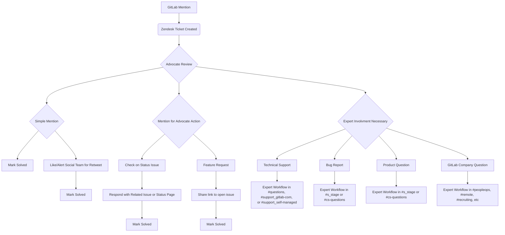

## On this page
{:.no_toc .hidden-md .hidden-lg}

- TOC
{:toc .hidden-md .hidden-lg}

## Zendesk instance

{: .shadow}

The Community Advocates team use a [dedicated Zendesk instance](https://gitlab-community.zendesk.com/) to centralize the management of mentions in the [social response channels](/handbook/marketing/community-relations/community-advocacy/#community-response-channels).

The majority of the response channels' mentions are routed to Zendesk via automation. Generally through [Zapier](/handbook/marketing/community-relations/community-advocacy/#zapier) or a native Zendesk integration.

Each mention is then converted into a ticket and filtered into a [View](#zendesk-views), ordered by channel priority. As part of their daily workflow, Community Advocates process each one of these views and manage the ticket lifecycle.

### Zendesk ticket lifecycle

A typical ticket lifecycle is as follows:

1. A wider community member mentions GitLab in one of our [social response channels](/handbook/marketing/community-relations/community-advocacy/#community-response-channels)
1. The social response automation routes the mention to Zendesk and converts it into a ticket.
1. The ticket appears in one of the [View](#zendesk-views) as New
1. A Community Advocate scans through the views by priority or expertise, and opens the ticket
1. The Community Advocate decides the type of response. Typically, this will be either replying on the social channel, [involving experts](/handbook/marketing/community-relations/community-advocacy/workflows/involving-experts/) or marking the ticket as NOOP (no action required).
1. After the action for the ticket has been taken, the ticket will be closed by the Community Advocate, either manually or via a [macro](#zendesk-macros).

### Advocate Workflow

This chart outlines some of the possible paths that advocates may follow when evaluating and responding to incoming Zendesk tickets. 

### Zendesk Contingency Plan
The Community Advocacy team primarily uses Zendesk to respond to mentions. When Zendesk is down, advocates should actively monitor Twitter and HackerNews for GitLab mentions, and respond to them accordingly from their individual accounts. Advocates should work the [Forum issue board](https://gitlab.com/gitlab-com/marketing/community-relations/community-advocacy/general/-/boards/1836026?label_name[]=Forum) per usual.

### Zendesk subscription

After [a discussion with the GitLab Support team](https://gitlab.com/gitlab-com/support/support-team-meta/issues/1583), it was concluded that for the specific Advocate workflows and metrics it would be best to keep the [Community Relations Zendesk instance](https://gitlab-community.zendesk.com/) separate from the [Support team's Zendesk instance](https://support.gitlab.com).

The Community Relations instance runs on a [Professional Zendesk Support](https://www.zendesk.com/product/pricing/#support_pricing) subscription, with one _Agent_ seat per Community Advocate plus extra seats for the team manager and collaborators. Additionally, the [Collaboration Add-on](https://support.zendesk.com/hc/en-us/articles/203662036-Understanding-and-setting-light-agent-permissions-Collaboration-Add-on-) provides us extra seats for _Light Agents_ with read-only access to tickets.

#### Adding new agent seats to existing subscription

- If there is a need to increase the number of agent seats, contact the GitLab Account Manager at Zendesk. Their details are in the `Community Relations - Zendesk contact` secure note in 1Password, on the Marketing vault.
- [Account billing details](https://gitlab-community.zendesk.com/admin/billing/subscription) (only accessible by the Zendesk instance owner)

After the initial contact and agreeing to the subscription plan update:

1. The GitLab Account Manager at Zendesk sends the unsigned service order to the DRI at GitLab via e-mail.
1. DRI submits a finance issue following the [Procure to pay process](/handbook/finance/procure-to-pay/#procure-to-pay-process), attaching the unsigned service order. See this [existing subscription add-on issue](https://gitlab.com/gitlab-com/finance/-/issues/2295) for reference.
1. DRI works with stakeholders to complete the approval chain
1. DRI reaches back to the GitLab Account Manager at Zendesk and asks them to:
   1. Please send the DocuSign contract to our CFO to sign. His e-mail address is: `{ADD_CFO_EMAIL}`
   2. Please add the comment: "Approved by GitLab at `{ADD_FINANCE_ISSUE_LINK}`" to the DocuSign e-mail
   3. Please add me as CC on the DocuSign document so that I have visibility of it and get a notification when it's been signed by GitLab
1. DRI uploads signed contract to ContractWorks after CFO signature.

### Zendesk access

Zendesk access is provided during onboarding for every Community Advocate. Access as an Agent (read/write access to tickets) or a Light Agent (read-only access to tickets) can also be provided for other team members using the [access request](/handbook/business-ops/team-member-enablement/onboarding-access-requests/access-requests/#single-person-access-request) process if needed.

Once access is set up:

1. Go to [https://gitlab-community.zendesk.com](https://gitlab-community.zendesk.com)
1. Log in as "Agent" via SSO and your GitLab Google Suite account.

### Provisioning agents

To add an Agent:

1. Log into Zendesk 
1. Go to [`Settings > Manage > People`](https://gitlab-community.zendesk.com/agent/admin/people)
1. Click on [`add agent`](https://gitlab-community.zendesk.com/agent/users/new)
1. Fill in name and e-mail address
1. Choose the role, either `Agent` (read/write access to tickets) `Light Agent` (read-only access to tickets, but can leave internal notes)
1. Click `Add`
1. Choose the relevant groups for the new agent, and optionally set their time zone

### Deprovisioning agents or changing roles

To find a user account and edit their status:

1. Log into Zendesk 
1. Go to [`Settings > Manage > People`](https://gitlab-community.zendesk.com/agent/admin/people)
1. Enter their e-mail on the search box and click on `Search`
1. When the user appears on the list of results, click on `Edit`

To change the role for an account (e.g. promote or demote as Admin):

1. Follow steps above to find a user account and edit status
1. Click on the `Role` dropdown on the left
1. Select the appropriate role. The status is saved automatically upon change.

To deprovision (remove agent status):

1. Follow steps above to find a user account and edit status
1. Click on the `Role` dropdown on the left
1. Set the role to `End User` (no read/write access). The status is saved automatically upon change.

## Zendesk views

### View limits workaround

{: .shadow}

There is a [limit on the number of views](https://support.zendesk.com/hc/en-us/articles/231732128) that can be displayed on the main "Views" panel on Zendesk, regardless of the type of subscription:

- 12 shared views
- 8 personal views

If the number of views exceeds these limits, the additional views are moved to the `Settings > Views` panel. As the Community Advocates make use of the shared views feature, and as the number of response channels already exceeds the limit of 12, this poses a hindrance on ticket visibility and effectivity.

As a workaround, the team has decided to standardize the personal views for each Advocate, thus effectively increasing the number of visible Views to 20. If the number of response channels exceed the count of 20, an alternative approach could be to consolidate some of the existing views –a practice already followed where it makes sense (e.g. E-mail view).

The workaround is based on two steps: creating a shared view, which then every advocate can clone as a personal view.

#### Creating new shared views

To create a new shared view:

1. Navigate to `Settings > Views`
1. Click on the `Add view` button or clone an existing shared view
1. Set up or modify the filter conditions if necessary
1. On `Available for`, choose `All agents`
1. Inform the rest of the team about the availability of the new view  

#### Cloning shared views as personal views

To create a personal view from a shared view:

1. Navigate to `Settings > Views`
1. In the views list, hover over the right hand side of view you want to clone
1. Click on the ellipsis to open the context menu
1. Choose `Clone` 
1. Do not modify the filter conditions
1. On `Available for`, choose `Me only`  

## Zendesk macros

A macro is similiar to an email template, but consists of one or more actions that modify the values of a ticket's fields. Macros are applied to tickets manually by Advocates. For example, we use macros for mentions or questions requests that we can answer with a single, standard response. Please keep in mind, though, that the goal is to personalize each response as much as possible.

Macros can perform the following tasks:

* Add comment text
* Update ticket fields
* Add or remove ticket tags
* Add CCs
* Change the assignee
* Set the ticket subject
* Add attachments to ticket comments

### Creating macros

There are two types of macros: personal macros (created by an agent or administrator for their own use) and shared macros (created by an administrator  with permission for multiple users).

Please make sure to focus on creating shared macros since we want to keep all the info transparent and available to the whole team.

#### Creating personal macros

Although only administrators can create the macros that are shared by all Community Advocates, Advocates can also create personal macros for their own use. A personal macro is only visible to and can only be used or modified by the creator. 

1. Click the **Admin** icon in the sidebar, then select **Macros**.
1. Click the **All shared macros** drop-down menu and select **Personal macros**.
1. Click the **Add macro** button.
1. Enter the macro name, and add actions for your macro as described in Building macro action statements.
1. Click **Create**.

#### Creating shared macros

Administrators (and agents in custom roles with permission) can create macros that are shared by all Zendesk Support agents or macros that are shared by only agents in a specific group. Administrators can also create personal macros for their own use.

A personal macro is only visible to and can only be used or modified by the creator. Administrators can create shared macros, and can modify all shared macros, regardless of who created them.

1. Click the **Admin icon** in the sidebar, then select **Macros**.
1. Click the **Add macro** button.
1. Enter a **Macro name.**
1. (Optional) Enter a **Description.**
1. Select an option from the Available for menu:
    * **All agents**, available to all agents.
    * **Agents in group**, available only to agents in the group specified. A drop-down menu to choose the group appears when you select this option.
    * **Me only**, available only to you.
1. Under **Actions**, use the drop-down menus to add actions for your macro as described in Building macro action statements.
    * If you choose the Comment/description macro action, and you have rich text formatting enabled, you can add formatting and inline images and you can add attachments to your macro comments.
1. Click **Create**.

### Applying macros

You can manually apply one or more macros to a ticket at once. Just as you can make bulk updates to many tickets at once, you can also apply a macro to more than one ticket using your views.

A typical use case is a ticket that contains more than one question or issue, let's say two in this example. You might have set up two macros that both insert a comment into a ticket to answer each issue separately. By applying each macro to the ticket, you add two comments and address both issues in a single response.

1. In a ticket , click the **Apply macro** button in the bottom toolbar.
1. Typically, your five most commonly used macros from the past week appear at the top of the macros list.
    * You can select one of these, begin typing the name of the macro, or scroll through the list to find the one you want to use.
1. The actions defined in the macro will be applied. If the macro updated the ticket comment, you can edit the text before submitting the ticket.
1. To apply another macro, click **Apply macro** again and select another macro.

### Previewing macros

There is an option to view a description of a macro, and preview the update it will make to a ticket, before applying it.

1. In a ticket, click the **Apply macro** button in the bottom toolbar.
1. Scroll through the list to locate the macro you want to use.
1. Hover your cursor over the macro to display its description tooltip.
    * If the macro does not have a description, the tooltip does not appear.
1. If the description matches the macro you want to apply, click on it to use it.

### Current macro stack descriptions

| Macro Name | Macro Description |
|---|---|
| Advocate responded | Use when an Advocate has responded to a ticket without consulting an expert. Assigns the ticket to you, applies the `advocate-responded` tag, and changes ticket status to `solved`. |
| CoC Violation:: Unable to moderate | Use when unable to modify a code of conduct violation due to access, which will need to be handled later. Applies tag `conduct-violation-hold` tag, changes ticket status to `on-hold`, and adds you as CC.|
| Don't Engage::Country Specific Hiring Restrictions | Comments related to hiring restrictions that we [do not respond to](/handbook/marketing/community-relations/community-advocacy/guidelines/general/#topics-where-community-advocates-dont-respond). Applies tag `mention`, assigns the ticket to you, and changes ticket status to `solved`.|
| Don't Engage::Harassment By Community Members | Comments we receive that can be considered harassment that we [do not respond to](/handbook/marketing/community-relations/community-advocacy/guidelines/general/#topics-where-community-advocates-dont-respond). Applies tag `mention`, assigns the ticket to you, and changes ticket status to `solved`.|
| Don't Engage::IPO Status | Comments we receive related to GitLab's IPO status/going public that we [do not respond to](/handbook/marketing/community-relations/community-advocacy/guidelines/general/#topics-where-community-advocates-dont-respond). Applies tag `mention`, assigns the ticket to you, and changes ticket status to `solved`.|
| Don't Engage::Location Based Pay | Comments we receive related to GitLab location-based payment policy that we [do not respond to](/handbook/marketing/community-relations/community-advocacy/guidelines/general/#topics-where-community-advocates-dont-respond). Applies tag `mention`, assigns the ticket to you, and changes ticket status to `solved`.|
| Don't Engage::Politically Sensitive Topics | Comments we receive that are politically sensitive and are directed by corporate communications to [not respond to](/handbook/marketing/community-relations/community-advocacy/guidelines/general/#topics-where-community-advocates-dont-respond). Applies tag `mention`, assigns the ticket to you, and changes ticket status to `solved`.|
| No Response::Send to Social | Mentions we receive should be handled by the social team at GitLab, including (but not limited to) responses to tweets posted by the social team, overtly positive comments about GitLab, and mentions we think should be retweeted. Applies tag `social`, assigns ticket to you, forwards to social@gitlab.com, and changes ticket status to `solved`.|
| Country block feedback | Use when tagging feedback related to the China/Russia country block. Applies tag `country-block`, assigns the ticket to you, and changes ticket status to `solved`.|
| EDU/OSS/YC/merch::EDU renewal | Applies `license` tag, adds email template, assigns the ticket to you, and changes ticket status to `pending`. |
| EDU/OSS/YC/merch:: EDU Announcement | Applies latest EDU program announcement; [Please see this issue](https://gitlab.com/gitlab-com/marketing/community-relations/education-program/general/-/issues/77#note_364647278) for latest announcement |
| EDU/OSS/YC/merch:: EDU General Rejection| Applies `license` tag, adds email template, assigns the ticket to you, and changes ticket status to `pending`.|
| EDU/OSS/YC/merch::EDU license approved | Applies `license` tag, adds email template, assigns the ticket to you, and changes ticket status to `pending`. |
| EDU/OSS/YC/merch:: EDU Requesting Email Domain| Applies `license` tag, adds email template, assigns the ticket to you, and changes ticket status to `pending`.|
| EDU/OSS/YC/merch::Collecting EDU usage info | Applies `license` tag, adds email template, assigns the ticket to you, and changes ticket status to `pending`. |
| EDU/OSS/YC/merch::Basic info on EDU program | Applies `license` tag, adds email template, assigns the ticket to you, and changes ticket status to `pending`. |
| EDU/OSS/YC/merch::EDU Requesting Non-Profit Verification | Applies `license` tag, adds email template, assigns the ticket to you, and changes ticket status to `pending`.|
| EDU/OSS/YC/merch::License Update | Use to track Education, OSS and YC license notifications. Applies `license` tag, assigns the ticket to you, and changes ticket status to `solved`. |
| EDU/OSS/YC/merch::Vendor Update | Used to tag order update emails from our vendors. Applies `vendor-update` and changes ticket status to `solved`. |
| EDU/OSS/YC/merch::OSS Renewal | Applies `license` tag, adds email template, assigns the ticket to you, and changes ticket status to `pending`.|
| EDU/OSS/YC/merch:: OSS Announcement | Applies latest OSS program announcement |
| EDU/OSS/YC/merch:: OSS application approved | Applies `license` tag, adds email template, assigns the ticket to you, and changes ticket status to `pending`.|
| EDU/OSS/YC/merch:: OSS Rejection | Applies `license` tag, adds email template, assigns the ticket to you, and changes ticket status to `pending`.|
| EDU/OSS/YC/merch::Non-Profit Application | Used to track applications to the Education program by Non-Profit groups that are not universities. Applies `non-profit` tag, assigns the ticket to you, and changes ticket status to `solved`. |
| EDU/OSS/YC/merch:: OSS Basic Program Information| Applies `license` tag, adds email template, assigns the ticket to you, and changes ticket status to `pending`.|
| EDU/OSS/YC/merch:: OSS Requesting Valid Address| Applies `license` tag, adds email template, assigns the ticket to you, and changes ticket status to `pending`.|
| EDU/OSS/YC/merch::Handing off to sales team | Applies `license` tag, adds email template, assigns the ticket to you, and changes ticket status to `pending`. |
| EDU/OSS/YC/merch:: EDU Welcome | Applies email template for welcoming new EDU program member, and changes the ticket status to `pending`  |
| EDU/OSS/YC/merch:: OSS Welcome | Applies email template for welcoming new OSS program members, and changes the ticket status to `pending` |
| EDU/OSS/YC/merch:: EDU Renewal Thank You | Applies email template for updates for renewing EDU program members, and changes the ticket status to `pending` |
| EDU/OSS/YC/merch:: Send Quote via Email | Applies email template for sending quote manually via email, and changes the ticket status to `pending` |
| EDU/OSS/YC/merch:: Startup Rejection | Applies email template for general rejection email template for startup applicants, and changes the ticket status to `pending` |
| Email::AntiSales | Use to reject sale offer. Applies plain text template to email. Assigns the ticket to you and changes ticket status to `solved`.|
| Email::CommunityWriters | Use for outreach/requests for involvement in Community Writers program. Applies plain text template to email. Applies `guest-post` tag, assigns the ticket to you, and changes ticket status to `solved`. |
| Email::Hackathon | Use to forward to our Hackathon landing page. Applies email template, assigns the ticket to you and changes ticket status to `pending`.|
| Email::Meetups | Use to forward to our Meetups landing page. Applies email template, assigns the ticket to you and changes ticket status to `pending`.|
| Email::Sponsorship | Use for sponsorship requests. Applies plain text template to email and `sponsorship` tag, assigns the ticket to you, and changes ticket status to `solved`.|
| Involving Experts::Community Involvement | Applies `community-involvement` tag and changes ticket status to `pending`. |
| Involving Experts::Expert Responded | Use to track responses from GitLab experts to community members via their personal social accounts. Applies `expert-responded` tag and changes ticket status to `solved`. |
| Involving Experts::Reached out to an Expert | Use to document that we reached out to an expert. Changes ticket status to `open` and adds an internal note: "Reached out to an expert: ". |
| Involving Experts::Expert Response | Use to mark a response from the GitLab team. Changes the ticket status to `solved` and applies the `expert-response` tag. |
| Mention | Use when no action is required. Applies the `mention` tag, assigns the ticket to you, and changes ticket status to `solved`.|
| Monitoring | Use when you're keeping something open to monitor. Assigns the ticket to you, and changes ticket status to `open`. |
| Non-English | Can be applied to any ticket view. Applies `non-english` tag, assigns the ticket to you, and changes ticket status to `solved`. |
| Reddit::Upvoted | Use on Reddit tickets when a post is upvoted but doesn't need a reply. Applies the `upvoted` tag, assigns the ticket to you, and changes ticket status to `solved`. |
| Removed | Use when the mention of GitLab is removed by author.  Applies the `removed` tag, assigns the ticket to you, and changes ticket status to `solved`. |
| StackOverflow::Insufficient Information | Use when the StackOverflow post has insufficient information. Assigns the ticket to you and changes ticket status to `solved`. |
| StackOverflow::Solved | Use when the question has been answered. Assigns the ticket to you and changes ticket status to `solved`. | 
| Swag::Lost Order | Applies lost order email template |
| Swag::Out of Stock | Applies out of stock email template |
| Swag::Ask Customer to Contact Printfection | Tells customer how to contact Printfection to inquire about missing order |
| Twitter::Are you still experiencing? | Use this macro to confirm whether a user is still experiencing the issue they tweeted about. Applies the `support` tag, assigns the ticket to you, and changes ticket status to `pending`. |
| Twitter::BugIssue | Use this macro to provide the user resources/direction to report a possible bug. Applies Tweet template "Sounds like a bug. You should open a bug report about it in https://gitlab.com/gitlab-org/gitlab/issues. We'd like to follow up on it." Applies the `bug` tag, assigns the ticket to you, and changes ticket status to `pending`. |
| Twitter::CurrentIssue | Use this macro when someone reaches out via Twitter about a current Service Incident. Applies Tweet template "Hello! We're sorry for the inconvenience. We're currently investigating this issue here:" Applies the `downtine` tag, assigns the ticket to you, and changes ticket status to `solved`.|
| Twitter::Downtime | Applies Tweet template "Sorry for the inconvenience. See the latest @gitlabstatus tweets for more info. Everything should be fine now." Applies `downtime` tag, assigns the ticket to you, and changes ticket status to `solved`.|
| Twitter::FeatureProposal| Use to encourage community to open feature proposal issues. Applies Tweet template "Hello! If you want to open a feature proposal issue, you can do so by using the “feature proposal” template here: https://gitlab.com/gitlab-org/gitlab/-/issues?" Applies the `feature-proposal` tag, assigns the ticket to you, and changes ticket status to `solved`.|
| Twitter::Incident Resolved | Use to follow up after GitLab incidents are resolved. Applies Tweet template "Hello! We're sorry for the inconvenience. The incident should be resolved now, please let us know if you're still experiencing any issues." Applies the `downtime` tag, assigns the ticket to you, and changes ticket status to `solved`.|
| Twitter:Retweet | Use when forwarding Community member's tweet to our social team for retweets. Applies the `retweet` tag, assigns the ticket to you, and changes the ticket status to `solved` |
| Twitter::Support | Use to follow up with support questions from paid users. Applies Tweet template "Can you please open a support ticket at https://support.gitlab.com/hc/en-us/requests/new? We'd love to look into this." Applies the `support` tag, assigns the ticket to you, and changes ticket status to `solved`.|
| Twitter::SupportTracker| Use to follow up with support questions from free users. Applies Tweet template "Could you please open an issue about that at https://gitlab.com/gitlab-com/support-forum/issues with as much info as possible? We'd love to follow-up on it." Applies the `support-forum` tag, assigns the ticket to you, and changes ticket status to `solved`.|

## Sending emails through Zendesk

Emails sent to [our list of contact emails](/handbook/marketing/community-relations/program-resources/#contact-e-mails) create a new ticket in Zendesk, and public comments in Zendesk are sent as an email from that contact email back to the recipient.

There are instances where the community advocates need to change the email address of the recipient, the sender, or both, which can be done through Zendesk.

### Changing the email recipient
1. Click `(change)` next to the recipient's email address at the top of the ticket. Alternatively, you can click the 👤 symbol on the left pane to bring up the `Requester` field.
{: .shadow}
2. This will open the `Requester` panel on the left side. Paste the new email address in the `Requester` field.
{: .shadow}
3. If their email address is already in Zendesk, the record will show up, which you can select.
{: .shadow}
4. If their email isn't in Zendesk, add them as a new user.
    1. Click `Add new user`
    1. Add their name and email to the corresponding fields
    1. Select `End User` as the role
    1. Click `Add`

{: .shadow}
{: .shadow}
5. If the email has been successfully changed, the new recipient will show up at the top of the ticket.
{: .shadow}

### Changing the email sender
1. Check what email address is currently used to send replies from at the top of the ticket. It will say `Via {email address}`
{: .shadow}
2. On the top-right of Zendesk underneath your profile picture, click `Apps`
[Change sender step 2](/images/handbook/marketing/community-relations/zendesk-emails/sender-2.png){: .shadow}
3. The app panel on the right-hand side will open up. Click the dropdown next to `Select an Email`
{: .shadow}
4. Select the email address you want to send the email from via the drop-down [list of email addresses](/handbook/marketing/community-relations/program-resources/#contact-e-mails).
{: .shadow}
5. If the sender address has been successfully changed, a notification saying `This ticket will be sent from {email address}` will pop up by the `Apps` tab, and the field at the top of the ticket will change.
{: .shadow}

## Monitoring competitor mentions in Zendesk

Zendesk auto-applies a `{COMPETITOR-MENTION}` tag to all tickets that include a mention of both GitLab and one or more of these competitor names: GitHub, Azure DevOps, Atlassian/Bitbucket, JFrog, CircleCI, Jenkins. 

To access competitor mentions in the Community Advocacy instance of Zendesk, submit an [access request](/handbook/business-ops/team-member-enablement/onboarding-access-requests/access-requests/#single-person-access-request) to be added as a Light Agent.

Once you have Light Agent access to the Community Advocacy instance of Zendesk, the the [competition tag reporting view](https://gitlab-community.zendesk.com/agent/filters/360172932834) will be available.

### Viewing competitor mentions by individual competitor name

Once you have Light Agent access to the Community Advocacy instance of Zendesk, you can also view competitor mentions individually with the following links:
* Tickets with competitor-mention tag that mention ["GitHub"](https://gitlab-community.zendesk.com/agent/search/1?type=ticket&q=tags%3A%22competitor-mention%22%20github)
* Tickets with competitor-mention tag that mention ["Azure DevOps"](https://gitlab-community.zendesk.com/agent/search/1?type=ticket&q=tags%3A%22competitor-mention%22%20azure%20devops)
* Tickets with competitor-mention tag that mention ["Atlassian"](https://gitlab-community.zendesk.com/agent/search/1?type=ticket&q=tags%3A%22competitor-mention%22%20atlassian)
* Tickets with competitor-mention tag that mention ["Bitbucket"](https://gitlab-community.zendesk.com/agent/search/1?type=ticket&q=tags%3A%22competitor-mention%22%20bitbucket)
* Tickets with competitor-mention tag that mention ["JFrog"](https://gitlab-community.zendesk.com/agent/search/1?type=ticket&q=tags%3A%22competitor-mention%22%20jenkins)
* Tickets with competitor-mention tag that mention ["CircleCI"](https://gitlab-community.zendesk.com/agent/search/1?type=ticket&q=tags%3A%22competitor-mention%22%20circleci)
* Tickets with competitor-mention tag that mention ["Jenkins"](https://gitlab-community.zendesk.com/agent/search/1?type=ticket&q=tags%3A%22competitor-mention%22%20jenkins)

### Requesting the addition of a competitor for tracking

To request the addition of a competitor for tracking, ping @advocates in the [#community-advocates](https://gitlab.slack.com/archives/CB16DMSLC) Slack channel with your request and a link to this page.

### Adjusting the tag in Zendesk with the addition of a competitor for tracking

1. Log into Zendesk.
2. Click the Admin cogwheel on the left side of Zendesk.
3. Click Triggers under Business Rules.
4. Click Tag Competitor Mentions.
5. Under Conditions, add a comma to the end of the list of competitors, then add the name of the desired competitor.
6. Scroll down and click Save. 
7. Update this handbook page to add the name of the competitor and the individual link for the new competitor mention.
