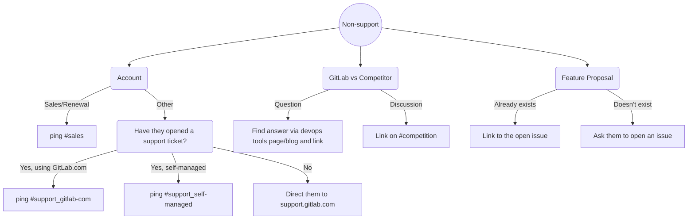
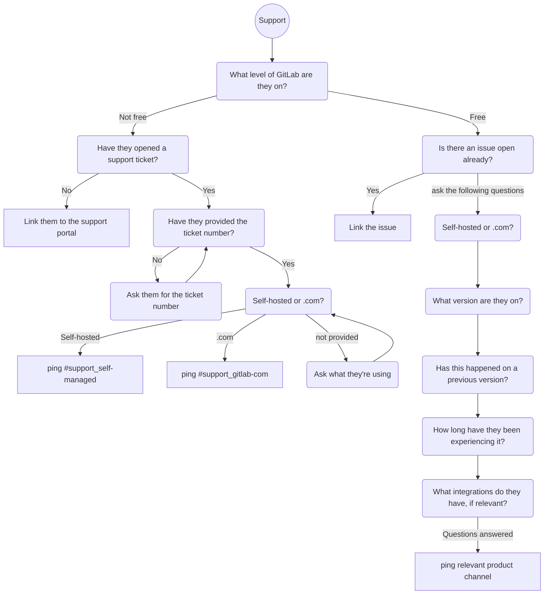

## On this page
{:.no_toc .hidden-md .hidden-lg}

- TOC
{:toc .hidden-md .hidden-lg}

## Overview

New posts to the GitLab forum are brought in to the [Forum Issue Board](https://gitlab.com/gitlab-com/marketing/community-relations/community-advocacy/general/-/boards/1836026?label_name[]=Forum) automatically with Zapier via the [GitLab Forum Bot](https://gitlab.com/gitlabforumbot) account. Information for this account is stored in 1Password. A new issue for each topic will appear on the board, and posts to that topic will appear as new comments on the issue. All activity is also posted to the `#gitlab-forum` channel on Slack. 

The best place to provide responses and other helpful information is directly in the [forum platform](https://forum.gitlab.com), Discourse. You will need to [create an account to participate](https://forum.gitlab.com/signup); please use your GitLab account to sign up.  GitLab Team Members are autmatically added to the Staff Group, and get a Staff Title, and Staff Badge.

### Issue Board Goals and Purpose

The goal of this board is to more easily collaborate on forum topics and posts across the wider [Forum Contributors Group](https://gitlab.com/gitlab-com/marketing/community-relations/general/-/issues/23). An issue board is more inclusive of our cross-org forum contributors and was specifically requested over Zendesk as a way of collabroating and researching forum requests.

There currently is no good way to privately communicate thought processes and loop in experts via the forum platform, Discourse. The issues in this board, even though it seems duplicative at times, will provide the our forum experts both a more private and instant way to troubleshoot.

## How to Use the Forum Issue Board

Due to lack of internal communication resources in Discourse, we use issues on the [Forum Issue Board](https://gitlab.com/gitlab-com/marketing/community-relations/community-advocacy/general/-/boards/1836026?label_name[]=Forum) for collaborating on new forum topics and posts. Via Zapier, any new topic—or new post on an existing topic—triggers the creation of a new issue on the board. New topics and posts do not show up on the issue board until they are more than 24 hours old, in order to give our community a chance to engage first.

There are three working columns on the Forum Issue Board: Open, Moderator, Work in Progress, and Closed. 

### Open 

Every new and outstanding topic and post that needs GitLab's attention will appear in this column. You can click into the issue, @-mention experts, open the topic in Discourse, and collaborate in the comments if you need time to troubleshoot. 

### Moderator 

Move issues into this column if you feel that the associated topic or post is easily one that a forum moderator or Community Advocate can answer. A few examples are: technical low-hanging-fruit type questions, code of conduct violations, asking for screenshots and error messages, or specific questions about the forum platform. 

### Work in Progress

Use this column to signify when a topic or post is being worked on by yourself, but hasn't a response, or is in the process of troubleshooting. There is no way to mark a topic or post as WIP in Discourse, so to avoid another person doubling the effort and working on an Open topic, claim ownership by using this column. 

### Closed

Drag issues over to this column when there is no longer any action needed on a topic or post. You can also close issues right in the issue by clicking `Close Issue` at the top, and they will automatically be moved to the Closed column.

## Best practices

- Always be courteous and generous, especially when a user is new to the forum. You can recognize new users (and dormant users) by the blue, temporary banner at the top of their posts.
- Add a welcome message when replying to new users. It could be as simple as "Hi, and welcome to the forum! :smile:" at the start of your post.
- Use the like button (the heart icon) as much as you can, to thank users for their input and to inspire other users to do the same.
- Use the solution checkbox button as much as you can, to indicate to others when a forum topic has an answer.

### Strategies for finding solutions in the forum

Community advocates can utilize the support Zendesk instance and existing GitLab issues to find resources and solutions for questions posted in the forum

The following categories can help identify key information that can be pulled from a forum post and used in a Google or Zendesk search.

The best case scenario result from these searches will be to either
1. identify a similar Zendesk ticket that contains follow up questions, docs, or a solution that can be shared on the forum
2. find a closed issue with a documented fix in the comments
3. find an open issue with a documented workaround in the comments

#### Keywords
Pulling keywords from posts can be used to search either Google, existing GitLab issues, or the support team's Zendesk instance

##### Self-Hosted Keywords

`self hosted`, `install`, `upgrade`, `update` `downgrade`, `kubernetes`,`docker` `omnibus`,`GitLab Runner`, `configure`/`set up`/`enable` and `Omnibus`/`Helm Chart`, `release`, `version`

##### SaaS/GitLab.com Keywords
`gitlab.com`

#### Zendesk Tags
Tags are specific to Zendesk searches and can be used to narrow down tickets based on the product (GitLab.com or self-hosted)

##### Self-Hosted Tags
`Ultimate`, `Starter`, `Premium`

##### SaaS/GitLab.com Tags
`Gold`, `Silver`, `Bronze`

#### Logs
Users will often post screenshots or copy in their log history into their forum posts. Use these key log elements to uncover solutions.

##### Exception.backtrace 
Purpose: traces the code most recently ran before it failed, top to bottom, to show what actions led up to the error.

Search Strategy: Search using the top 1 or 2 lines of this section of the logs 

##### Extra.response 
Purpose: provides context or information causing the error

Search Strategy: Combine extra response context with keywords to find relevant issues

#### Tips for searching the support Zendesk instance

1. Ignore tickets in the group called [`GitLab Support Forum`](https://gitlab.com/gitlab-com/support-forum). This is a deprecated internal service desk that used GitLab to process support issues. Information and solutions to these lives in issue comments, not the ticket.

## Administration

Most administration tasks will be done from the [Discourse Admin Dashboard](https://forum.gitlab.com/admin)

### How to Grant Admin Permissions

If you want to add an admin:

1. Go to the [list of forum users](https://forum.gitlab.com/admin/users/list/active)
2. Use the search box to find the user you want to grant admin permissions to
3. Click on the user to modify their profile
4. Scroll down to the `Permissions` section
5. Click on the `Grant Admin` button
6. An e-mail confirmation will be sent to the Admin that granted the permission (i.e. you). Go to your inbox and click on the link to confirm granting Admin permission to the user
7. If all went well, the `Permissions` > `Admin?` section on the user's profile admin should read `Yes`

Note: we would like to reserve only one or two Staff spots for forum Admins within our existing 15 total Staff spots. 

### How to Grant Moderator Permissions

If you want to add an Moderator:

1. Go to the [list of forum users](https://forum.gitlab.com/admin/users/list/active)
2. Use the search box to find the user you want to grant moderator permissions to
3. Click on the user to modify their profile
4. Scroll down to the `Permissions` section
5. Click on the `Grant Moderation` button
7. Immediately the `Permissions` > `Admin?` section on the user's profile admin should read `Yes`

Note: we only have 15 Staff spots available with our current Discourse subscription. Please check with an Admin (Lindsay Olson) if you want to grant, or want to receive, moderator status. Right now, the Advocates team + four others have Moderator status. 

### Moderator Specific Permissions

[Click this link to view the Moderator Quick Start guide.](https://forum.gitlab.com/t/read-me-moderator-quick-start-guide/39564) 

This guide explains Moderator permissions, expectations, and best practices. 

## Workflow

How to respond in the GitLab Forum: 

1. Review the issues in [Forum Issue Board](https://gitlab.com/gitlab-com/marketing/community-relations/community-advocacy/general/-/boards/1836026?label_name[]=Forum)
2. Review and sort issues in the `New` or `Moderator` (or other appropriate) columns
3. Write a response if you can, or involve an expert for assistance on the issue if you don't know how to engage or proceed. Troubeshooting questions and asking for details counts as a reply! Don't feel like you have to answer fully in one go
4. Post the comment on the original thread ([https://forum.gitlab.com](https://forum.gitlab.com)) using the link provided in the issue
5. Drag the issue into the `Closed` column, (or close the issue at the top) once a response has been provided.  

Whether you work through forum posts via the Forum Issue Board, or the [forum platform](forum.gitlab.com), consider using some of the following resources to help get answers to questions: 
* Search the forum for related topics - you may find a community member who has already solved something similar. You can loop them into the conversation or point the user to a thread that might be helpful
* Search [GitLab's documentation](https://docs.gitlab.com) for helpful information to aid in troubleshooting
* [Search Support's Zendesk instance for solved tickets](/handbook/marketing/community-relations/community-advocacy/workflows/twitter/#using-gitlab-support-zendesk) about the same issue the forum user is having and share that knowledge in the forum thread

### Moderator and Admin Workflow

**How and when to edit forum posts.**

Generally, we do not edit other peoples' posts. If we see something that can be improved, we should reach out to them privately to ask them to change it. This helps us build trust with our community and with the GitLab team, since it shows them that they have the creative freedom to post what they like on our forum. 

That being said, there are instances when moderators can edit posts directly. Here are some examples and how to do it:
* Violation of GitLab's [Code of Conduct](https://about.gitlab.com/company/culture/contribute/coc/) (Ex. redacting swear words, if they are unable or unwilling to edit it themselves)
* Redact private information (Ex. license keys, account info, email addresses, etc.)
* Editing can be achieved via the grey pencil icon in the post toolbar (... > pencil)

**How and when to mark a solution in a thread.**
* When there is a clear answer to the topic and/or question
* Makrking the solution can be done  via the grey checkbox icon in the post toolbar (... > checkbox)

**How and when to delete a forum post or topic.**
* Please do not delete other's posts. When necessary, message the user first, and let them have a chance to delete it themselves
* Deleting content for any reason is a breach of trust, which is something we are working hard to build in our forum community. If you feel like a post needs to be deleted, please reach out to an Admin, or Lindsay Olson, so the situation can be discussed

Follow the relevant workflow depending on the question:

## GitLab Forum Strategy

Engagement drives engagment, so the more the GitLab team engages with our wider community, the more they are likely to engage with us, and with others. By setting the example of providing thorough answers, we can build our forum up as a place of knowledge share and collaboration. [See the Forum's 2020 strategy slide deck for more](https://docs.google.com/presentation/d/1PiNlxFImSIO8kz9TfWMZ6GLGd9fYefILpC6LS3w3lJE/edit#slide=id.p). 

## Automation

New mentions are brought into Slack and Zendesk via Zapier.
