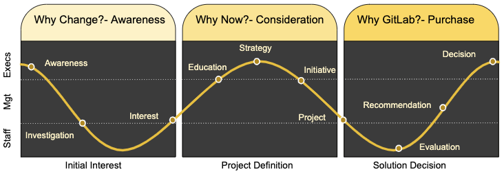

## On this page
{:.no_toc .hidden-md .hidden-lg}

- TOC
{:toc .hidden-md .hidden-lg}

## Why - Use Case Driven Go to Market

When a customer / prospect embarks on a transformation, they typically will initiate a specific improvement project, which will address a specific problem or challenge they are facing.

- **Value Drivers** describe the reasons **why**,
- **Use Cases** describe the specific **what** they are trying to change.

### A **Customer Use Case** is:

- A **customer problem** or **initiative**, that attracts **budget** , in **customer terms**
- Often aligned to industry analyst **market coverage** (i.e. Gartner, Forrester, etc. write reports on the topic)
- Relatively stable over time
- A **discrete problem** that we believe GitLab solves
- Often, a **reason customers choose GitLab** (hence which we should seek out in prospects)

### Use Case Details

The [Customer Use Cases](/handbook/use-cases/) page lists an overview of 8 customer use cases.

As we look at go to market, we've prioritized these usecases and more into two tiers.

#### Tier 1

These usecases are key to our GTM strategy, often are where we land in an account or are significant expand motions.

1. [Version Control and Collaboration](/handbook/marketing/product-marketing/usecase-gtm/version-control-collaboration/) (all project intellectual property - code, design, and more)
1. [Continuous Integration](/handbook/marketing/product-marketing/usecase-gtm/ci/) (how teams automate and streamline build and test to improve quality and velocity)
1. [DevSecOps](/handbook/marketing/product-marketing/usecase-gtm/devsecops/) (how teams shift security left and make it relevant throughout the delivery lifecycle)

#### Tier 2

These usecases are secondary in our GTM strategy and are a mixture of some landing motions and also expansion in accounts.

1. [Agile Project management](/handbook/marketing/product-marketing/usecase-gtm/agile/) (Make it easier for teams to collaborate and align on projects)
1. [Continuous Delivery](/handbook/marketing/product-marketing/usecase-gtm/cd/) (streamlining and automating delivering and deploying code to different environments)
1. [GitOps](/handbook/marketing/product-marketing/usecase-gtm/gitops/) (Adopting DevOps practices in managing infrastructure and operations - XaC + MRs + CI/CD)
1. [Simplify DevOps](/handbook/marketing/product-marketing/usecase-gtm/simplify-devops/) (making adoption of DevOps practices easier and streamlined, eliminating waste)
1. [Cloud Native](/handbook/marketing/product-marketing/usecase-gtm/cloud-native) (developing, building, delivering, and securing cloud native/micro services based applications - Kubernetes)

#### Tier 3

These usecases are other situations where GitLab helps address a specific problem in an account.

- [Data Science/Machine Learning](/handbook/marketing/product-marketing/usecase-gtm/data-science/)
- Remote Development Team Management
- Portfolio management
- Repository management
- Application monitoring and visibility
- Incident management

In product marketing, we focus on GitLab stages **and** also develop and curate collateral that aligns with a buyer's journey supporting the use cases.

## Buyer's journey and typical collateral

As a prospect is determining that they have a specific problem to solve, they typically go through several stages of a [buyer's journey](/handbook/marketing/growth-marketing/content/#content-stage--buyers-journey-definitions) which we hope ultimately leads them to selecting GitLab as their solution of choice.

| **Awareness** | **Consideration** | **Decision/Purchase** |
| --------- | ------------- | ----------------- |
| Collateral and content designed to reach prospects in this stage of their journey should be focused on **educating them about the problems they are facing**, the business impact of their problems, and the reality that others are successfully solving the same problem | Collateral and content designed to reach prospects in this stage of their journey should be focused on **positioning GitLab as a viable and compelling solution to their specific problem.** | Collateral and content designed to reach prospects in this stage of their journey should be focused on key information that a buyer needs to **justify GitLab as their chosen solution**. |
| Typical **Awareness** Collateral | Typical **Consideration** Collateral | Typical **Decision/Purchase** Collateral |
| **-** White papers describing the problem space **-** Infographics illustrating the impact of the problem/challenge **-** Analyst reports describing the problem/domain **-** Webinars focusing on the problem and how can be solved **-** Troubleshooting guides to help overcome the problem **-** Analysis of public cases where the problem impacted an organization (i.e. outage, data loss, etc) | **-** White papers describing the innovative solutions to the problem **-** Infographics illustrating the success and impact of solving the problem **-** Analyst reports comparing different solutions in the market (MQ, Waves, etc) **-** Webinars focusing on the success stories and how gitlab helped solve the problem **-** Customer Case Studies, Videos, Logos, etc **-** Solution Check Lists / Plans for how to solve the problem **-** Comparisons between GitLab and other solutions | **-** ROI calculators **-** Use case specific implementation guides **-** Use Case migration guides (from xyz to GitLab) **-** Getting Started info **-** References and case studies |

## Buyer's Journey - Audience

In addition the **buyer's journey**, there are also different audiences in an organization with different needs at different times. The general model for the buyer's journey outlines kinds of collateral that is needed at different stages of the buying cycle. It is incredibly important to understand the needs of the audience when creating collateral. Executives, managers, and individual contributors will need different information to support their specific work.

In this view, the journey is started from the executive's perspective.

- **Executives** will need information about business value, risk, cost, and impact to support strategic objectives
- **Managers** will need more detailed information to drive planning, justification, and migration details.
- **Contributors** need technical details about how it works, how it's better, and how it's going to help them in the future.

The Buyer's journey also starts when developers and the team start to look for solutions to their day to day challenges.

In this view, the staff initiates the effort, as they have identified a challenge and are the champion of a change. They then convince their managers and executives of the need to consider an alternative to their current state.

### Use Case Activation Team

#### Problem:

Use cases/solutions are large, cross-functional concepts that enable go to market motions for multiple GitLab stages and categories. Use cases/solutions are rapidly evolving and improving with new content and insight ranging from personas to requirements to discovery questions and more. Due to the speed of delivery and evolution, we need a consistent approach to engage in 2-way feedback and encourage the adoption of use case content.

#### What: - Activation Team

The activation team will be a stable group of extended stakeholders who will collectively shape, improve, and promote the adoption of use cases to enable us to become more efficient, responsive, and effective in our go-to market motions.

_“Messaging without marketing is like a tree falling in the forest - did it make a noise?”_

The activation team is an outlet for content validation and refinement, as well as enablers and promoters - who help us adopt use case messaging and content in our campaigns, content, and events.

#### Who:

- Product Marketing - Primary author and DRI messaging and positioning
- Technical Marketing - Primary author and DRI for marketing demos and positioning
- Product Manager - DRI for roadmap, vision, direction, and GitLab product features
- Content Marketing - DRI for development of awareness-level content and collateral
- Developer Evangelism - DRI for user content and awareness
- Customer Reference - DRI for recruiting, cultivating, nurturing customer case studies
- Competitive Intelligence - DRI for DevOps tool comparisons and competitive positioning
- Campaign Manager - DRI for activation through collaborative integrated campaigns, to be strategically integrated into segment campaign plans (focus on top-funnl MQL generation, with secondary focus on SAO attribution)
- Digital Marketing Manager - DRI for activation and optimization of targeting, messaging, offer, and channel through digital advertising channels
- Field Marketing Manager - DRI for local and regional events
- Field - Solution Architect - DRI for technical sales, sales demonstrations, and proof of value.
- Field - Technical Account Mgr - DRI for customer success
- Field Enablement - DRI for technical and sales enablement of the field team
- Partner marketing - DRI for joint marketing and messaging with partners and alliances
- Alliances team - DRI for managing key strategic technical relationships
- Analyst Relations - DRI for analyst research as proof points and analyst interactions
- Press Relations - DRI for press outreach to amplify content and awareness

##### Directly Responsible Individuals (DRIs) per use case

| Role | CI use case | CD use case | DevSecOps use case | VC&C use case | GitOps use case |
| ---- | ----------- | ----------- | ------------------ | ------------- | --------------- |
| Product Marketing (John) | Parker | @supadhyaya | Cindy | Jordi | @williamchia |
| Technical Marketing (Dan) | Itzik | @iganbaruch | Fern | William A | @csaavedra1 |
| Product Manager | Jason | @ogolowinski | David | James Ramsay | @nagyv-gitlab |
| Content Marketing (Erica) | @cbuchanan | @cbuchanan | Vanessa | Suri | @cbuchanan |
| Developer Evangelism | ? | ? | M.Friedrich | ? | ? |
| Customer Reference (Colin) | Kim, Fiona | @FionaOKeeffe, Kim | Kim, Fiona | Kim, Fiona | @KimLock, Fiona |
| Competitive Intel (Mahesh) | Mahesh, Aleeta | Mahesh, Aleeta | Mahesh, Aleeta | Aleeta | @mskumar, Aleeta |
| Campaign Managers (Jackie Gragnola) | @aoetama | @ikryzeviciene | @ikryzeviciene | @jennyt | @eirinipan |
| Digital Marketing (Matt Nguyen) | @mnguyen | @mnguyen | @mnguyen | @mnguyen | @mnguyen |
| Field Marketing (Leslie Blanchard) | @rachel_hill | @rhancock | @phuynh | @krogel | @lblanchard |
| Solution Architect (Jonathan Fullam) | @jfullam | @jfullam | @DarwinJS | @jfullam | @jfullam |
| Technical Account Manager (Sherrod Patching) | @vten | @jwoods06 | @kevinchasse | @agunter | @jrreid |
| Field Enablement (David Somers) | @kreykrey | @tparuchuri | @kshirazi | @iabbasi | @jblevins608 |
| Partner Marketing (Tina) | @TinaS | @saraedavila | @saraedavila | @TinaS | @saraedavila |
| Alliances Team | @bjung | @bjung | @abrandenburg | @bjung | @bjung |
| Corp Comm/ PR Team | @cweaver1 | @cweaver1 | @cweaver1 | @cweaver1 | @cweaver1 |
| Analyst Relations | @rragozzine | @rragozzine | @Tompsett | @rragozzine | @Tompsett |

#### Why/ Goals:

A framework for extended stakeholders who commit to regularly engage, contribute, and promote the most up-to-date, relevant, use case content to deliver business value. Specifically, this will help us:

1. More efficiently plan and deliver campaigns and events
1. Refine and improve messaging and content through feedback and iteration
1. Reduce the duplication of efforts and content across GitLab marketing
1. Have a focused team to communicate additions/changes through

#### How:

1. A separate “activation team” for each use case.
1. Stable counterparts for each use case.
1. Default to predominantly asynchronous communication via issues, MRs, docs, and a dedicated use case Slack channel
1. Work from issues/merge requests
1. Periodic slack updates of recent changes
1. Frequent feedback about content, campaigns, enablement, etc
1. Infrequent periodic meetings to discuss key issues, challenges, etc. (monthly or bi-monthly as needed)
    1. Draft/sample agenda:
    1. Summarize important resource page updates and new content
    1. Key feedback on content and messaging from field
    1. Key feedback on content and messaging from campaigns & events
    1. Strategy for improvement and prioritize next steps
1. Led/facilitated by the PMM

#### Key Links

|  | **CI use case** | **CD use case** | **DevSecOps use case** | **VC&C use case** | **GitOps use case** | **Agile use case** |
| --- | ----------- | ----------- | ------------------ | ------------- | --------------- | -------------- |
| **Resource page** | [CI page](/handbook/marketing/product-marketing/usecase-gtm/ci/) | [CD page](/handbook/marketing/product-marketing/usecase-gtm/cd/) | [DevSecOps page](/handbook/marketing/product-marketing/usecase-gtm/devsecops/) | [VC&C page](/handbook/marketing/product-marketing/usecase-gtm/version-control-collaboration/) | [GitOps page](/handbook/marketing/product-marketing/usecase-gtm/gitops/) | tbd |
| **Solution page** | URL tbd | URL tbd | URL tbd | [Solution page](https://about.gitlab.com/solutions/version-control) | URL tbd | URL tbd |
| **Topic page** | URL tbd | URL tbd | URL tbd | [Version Control](https://about.gitlab.com/version-control/) | URL tbd | [What is GitOps?](topics/gitops/) |
| **Campaign page** | [CI landing page](https://about.gitlab.com/why/use-continuous-integration-to-build-and-test-faster/) | Link to [epic](https://gitlab.com/groups/gitlab-com/marketing/-/epics/748) (URL to be added) | [DevSecOps landing page](https://about.gitlab.com/why/shift-your-security-scanning-left/) | [VC&C landing page](https://about.gitlab.com/why/simplify-collaboration-with-version-control/) | [GitOps landing page](/why/gitops-infrastructure-automation/) | tbd |
| **Webcast pages** | tbd | tbd | tbd | [VC&C Webcast](https://about.gitlab.com/webcast/collaboration-without-boundaries/) | tbd | [GitOps Webcast](/why/gitops-infrastructure-automation/) |
| **Slack channel** | #solution_ci | #solution_cd | #solution_devsecops | [#solution_vcc](https://join.slack.com/share/zt-fmu0oq6b-GiliYD2NPpBZYIP5MPQTTA) | [#gitops](https://gitlab.slack.com/archives/C01576AQV18) | #solution_agile |
| [**Use case epic**](https://gitlab.com/groups/gitlab-com/marketing/strategic-marketing/-/epics/71) | [CI epic](https://gitlab.com/groups/gitlab-com/marketing/strategic-marketing/-/epics/70) | [CD epic](https://gitlab.com/groups/gitlab-com/marketing/strategic-marketing/-/epics/171) | [DevSecOps epic](https://gitlab.com/groups/gitlab-com/marketing/strategic-marketing/-/epics/56) | [VC&C epic](https://gitlab.com/groups/gitlab-com/marketing/strategic-marketing/-/epics/42) | [GitOps epic](https://gitlab.com/groups/gitlab-com/marketing/strategic-marketing/-/epics/28) | [Agile epic](https://gitlab.com/groups/gitlab-com/marketing/strategic-marketing/-/epics/185) |

### UseCase GTM Bill of Materials

### Market Requirements

Use Case "Market Requirements" are the broad capabilities that a solution (product or multiple products) would need to support in order for a practitioner to use it for the use case. Each GitLab Use Case should have roughly 8-12 market requirements defined.

In product terminology, Market Requirements are similar to concept of [Jobs to be Done (JTBD)](/handbook/engineering/ux/ux-resources/#jobs-to-be-done-jtbd). Both represent something the end user or customer wants to accomplish. Like JTBD, Market Requirements are <i>**not**</i> features but instead a set of higher level capabilities that indicate what's "required" for a given solution to include in order to be successful in the market. For example, specific products do contain features that help to meet Market Requirements but the features themselves don't qualify as Market Requirements. JTBD tend to be very granular and specific. The [list of JTBD for a particular stage](/handbook/engineering/development/ops/package/jtbd/#jobs-to-be-done) can be long and is theoretically endless. Market Requirements are intentionally broad in an effort to keep the list of total requirements small and consumable. We expect that a given **Market Requirement** would consist of many **jobs to be done**

In [Command of the Message terminology (COTM)](/handbook/sales/command-of-the-message/#additional-resources) used by Sales, these are **NOT** the same thing as "Required Capabilities". COTM "Required Capabilities" are very narrow and focused on a specific value driver aligned with GitLab. **"Market Requirements"** are intended to be comprehensive for a given use case and defined by the market (analysts, vendors, etc), not GitLab specific features), as well as seen through an 'outside-in' paradigm of the market.

When industry analysts do research, they use a market requirements model to evaluate competing solutions. A typical analyst report may have a set of 40-60 capabilities in their market requirements model used to measure and compare vendors with each other. For the sake of our go-to-market efforts, we bucket capabilities into 8-12 key market requirements per use case.

The downstream impacts of market requirements are

- Technical Demos are based on showcasing specific market requirements
- Comparisons across the market (multiple vendors, multiple products) can be driven from market requirements
- ROI models can be built highlighting the value of specific market requirements.

### Use Case GTM Bill of Material Priorities & Tracking

<iframe width="1200" height="1100" src="https://docs.google.com/spreadsheets/d/e/2PACX-1vTptvo1N7m8tjLSgJFOoy8l2fhnJmlyS83JhsT2DU6Ki3x1tcJ0Jd4Y4nvDnz0EbLEddAzpWHQYMWVs/pubhtml?gid=1180560927&amp;gridlines=false&amp;single=true&amp;widget=true&amp;headers=false&amp;rm=minimal&amp;range=A1:L42"></iframe>

- [GTM Tracking Spreadsheet](https://docs.google.com/spreadsheets/d/1K78pI_sqS91o8fpMReCF5n7gf7tZjCFxU4PjX2uddxk/edit#gid=2033522968)

#### Use Case GTM Areas of Interest

- [Version Control and Collaboration (VC&C)](/handbook/marketing/product-marketing/usecase-gtm/version-control-collaboration/)
- [Continuous Integration (CI)](/handbook/marketing/product-marketing/usecase-gtm/ci/)
- [Continuous Delivery (CD)](/handbook/marketing/product-marketing/usecase-gtm/cd/)
- [Shift Left Security / DevSecOps](/handbook/marketing/product-marketing/usecase-gtm/devsecops/)
- Agile **TBD**
- [Simplify DevOps](/handbook/marketing/product-marketing/usecase-gtm/simplify-devops/)
- Cloud Native **TBD**
- [GitOps](/handbook/marketing/product-marketing/usecase-gtm/gitops/)

### Bill of Materials Material Details

- Product Marketing
- [Technical Marketing](bom/tmm.html)
- Competitive Intelligence
- Market Research and Customer Insights
- Partner and Channel Marketing

### Tracking Progress

We will use Epics and Milestones to track our overall progress of creating and activating these use cases.

1. This [Epic Roadmap](https://gitlab.com/groups/gitlab-com/marketing/-/roadmap?label_name%5B%5D=usecase-gtm&layout=MONTHS&scope=all&sort=start_date_asc&state=opened&utf8=%E2%9C%93_) view shows the current Epics that are actively being workd.
1. This [Milestone](https://gitlab.com/gitlab-com/marketing/product-marketing/-/milestones/11) is tracking all the issues in the Use Case GTM Sprint #3 (March 2020)

#### Bill of Materials progress

